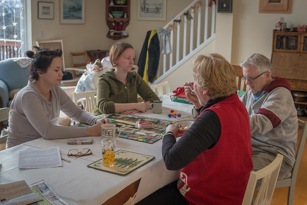

It's great to learn how to write clean code… but in my current job, I'm often battling against Legacy Code!

I get a lot of practice while I'm at work. But I feel the pressure to get things done. So I don't explore much and I fall back to the techniques I know. In my comfort zone.

Do you feel the same?

> I'd like to hone my skills until I can quickly see how to break dependencies and split huge classes that do far too much!

Yeah! But how can you sharpen your skills?

## Coding katas: repeatable exercises to practice your coding-fu

You may have come across coding katas.

If you never did, picture them as small coding exercises. They are meant to be practiced again and again and again. The goal is to solve a defined problem.

It's very efficient to try out a new technique on something concrete. It's also a good way to practice a technique you know until you master it.

It's like building a Todo App every time you want to try out a new front-end framework.

### There are plenty of coding katas out there!

There are even [kata-logs](https://kata-log.rocks/) of exercises you can try out!

But if you tried a couple of katas, you might have realized they have one shortcoming: **none of them seem to allow you to practice refactoring bad code!**

That's true, the vast majority of katas makes you code from scratch…

However, there are a few which are specifically tailored for practicing refactoring Legacy Code. Katas where [Michael Feathers' techniques](../key-points-of-working-effectively-with-legacy-code) would shine.

Here's my shortlist of katas you should try out.

## 5 katas to help you practice working with existing code

Real-life codebases generally have so many issues at the same time, it's overwhelming. Where should you start when you're dealing with a 500k lines of spaghetti code?! You just want to _start_ cleaning the code, but you're already playing in hardcore mode.

What you need, is **dirty code at a smaller scale**.

It should still be complex, or you wouldn't practice much. But it should be manageable, so you _can_ practice. Your goal is to turn that little mess into clean code.

Whether you're done or you're stuck, you can throw it away and start over! No deadline. Nothing to ship. Just a playground to try things 👌

### 1. The Gilded Rose

This one is my favorite.

It's **the perfect first kata** to practice refactoring Legacy Code.

👉 [github.com/emilybache/GildedRose-Refactoring-Kata](https://github.com/emilybache/GildedRose-Refactoring-Kata)

Your goal is to add a new feature to an existing codebase. The code is messy, but it's "just" a bunch of nested conditionals. It surely can be improved, but nothing overwhelming.

There's no HTTP call, no database request, no randomness. Just pure logic… that's quite tangled!

That's why I generally use this kata to train people who never did refactoring katas before 🎓

I like how [the requirements](https://github.com/emilybache/GildedRose-Refactoring-Kata/blob/master/GildedRoseRequirements.txt) give _too much information_. Just like a regular conversation with people. If you want to get this done, you need to focus on the 3 steps of working with Legacy Code:

1. Add the missing tests
2. Refactor the code
3. Implement the new feature

It's also a great kata to try [the approval tests technique](../3-steps-to-add-tests-on-existing-code-when-you-have-short-deadlines/).

### 2. The Tennis

This one is great to practice **an authentic time constraint**.

👉 [github.com/emilybache/Tennis-Refactoring-Kata](https://github.com/emilybache/Tennis-Refactoring-Kata)

You're working for an imaginary consulting company. A colleague of yours spent 8.5h implementing a Tennis scoring software. This colleague is ill and you need to take over. You only have 1.5h left in the budget to clean the code and make it maintainable. What will you do?

Again: no HTTP, no database, no randomness. Just pure, tangled logic to refactor.
Although the Tennis scoring rules are _a little bit_ more complex than the Gilded Rose kata (in my opinion).

A few characteristics of this exercise:

- Tests are already here, so you can focus on **pure refactoring** techniques.
- There are 3 variants that showcase different code smells and challenges.
- At the end of the kata, do a retrospective to list what were the smells you spotted and how you refactored the design. Why is it better? How would that help?

### 3. The Trip Service

I like this one because **it adds nasty dependencies to the mix**.

👉 [github.com/sandromancuso/trip-service-kata](https://github.com/sandromancuso/trip-service-kata)

The logic of this one is not really complex. What makes it challenging are the problematic dependencies: the code you need to test depends on HTTP calls and database requests!

Well, actually, it _simulates_ the problematic dependencies.

There's no actual call to a third-party service, neither you'll have to set up a database. But these "calls" will throw an error. So the whole thing is hard to test 😏

Databases, HTTP, randomness… These are difficult to test. That's what makes your life miserable when dealing with real-life Legacy Code.

This kata is great because you'll learn **how to break dependencies** when you don't have tests!

I recommend you practice this one again and again. Practice until you feel confident enough to break a problematic dependency.

### 4. The Trivia Game

_(Source: ["Christmas Story, the trivia game"](https://www.flickr.com/photos/sowrey/38594771684) by Geoff Sowrey)_

This is the typical kata people practice during a Legacy Code Retreat.

👉 [github.com/jbrains/trivia](https://github.com/jbrains/trivia)

It combines previous techniques into a very comprehensive exercise:

- No tests
- Non-trivial logic
- Usage of `stdout` and randomness to create problematic dependencies

I like how it looks more like an actual legacy codebase—except it's not 600k lines long.

**I don't recommend starting with this kata.**

Unless you have a mentor.

If you don't, practice the previous exercises. Multiple times. When you can comfortably test, refactor and redesign existing code, then it's a good time to tackle this one.

### 5. The "baby steps" timer (front-end)

This one is not really famous, but I really like it.

If you want **to work with _front-end_ Legacy Code, this is the best**.

👉 [github.com/dtanzer/babystepstimer](https://github.com/dtanzer/babystepstimer)

It's an actual timer with a few characteristics:

- You can move the timer window around with your mouse.
- Once you start the timer, the window stays always on top.
- When the timer counts down to zero, it becomes red.
- Before the timer counts down to zero, you can press "Reset" in the timer window.

Therefore, if you try the TypeScript version, you'll have to deal with the browser environment and API.

How do you write tests on such code? How can you break the dependency on the browser with minimal changes? Can you separate the pure logic from the browser stuff?

I'm sure you'll learn a lot about modeling a front-end application, without relying on a modern framework—you won't need it.

---

These are the few katas I use and recommend for developers who want to hone their refactoring skills.

So go ahead, pick one and start cleaning that Legacy Code 👊
