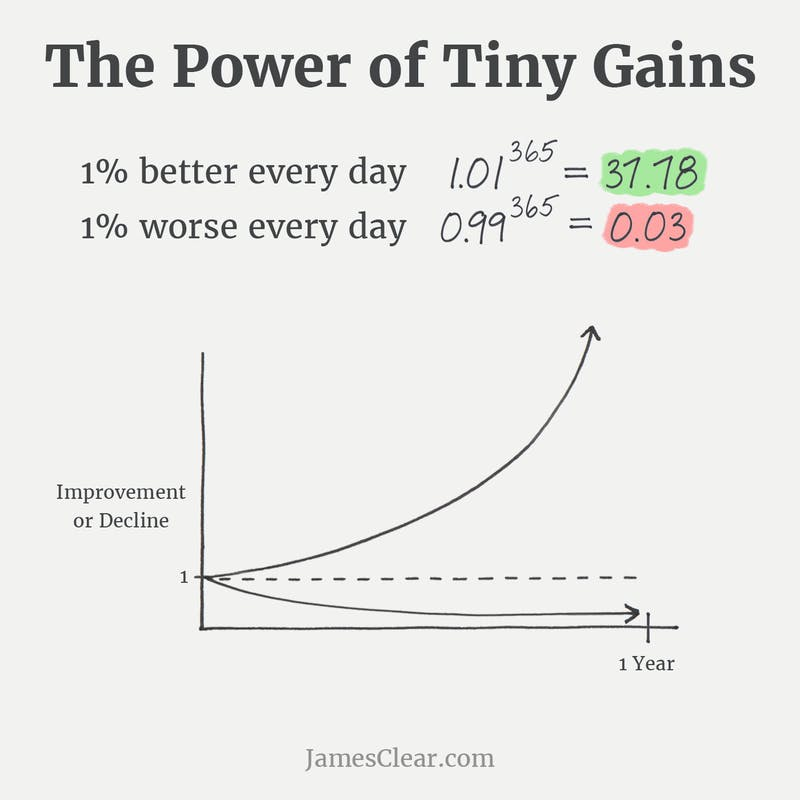
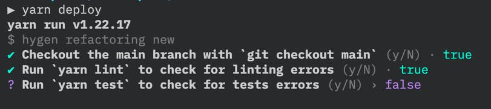

I wanted to make a recap of the most common and useful advice one can give to tackle Legacy codebases.

I have a few of my own, but I also went out to ask experimented developers about their opinions.

I ended up with 7 advice. Let's dig into these!

## 1. Stay curious

Approach the problem with an open mind.

Legacy systems are often frustrating to work with. Yet, you probably aren't the only one in this.

Ask questions to your colleagues, discuss with non-technical people, look up for information around. You may be surprised how much you can discover that wasn't obvious at first sight.

## 2. First, get it running

So many problems to address! An overwhelming mess! I know the feeling.

When you are dealing with many problems, the most efficient way I know is to start with one and focus on that.

Can you get the system running on your machine already? Start with that. Once you get it solved, it will help you tackle the other issues.

You can run it? Great! Then, get the tests running. There is no test runner? Put one in place. Then, make sure you can deploy new versions to production. And so on…

Pick one problem that will help solve others and focus on that. Get it done, then move to the next one. Don't try to tackle everything at once, that doesn't work well.

## 3. Take notes as you go

When you onboard on a new, legacy codebase, you are in a great position to notice problems!

As you learn the quirks of the system and how to solve them, take notes. These don't need to be polished and all. Raw Markdown notes would do.

Put these notes in a place where they are easy to search for. That may be Markdown files versioned along with the source code [as we do for ADRs](https://understandlegacycode.com/blog/earn-maintainers-esteem-with-adrs/).

I find it useful to take notes for things like:

- How I solved problem X (eg. _I got this error when installing dependencies, so I did that and it worked_).
- Jargon, terms I'm not familiar with
- The structure of the code, where to put things

A complimentary piece of advice is to train yourself to detect when you make assumptions.

## 4. Refactor as you go

This is very similar to the previous point, but turning the dial up a bit.

As you work with the code, your understanding will grow. You will have these aha moments. "Ooooh, that's what it does!"

You can capture these learnings in notes and code comments. I also recommend you take an extra step and improve the names.

Functions and variable names are important beacons for understanding. When something wasn't obvious at first and it finally clicked, take the time to improve the names so the intention is clearer!

This is easier to do with a fresh pair of eyes.

A technique I really like is called [Exploratory Refactoring](https://understandlegacycode.com/blog/demine-codebase-with-exploratory-refactoring/) (or "Scratch Refactoring"). Allow yourself to do rogue changes in the code. You won't keep these changes, so you don't care if the code still compiles. The goal is to interact with the code instead of passively reading it. Timebox yourself for 30min. In the end, take notes of what you learned and scratch that work.

## 5. Read books

There is not a ton of resources on dealing with legacy systems. But there are a few that are quite good if you ask me.

​[Working Effectively with Legacy Code](https://understandlegacycode.com/blog/key-points-of-working-effectively-with-legacy-code/), from Michael Feathers, is a reference. I bet many of you have read it already. If you never had the chance, then it's the book I would recommend you to read.

If you have read this one already, [I listed a few more that I found the most relevant](https://understandlegacycode.com/#books).

Books, blog posts, talks, screencasts… These resources will expose you to new techniques and approaches. These will constitute a useful tool belt for when you are facing a new problem to solve, like identifying Seams in existing code so you can write tests for it.

## 6. Write the missing tests

Tests are particularly useful for 3 reasons:

1. Gain an understanding of what the code actually does
1. Reduce the risk of introducing a bug when making changes
1. Identify the main problems of the code design (eg. too many hidden dependencies)

Writing good tests is a skill to practice. Writing tests on existing code is even harder, because you may need to refactor this code… without tests to have your back!

That's where reading books and watching talks will help. You may already be doing [Characterization Testing](https://michaelfeathers.silvrback.com/characterization-testing) by intuition. There are more techniques and tools that can help you do it faster and safer.

Obvious candidates for me are [Safe Refactorings](https://understandlegacycode.com/blog/legacy-of-socrates-8th-edition/#how-we-use-safe-refactoring-to-untangle-gnarly-code-without-tests) and [Approval Tests](https://understandlegacycode.com/approval-tests).

You don't need to write all the missing tests. Just write enough tests for the code you need to change. The time you invest here will be saved in the understanding you gain and the production support you won't have to do.

## 7. Make it better, not perfect

The most important advice of all, if you ask me.

This stuff is hard. It's overwhelming to work with an existing system, built on old technologies, patched everywhere, yet serving actual people in production! 🙀

**It's fine to have a partial understanding of the system.**

Your understanding will grow over time. You will have these aha moments. You can speed up that process by:

- Talking to people
- Taking notes
- Using techniques such as [Behavioral Analysis](https://understandlegacycode.com/behavioral-analysis)

Be mindful of yourself. This is a marathon. If you can make it just 1% better every single day, time will be on your side.

When you get overwhelmed by a problem, **take a break and step away**. To talk to people, take a step back. It may not solve your problem, but it may also give you new ideas.

I solved a lot of problems by simply "talking to others" about them.

Another good example of the "make it better, not perfect" mindset is this: consider you want to automate the deployment process (lovely). This can be an overwhelming task, with a lot of intermediate problems to solve…

Now, what about this:

1. You take notes of the steps that need to be performed to deploy
1. You put these steps in a script
1. You expose this script with a command, like if it would deploy it for you

This is a trick I learned from [Arlo Belschee](https://twitter.com/arlobelshee) (I don't recall where, though).

The script won't do the deployment itself. In fact, it may just start with telling you the _manual_ steps you need to do.

It's not fully automated yet but:

- You now have a command to run to "deploy"
- It reduces the risk of forgetting about a step
- You can iterate to progressively automate each individual step.

Over time, this process will be more and more automated. But it doesn't have to be 100% automated or nothing. Only a Sith deals in absolutes 😉
