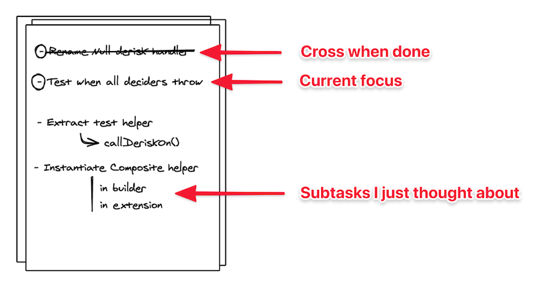
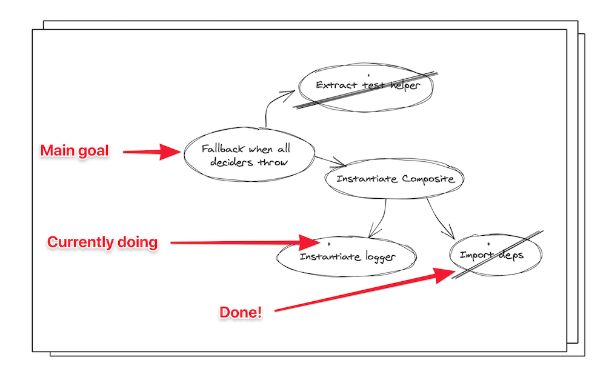
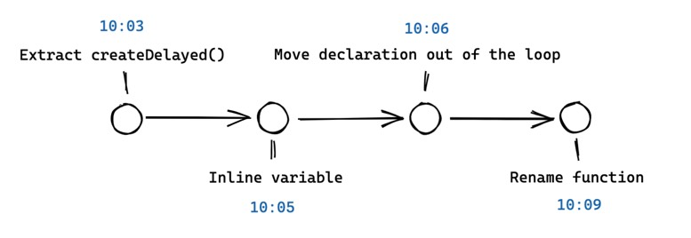
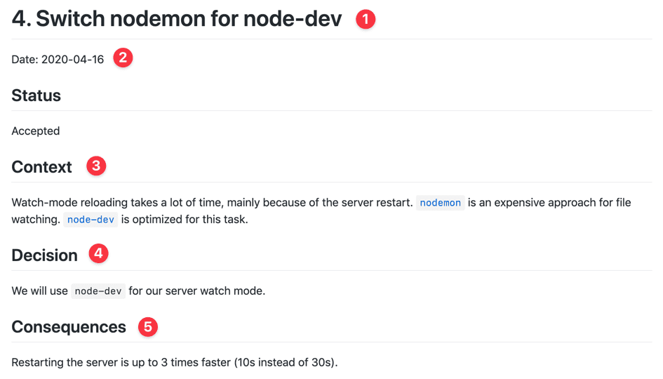
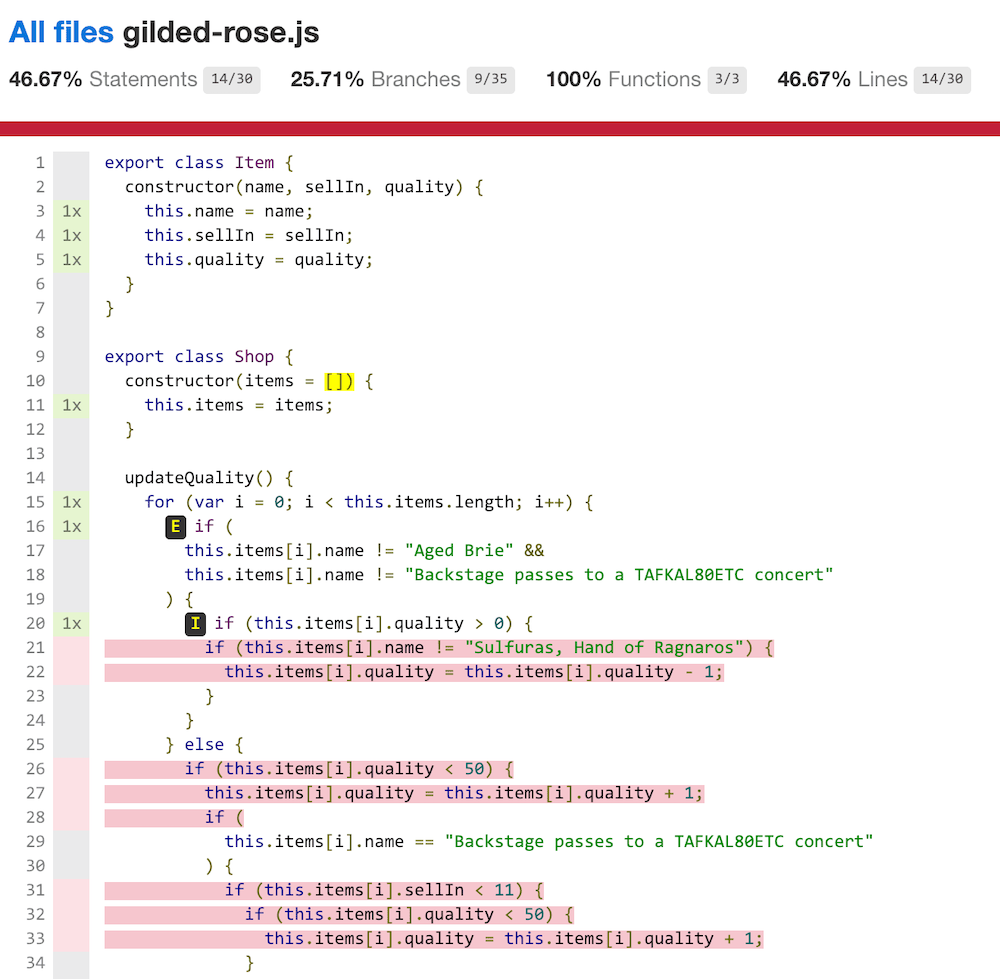
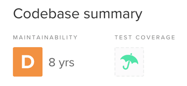
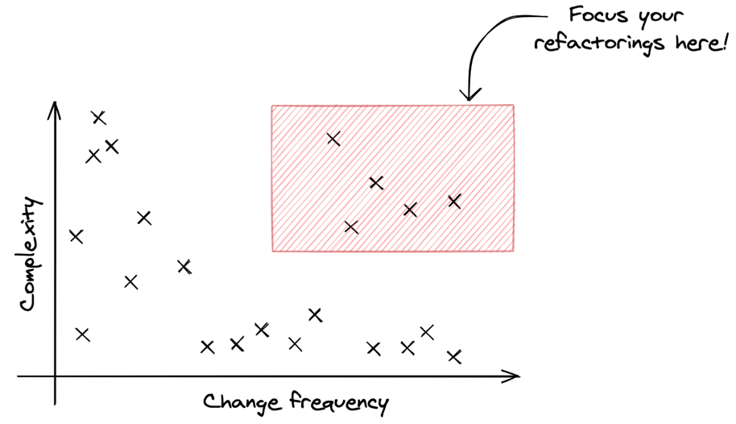
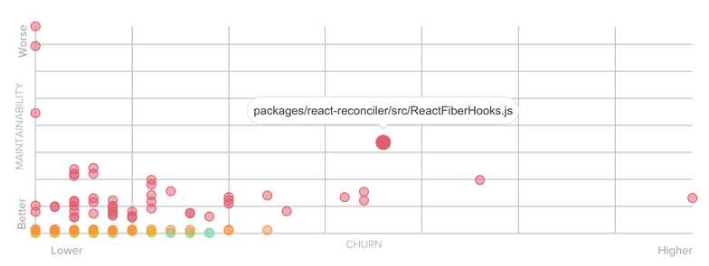

_🇫🇷 Si tu souhaites lire cet article en français, je l’ai écris à l’origine [en tant qu’article invité sur jesuisundev.com](https://www.jesuisundev.com/7-techniques-pour-reprendre-le-controle-de-ton-legacy-code/)._

<iframe width="560" height="315" src="https://www.youtube-nocookie.com/embed/f3B8CqL1Pbg" frameborder="0" allow="accelerometer; autoplay; encrypted-media; gyroscope; picture-in-picture" allowfullscreen></iframe>

_☝ Here's the recorded talk. If you prefer to read, go ahead with the article._

Let's face it: we spend most of our time changing existing code. Usually, we didn't even write that code in the first place. Often, there's no test. Sometimes, the authors of the code are long gone! And yet, we have to understand and modify this code – without introducing any bug, thank you.

You'd love to change any part of the code with confidence… but you never have time! This change has been estimated as a 2-day task and there are many others to ship before the end of the Sprint/demo to the client/delivery/_<insert your deadline here\>_. Nightmare!

But what if you had a secret weapon? Techniques to approach this Legacy efficiently, reach your goal without getting distracted with all the Technical Debt? You could regain control of this project and make it easier to maintain, each iteration!

Working on Legacy Code is indeed no fun… but it could be.

Here are 7 concrete techniques that will help you regain control of your Legacy.

## 1. The Brain Dump 🧠

Your brain is not optimized to memorize a lot of things. You can only juggle with a limited number of thoughts.

The problem is: your Legacy is a jungle. It's full of badly named variables, non-standard structures, useless indirections, bad abstractions… To reach your goal, you need to go through a lot of traps you can't anticipate. When you move something, you reveal 3 more issues that were hidden behind!

If you try to juggle with all of these things in your head, you'll get lost.

It's the "I'm almost done on this ticket" effect. You have been repeating that for the past 3 days during stand-up. This usually ends up with Pull Requests that are too long and contain many more changes than expected.

You need to get these ideas out to not getting lost. The easiest way to do that is **a sheet of paper**.

Take a sheet and a pencil. Start by dumbing everything you want to do on this code. Write down a TODO list.

Then, choose a first task and start doing it.

As you move on this task, you'll have new ideas. New tasks that you discover. Refactors you want to do. When it happens, don't do them: **write them down!**



Writing them down on your piece of paper has 2 main benefits:

1. **You calm your mind.** It knows information is out of your head and you won't forget it. Thus, you'll stop rehashing this idea every 5 minutes and you can focus on the ongoing task!
2. **You'll avoid the tunnel effect.** You'll end what you started before you start something else. You'll cross off the task that is done, commit, and take a break! You'll have a clearer vision of your progress instead of a vague feeling of "almost done".

If you know [the GTD method](https://gettingthingsdone.com/), this will feel familiar.

## 2. The Mikado Method 🥢

The Mikado Method is a similar concept than the Brain Dump, but with more structure. It's perfect when you want to reach a particular goal and you don't know what will get in your way.

Here again, you just need a sheet and a pencil.

Start writing down your main goal. Circle it twice. Then, try to achieve it.

If you realize you need something else to do this task, do these 2 very important things:

1. Cancel your pending changes (`git reset --hard`)
2. Write down the subtask you need to do and link it to the main task.

Then, start over from the subtask. Iterate if you realize you miss something again.



At some point, the subtask will be so small that you'll be able to do it without trouble. Great! Commit that, cross off that task, and celebrate internally!

Then, take another subtask and continue. As you achieve subtasks, you make the main one easier. At some point, doing it will be really easy!

Just like the Brain Dump, you'll feel less stressed and you'll have a better view of your progress. You'll be able to push intermediate Pull Requests that will progressively make the main goal easier to achieve.

If you want to learn more, I've dedicated [a full post on this](../a-process-to-do-safe-changes-in-a-complex-codebase) and [there's a book on that](https://www.manning.com/books/the-mikado-method).

## 3. Over-committing ➿

When you work on Legacy Code, it's very easy to get stuck in a position where nothing works anymore and you don't really know why.

In this context, I recommend taking a safer approach.

I mean, if only you had a way to have checkpoints for every single step you take in the right direction! With this, you won't have to start over again if you do one or two wrong moves. You could just go back to the last checkpoint!

Well, this is _exactly_ where your version control system excels. Create checkpoints.

My advice: when you work on Legacy Code, commit very very very often. You should commit more often than you imagine. Here are 2 options:

1. **Commit every 5 minutes.** That's easy to do, you only need a timer. Each time it rings, commit and run the timer again.
2. **If you practice the Mikado Method, commit every subtask you achieve.** The technique is optimized to make you do small changes, therefore it's perfect for frequent commits.



It's OK if your commit messages are messy or duplicated. You can (should) edit them before you push on the shared repository. I frequently create commits that I squash later. Having too many commits will help you more than not having enough.

Practice this technique and you'll see the quality of your Pull Requests raise up after a few weeks. But most of all, you'll have your checkpoints!

## 4. ADRs 📝

Sometimes, you'll hit a very annoying obstacle: lack of context.

It's terrible when you don't know why something is written that way. It makes you face a dilemma: keep the code as it is and work around, or change it and take the risk of breaking something unexpected. At best, this will just take longer to solve. Tracing back to the original decision behind the code you have in front of you feels like archaeology, and it's not easy!

Unfortunately, I don't have a magic spell to generate missing documentation for you. But I still have a technique that will stop your code from bleeding so hard. Here's an advice that's more pragmatic than "just write the doc".

Meet **Architecture Decision Records** (ADRs).

Here's the concept: each time you make a non-trivial decision, write a note about it. The good news is that you don't really have to maintain this note. It captures the "why" behind your decision like a snapshot. Your future self will thank you for taking 5 extra minutes to write this down!

Here's what it looks like:



The structure is simple:

1. The title that recaps the decision you're taking
2. The date
3. Context around this decision. Explain why you're going this way instead of another. Describe your constraints, what you know, how things work today, etc. Everything that motivates this decision.
4. The decision itself
5. Consequences of this decision, good and bad. Maybe this comes with compromise, document them!

Keep ADRs versioned along with the code. It's simple, easy to find, and to search when you're looking for a particular decision.

Make a habit to write these ADRs. It's a little investment that quickly pays off. From my experience, that also helps the reviewer of the Pull Request!

Finally, I'd recommend you use [the adr-tools CLI](https://github.com/npryce/adr-tools). It makes all of this so easy that you won't have any excuse not to write them.

If you want to learn more about ADRs, [I wrote a detailed post on this topic](../earn-maintainers-esteem-with-adrs) too.

## 5. Approval Testing ✅

This technique feels like a secret weapon.

This is the fastest way I know to write tests on existing code, so you can refactor it safely.

You may know it under a different name: Characterization Tests, Golden Master, or Snapshot Tests.

It comes in 3 main steps:

1. 📸 Generate an output you can snapshot
2. ✅ Use test coverage to find all input combinations
3. 👽 Use mutations to verify your snapshots

### 1. 📸 Generate an output you can snapshot

The first step is also the most complex. Generate a text you can write in some file: this will be your snapshot.

If the code you're testing returns a value, you already have it. Otherwise, you'll likely need to intercept calls made in your code to log the parameters that are given… A different approach is to introduce logs in your code.

Here's an example using the Jest library, in JavaScript:

```js
it("should update quality", () => {
  expect(updateQuality("foo", 0, 0)).toMatchSnapshot()
})
```

The first time you run the test, it passes and stores the result in a file. Then, it compares the result of further runs with the one that was stored. If it's different, the test will fail. The idea is to detect if anything changed!

### 2. ✅ Use test coverage to find all input combinations

Once you have your first snapshot, you have 1 scenario covered. There is certainly much more you need to find out before you can feel confident changing your code.

This is where test coverage is a very useful tool. It tells you which code is not tested!

Here's an example:



Red lines are the ones that are not covered. Your goal is to have no red line. Change all inputs you can so you cover as many scenarios as possible!

### 3. 👽 Use mutations to verify your snapshots

Once you've covered everything with tests, there's one last thing to check: that you're actually covering the code.

This is the limit of test coverage: it doesn't prove the quality of your tests. You can have 100% test coverage without testing much. This is why I never set a % of test coverage as a metric. It's a useful tool, but it can't be an objective.

How do you quickly verify the quality of your tests? By introducing "mutations". Concretely, this means you should introduce bugs in the source code deliberately, so you can check a test is failing.

My preferred way of doing so is to comment code. Comment a line of code, then run the tests:

- If they fail, you can rejoice to know that you have a safety net if you introduce a bug here.
- If they pass, you need to find the combination of the missing inputs that will cover this scenario.

### Why does it work?

When you're done, you can restructure your code safely. If you do a mistake, you'll know immediately. That's when it pays off and you save so much time!

You don't really need to understand what the code does before you can apply the technique, which is a clear benefit. Consider that the code is working a certain way and you want to preserve that.

I was able to write tests in a couple of hours instead of days thanks to this technique.

However, I need to warn you: **you can't keep these tests around!**

The main issue with snapshot tests is that they will fail anytime the behavior of the code changes. That's great when you need to refactor the code. That's noisy when you need to actually modify the behavior of the code.

If you keep these tests, your team will get used that tests fail after every change. They'll just get used to updating the snapshots, without really paying attention to what's failing. When a team behaves like this, I make them delete these tests. They are not worth it.

Therefore, as tempting as it can be, you shouldn't write snapshot tests in general. The only very valid use-case is the Approval Testing technique.

Approval Testing allows you to refactor code in no time with _temporary_ snapshot tests.

## 6. Hotspots Analysis 🎯

The best way to regain control over Legacy Code is to improve it progressively. Add tests, refactor some code each and every Pull Request. Make time your best ally.

But where should you start?

If you try to run static code analysis on your codebase, I bet you'll see you've accumulated way too much Technical Debt. Take [the React.js codebase](https://github.com/facebook/react/) for example. [CodeClimate](https://docs.codeclimate.com/docs/churn) says it has accumulated 8 years of Technical Debt:



This means it would take 8 years for a developer to fix all of these issues. This is absurd. You better focus on what matters. But how to find out what matters?

People usually focus on the gravity of the issues. They'll focus on "critical" issues, thinking it's a good start. It's a mistake.

The thing is, code complexity is not enough to prioritize refactoring. To be efficient, you need to combine it with another metric: change frequency — aka _Churn_.

Think about it: if code is a real mess but you never have to touch it, who cares? Focus on complex code that is frequently changed. These are **Hotspots**.



Many tools will give you some complexity score for each file in your codebase. This often varies per language.

You already have Churn information… in your version control system! If you're using git, you can use this command from any repository to get the list of the 50 most modified files from the past year:

```bash
git log --format=format: --name-only --since=12.month \
 | egrep -v '^\$' \
 | sort \
 | uniq -c \
 | sort -nr \
 | head -50
```

This kind of analysis will make you make smart decisions and have fast results.

Thanks to CodeClimate, I know where I'd start if I really wanted to improve React codebase:



If you need to convince non-technical people about refactoring work, I've detailed [how you can generate visual graphs of your Hotspots](../convince-management-to-address-tech-debt-with-enclosure-diagrams).

## 7. Katas 🥋

Finally, here's a technique that's really a piece of advice: you should practice.

Working with Legacy Code is a skill you can learn. Reading and understanding code that lacks tests and documentation is a muscle you can develop.

However, your Legacy codebase isn't the best place to practice. Complexity is maximal and time constraints will force you to stay in your comfort zone so you can ship in time.

Ideally, you need a playground where you have just enough complexity to take some risks. There are plenty of code exercises to practiced development skills. These are called katas as they're meant to be tackled again and again until you know the moves. But most katas start from scratch.

This is why I searched for 5 exercises that are perfect to practice refactoring skills. I sorted them by increasing complexity:

1. [The Gilded Rose kata](https://github.com/emilybache/GildedRose-Refactoring-Kata) is the best to start with. I frequently use this one to illustrate techniques. This is what I was using earlier to show you the Approval Testing! There's no database, no HTTP call. Just dirty code that you need to understand and change. Perfect to begin with!
2. [The Tennis Refactoring kata](https://github.com/emilybache/Tennis-Refactoring-Kata) shares the same spirit. The constraint is a bit different though: you only have 1.5h left to improve the code that was written by a colleague. What can you do? I like it because it forces you to focus and know when to stop.
3. [The Trip Service kata](https://github.com/sandromancuso/trip-service-kata) introduces the notion of "annoying dependency". It simulates calls to a database or HTTP server, so you have to find workarounds to write tests over the existing logic.
4. [The Trivia kata](https://github.com/jbrains/trivia) is a complete exercise. Code is dirty, there are problematic dependencies, there is no test… This is the kind of kata you practice when you attend Legacy Coderetreat (events dedicated to learning to deal with Legacy Code). I won't recommend you to start with this one.
5. [The Baby Steps Timer kata](https://github.com/dtanzer/babystepstimer) is similar to the Trivia kata but is focused on front-end. This is a great exercise when you're working with a Single Page Application and you realize that React/Angular/Vue.js didn't solve all your problems.

With these 5 playgrounds, you have plenty of room to practice the different techniques I presented you here.

When to practice? Well, of course, you could take on your own free time if you can afford it. Solo at home or with friends, even with strangers. I'm very into meetups and coding dojos. But I also have a baby girl, thus other priorities to juggle with.

Therefore, I promote a different approach: **professional training**. These exercises are meant to make you a better, more efficient developer. Your company should probably invest in training every year. Check if you can dedicate some training to practice on these, at work.

Knowing how to work with Legacy Code is a worthy investment for your career than learning about framework X or Y that's trendy. Companies desperately need efficient, mature developers.

## My last advice

Voilà. You now have 7 techniques to regain control of your Legacy.

**Pick one and practice it the next time you work!**

Working on Legacy is no fun… when you don't know how to reverse the steam. By mastering a few techniques like these, your vision of Legacy will change. It won't feel like an imposed burden, but as a challenge that you know how to solve. This is an investment in your own, daily, personal development!

Take care 👋
