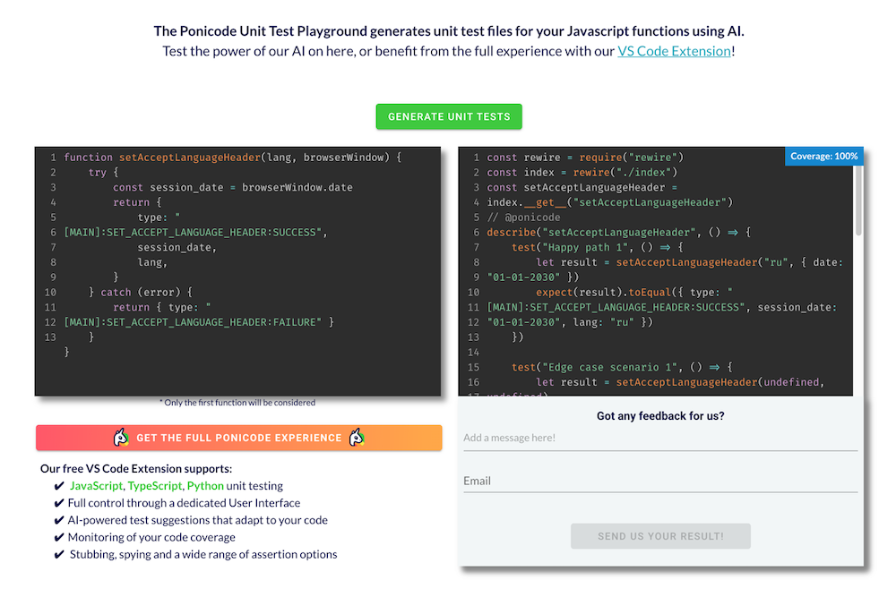
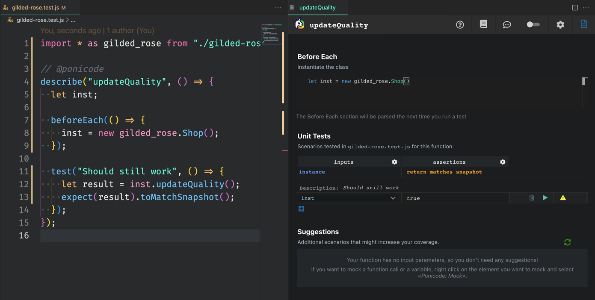
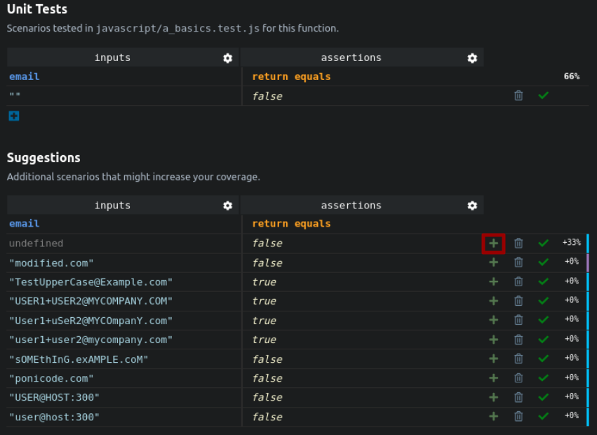

A tool recently grabbed my attention: [Ponicode](https://www.ponicode.com/).

It describes itself as a tool focused on allowing teams to meet deadlines, without sacrificing code quality. That's great: delivering value AND improving code quality is the balance I try to bring to the projects I'm working on.

Funnily enough, "code quality" is usually what makes the team preserve a high velocity, as they spend less time debugging and fixing bugs over time. But I know very well the challenge of getting the team to invest in practices they aren't familiar with, like testing and refactoring.


What intrigued me the most with Ponicode was the following claim:

> Thanks to the power of artificial intelligence we can help you do it faster than ever.

At this point, I never used AI-based tools to help me tame a Legacy codebase.

The challenge with Legacy Code is that:

- we don't know what it does (lack of docs, tests, etc.)
- we need to change it

Therefore, most techniques I know will focus either on:

- retrieving the knowledge of the code ([behavioral analysis](https://understandlegacycode.com/behavioral-analysis/), [approval testing](https://understandlegacycode.com/approval-tests/), etc.)
- minimizing risky changes

Can AI make this work faster? Can Ponicode turn you into a "Code Quality Hero"?

Let's try their unit testing assistant 🤠

## Setting up Ponicode

Ponicode provides a VS Code extension that works for JavaScript, TypeScript, and Python projects. It's free and will assist you to create unit tests on existing code.

You can get it running [by following the instructions here](https://www.ponicode.com/developers).

They even have [a playground](https://playground.ponicode.com/unit-test) where you can see the "AI-based test generation" in action. Put a function on the left side, click the button, and 💥 MAGIC 💥 the tests got generated on the right:



Besides having some Ponicode specific code (`@ponicode`, `index.__get__()` that's specific to the playground), the generated tests are interesting indeed. AI seems to provide different inputs and capture the outputs by itself.

Very quickly we got some tests written. The tests labels aren't good (`"Happy path N"`), but it's the kind of labels you would come up with Approval Testing too.

Now, that was for the commercial demo. Let's try that on actual code.

## The Expense Report kata

Let's stay in the playground for a bit. It seems that you can drop any kind of function, click on the button, and see your tests being generated.

I know a refactoring kata that involves a simple function that has no test. It's a good exercise for:

1. Writing the missing tests
2. Refactor the code
3. Add new behavior, which should be much simpler after the code is refactored

This is the [Expense Report kata](https://github.com/christianhujer/expensereport/). Let's use the JavaScript version that [you can find here](https://github.com/christianhujer/expensereport/blob/trunk/expensereport-javascript/Expenses.js):

```js
const type = {
  BREAKFAST: 1,
  DINNER: 2,
  CAR_RENTAL: 3,
}

function printReport(expenses) {
  let total = 0
  let mealExpenses = 0

  process.stdout.write(
    "Expenses " + new Date().toISOString().slice(0, 10) + "\n"
  )

  for (const expense of expenses) {
    if (expense.type == type.DINNER || expense.type == type.BREAKFAST) {
      mealExpenses += expense.amount
    }

    let expenseName
    switch (expense.type) {
      case type.DINNER:
        expenseName = "Dinner"
        break
      case type.BREAKFAST:
        expenseName = "Breakfast"
        break
      case type.CAR_RENTAL:
        expenseName = "Car Rental"
        break
    }

    const mealOverExpensesMarker =
      (expense.type == type.DINNER && expense.amount > 5000) ||
      (expense.type == type.BREAKFAST && expense.amount > 1000)
        ? "X"
        : " "

    process.stdout.write(
      expenseName + "\t" + expense.amount + "\t" + mealOverExpensesMarker
    )
    total += expense.amount
  }

  process.stdout.write("Meal expenses: " + mealExpenses)
  process.stdout.write("Total expenses: " + total)
}
```

After dropping this code input, I would click on **Generate Unit Tests** and wait for the generated tests. Unfortunately, they are disappointing:

```js
const rewire = require("rewire")
const index = rewire("./index")
const printReport = index.__get__("printReport")
// @ponicode
describe("printReport", () => {
  test("Happy path 1", () => {
    // Function threw: process is not defined
    printReport(false)
  })

  test("Happy path 2", () => {
    // Function threw: process is not defined
    printReport(true)
  })

  test("Edge case scenario 1", () => {
    // Function threw: process is not defined
    printReport(undefined)
  })
})
```

I'm not really sure what happened here. `expenses` was supposed to be a list of `expense` (which sounds like an object). The output ought to be a report string, written in `process.stdout`.

Yet, the generated tests aren't doing much. It seems that AI failed us here 🤔

I tried to separate the Command (print to stdout) from the Query (get me the report string) so the function would only return a string… but no luck.

So that's disappointing. But that was the playground. Let's see if the VS Code extension can actually be helpful!

## The Gilded Rose Kata

I installed [Ponicode's VS Code extension](https://marketplace.visualstudio.com/items?itemName=ponicode.ponicode) and wanted to experiment with the tool on the most popular refactoring kata that I know: [the Gilded Rose kata](https://github.com/emilybache/GildedRose-Refactoring-Kata).

Gilded Rose is an excellent refactoring kata to get started!

It's [the one I recommend you to start with](https://understandlegacycode.com/blog/5-coding-exercises-to-practice-refactoring-legacy-code/) if you never practiced a refactoring kata before. It contains mangled code logic… but it's only pure logic. No stdout, database, or HTTP call in the mix to get in your way. It's a gentle starter.

To be honest, I was also afraid it would be biased. Since it's the most popular of refactoring kata, I thought Ponicode's AI would already know the tests to write based on their data set. Still, it would have been a good starting point to assess the usefulness of the tool in such a context.

Boy, I was wrong!

### The VS Code extension

Ponicode's extension gives you a GUI from which you can write and configure the tests that will be generated:



The generated test was the following:

```js
import * as gilded_rose from "./gilded-rose"

// @ponicode
describe("updateQuality", () => {
  let inst

  beforeEach(() => {
    inst = new gilded_rose.Shop()
  })

  test("Should still work", () => {
    let result = inst.updateQuality()
    expect(result).toMatchSnapshot()
  })
})
```

I'm putting aside the style of the generated code which is different than what I would write. If I don't need to write and read that code, it doesn't really matter, right?

Still, there are a couple of issues with this:

1. **Suggested tests are not helpful**. It won't prefill the `Shop` with relevant `Items`. It simply instantiates an empty shop and calls `updateQuality()` on it. Pretty much like the playground, it doesn't work on this example.
1. **The tool can't run snapshot tests by itself**. So Approval Tests can't be executed from the tool.
1. **There's no way to test different inputs easily**. The instantiation of the class is done in `beforeEach()`. I didn't find a way to instantiate with different values.

The tool may work if:

- You know what the expected values are
- You are testing a function, not a class, nor a closure

But the tool also has a cost: the GUI is an added abstraction that you need to learn.

At this point, I lost more time learning how to write tests through the UI than writing the test code myself.

### What it looks like to solve this kata?

For the record, a typical [Approval Tests](https://understandlegacycode.com/approval-tests/) solution to this kata would look like this:

```jsx
import { Item, Shop } from "./gilded-rose"

describe("Gilded Rose", () => {
  it("should update quality", () => {
    expect(doUpdateQuality).toVerifyAllCombinations(
      [
        "foo",
        "Aged Brie",
        "Backstage passes to a TAFKAL80ETC concert",
        "Sulfuras, Hand of Ragnaros",
      ],
      [-1, 0, 2, 6, 11],
      [0, 1, 49, 50]
    )
  })

  function doUpdateQuality(name, sellIn, quality) {
    const gildedRose = new Shop([new Item(name, sellIn, quality)])
    const items = gildedRose.updateQuality()
    return items[0]
  }
})
```

That is not long to type. The whole trick consists of quickly combining all sorts of possible inputs (here, 80 combinations are generated).

Unfortunately, **you can't do that with Ponicode**. It will require you to write the 80 individual tests by yourself 😬

It might suggest you inputs/assertions to add, but you very much need to handle that manually:



[Approval Testing](https://understandlegacycode.com/approval-tests/) is a much faster way to cover existing code with tests. That's because you don't really need to understand what the code is doing.

What you want is to **preserve the existing behavior**. The remaining challenge is to find all of the inputs that would cover the possible scenarios and a way to capture the behavior.

In the case of the Gilded Rose kata, that's easy because there is no database call or whatever. It is pure logic.

Yet, Ponicode AI assistant wasn't able to help here 🤷‍♂️

## I wouldn't use Ponicode to write tests on Legacy Code

As of November 2021, I feel the tool isn't mature enough.

It _may_ be useful if you are not a developer but somehow need to write tests. Then it gives you a GUI you can use, that will generate the tests for you.

Maybe the AI can generate some boilerplate tests for you, to give you a headstart. That's what it says, but testing it on simple refactoring kata didn't convince me about that…

On the other hand, you will spend a lot of time building up tests that you could have written manually. Manually writing the tests allow you to refactor them, define custom assertions, build abstractions that will help me clean up the code. I will lean on the tests to safely tame the Legacy Codebase.

Ponicode assistant falls short:

- Generated code has a style that may not fit the codebase. It adds friction to maintaining the tests themselves!
- It doesn't automagically create the different inputs/outputs for you on regular logic. AI failed us here 😢
- You are limited in what you can do. If the tool didn't implement it, you are stuck.

## Can AI-based tools help you test Legacy Code?

I started with this question. While I explained why Ponicode solution won't do the job (for now), I think we need to distinct that specific tool from the theory.

Let's take a step back and think about the problem we are trying to solve.

In my experience, you end up in this situation:

- You need to change existing code
- You don't feel confident you know everything that code may impact
- You are afraid to break something unexpectedly when doing the change
- You don't see a quick way to verify the side-effects
- You have a time constraint to deliver your change

In general, developers in this situation will do the change, test the effects as much as they can, cross fingers and move on. Often, some regressions will appear and they will have to fix bugs later on. Sometimes they become urgent fires.

Generally, that's how you enter an endless state of maintenance. Spending a good chunk of your time fixing bugs that previous changes introduced, probably introducing new ones. 😩

**[Approval Testing](https://understandlegacycode.com/approval-tests/) is a way to quickly put existing code under tests**. Instead of spending days writing tests on code that you don't know, it will only take you hours!

It doesn't solve the following problems though:

1. If it does side effects, how do you capture the behavior? E.g. it writes data into some database.
2. How do you figure out all the explicit parameters and the implicit ones (e.g. global variables) to run a specific scenario?

I think the 2nd point is where AI could help. Based on enough data and experience, it may be able to provide relevant combinations that would take you longer to figure out.

I believe AI can be a tool you would use to do this kind of work faster. You still need to be in control. It would be some sort of _copilot_ ([if you see what I mean](https://copilot.github.com/) 😉). That may save you some time.

Unfortunately, **Ponicode can't do that today**. I don't know any other tool that could help with that.

Do you?
