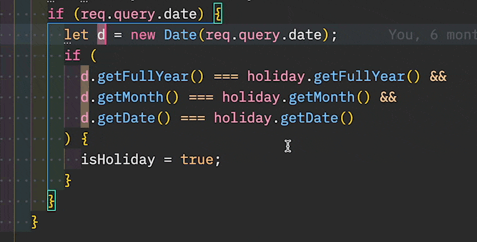
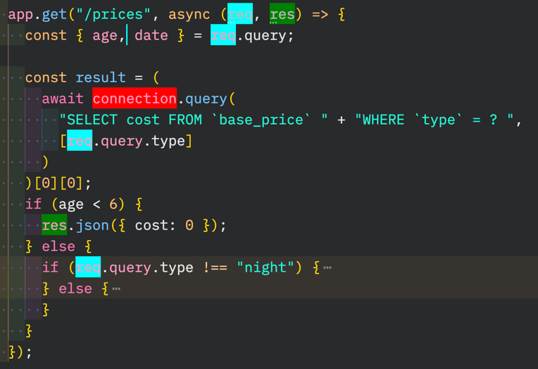
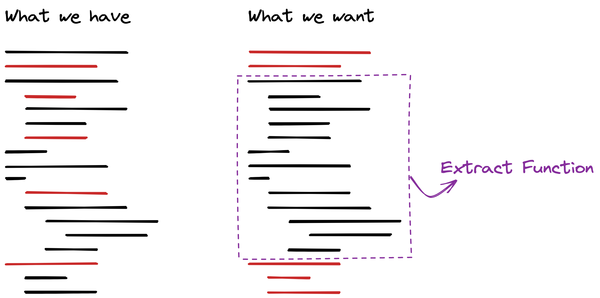
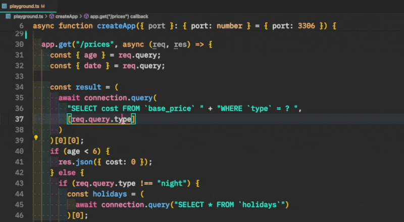
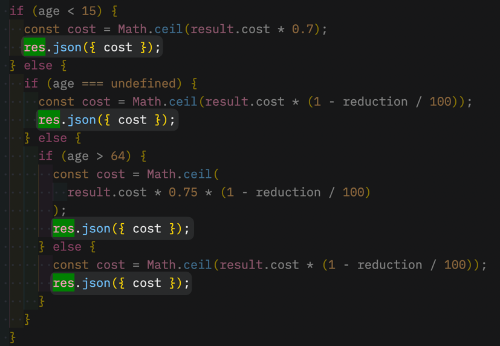
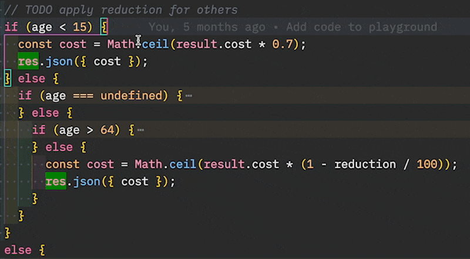
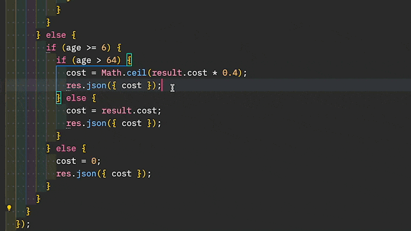

_This is Part 2 of a 3-post series. You can read:_

- [Part 1](https://understandlegacycode.com/blog/one-way-of-refactoring-untested-code/), _where I presented you with a first approach (Test First)_
- [Part 3](https://understandlegacycode.com/blog/comparing-two-approaches-refactoring-untested-code/), _where I compare both approaches_

**Untested code.**

You are not the one who wrote it. Yet, it’s your job today to change it. It should support some new behavior. The question is: how do you make the change without breaking anything? 🤔

[In another article](https://understandlegacycode.com/blog/one-way-of-refactoring-untested-code/), I detailed one way of refactoring legacy code. That is the classic approach. The one many experienced developers would recommend, including me:

1. **Write high-level, integrated tests** that will involve an actual MySQL database and HTTP calls
2. **Refactor** the Business Logic (Domain) out of the I/O (Infrastructure)
3. **Pull down most of the integrated tests** to write isolated tests on the Domain code instead

If you don’t have tests and you need to update that code, **write the missing tests first**.

## This is not easy stuff

The first step is usually the most difficult.

You need to write automated tests on some code that wasn’t designed with tests in mind. Many things get in the way and you have to find solutions to run your app with a database and third-parties. Since you don’t know how the application works in detail, you don’t want to mock too much. You want to test the real thing. This is a challenge that takes time and skills…

On real projects, most of us lack these skills. Adding tests on existing code that we didn’t write isn’t something we practice.

Furthermore, deadlines keep developers under pressure. We generally feel like we don’t have time to experiment with this. So we fall back to the only way we know: do blind changes the best we can, crossing our fingers no bad regression will happen. We also restrict ourselves from changing the code that doesn’t absolutely need to be changed, because it’s risky.

When we should spend time writing the missing tests to make further changes safer and faster, we don’t invest that time. **And it gets worse.**

But still, in my experience, the major blocker to adopting the recommended approach is the time it would take to achieve the first step:

1. **Write high-level, integrated tests** that will involve an actual MySQL database and HTTP calls

If that’s YOUR blocker, I have great news!

There is a way to get _most_ of the existing code under tests, without having to write all the high-level tests first. It’s a middle-ground, which means:

- It won’t be as safe as the recommended approach
- But it will be faster to perform

I practiced this alternative approach on [the Lift Pass Pricing refactoring kata](https://github.com/martinsson/Refactoring-Kata-Lift-Pass-Pricing) — the same exercise I used to present the recommended approach. It also takes skills (thus practice) to do it safely. Regardless, I’m convinced it’s a safer approach than not writing the tests at all.

Let’s dive in.

## An alternative approach

The approach to test _most_ of the code faster is shorter:

1. **Refactor** the Business Logic (Domain) out of the I/O (Infrastructure) **using safe refactorings**
2. **Write isolated tests** on the Domain code

Unlike the recommended approach, we start by touching the code before we even have tests!

Yes, this is risky. Hopefully, we can reduce that risk. It depends on how we touch the code. There are practices that make touching the code safer:

- Automated refactorings using a tool you trust
- Manual refactorings that follow a proven recipe
- Smaller refactorings
- Automated tests covering the change

In our situation, we don’t have the tests to cover our changes. We could manually test behavior after each change we make, but that’s usually tedious and time-consuming. If we had so much time, it would be wiser to follow the recommended approach instead.

Therefore, we should resort to small, automated, or scripted refactorings as much as possible until we can finally write some tests!

In fact, what we want is to refactor _just enough_ code, so we make it easier to write missing tests.

Let’s see that in practice.

## Step One: refactor using safe moves

So the first step is to refactor right away, using “safe refactorings”.

> But what is safe refactoring?

I would say that it’s a code transformation that is proven to not change the behavior of the code. Ideally, think of [Arlo’s Provable Refactorings](https://github.com/digdeeproots/provable-refactorings). In practice, you can assume automated refactorings from popular tools to be safe most of the time. These tools are more developed with statically typed and popular languages—Java and C# devs often have more options than Python ones.

Finally, following a well-documented refactoring recipe manually is often safe. I’m talking about Martin Fowler’s [Refactorings](https://www.martinfowler.com/books/refactoring.html) for instance. Automated is best, but closely following the recipe is acceptable.

A common example of refactoring that is usually safe in most languages is **Rename Symbol**. Your IDE can generally do that. It’s faster and safer than changing all occurrences of a variable name by hand.



Since we don’t have tests, we need to be extra careful when touching the code. Therefore, I would rely as much as possible on refactorings that are either:

- Automated by my editor
- Strictly following a well-known recipe

The goal is to get most of the code in a state where it’s easy to write tests. The Infrastructure code is what is making the code difficult to test. All of the database and third-party API calls. Things that depend on time, randomness, etc. In fact, anything that is outside of your control. Thus, if you can isolate the rest of the code logic from these things, you will at least be able to cover this logic with tests easily.

And it turns out this can usually be done with only a handful of refactoring moves:

- Extract Variable
- Inline Variable
- Rename Symbol
- Extract Function
- Split declaration and assignment
- Slide Statements
- Pull Down Common Tail of Conditional

### Identify the Infrastructure bits

Enough with the theory, let me show you what it looks like on [the coding kata](https://github.com/martinsson/Refactoring-Kata-Lift-Pass-Pricing).

The very first thing I do is to identify what’s in the way: the Infrastructure. If I can, I like to highlight these bits in the code in some way. That depends on your tooling. A low-tech way of doing so would be to simply print the code and mark the relevant parts with a highlighter—printing code is actually a practice recommended [in Felienne’s book](https://understandlegacycode.com/blog/key-points-of-programmer-brain/).

Personally, I’m currently working on a VS Code extension to highlight multiple symbols in JavaScript code. I will use it to identify the references that are outside of my control for the function I want to refactor.

In this case, these are:

- `req`, which represents the HTTP request that’s coming from [the Express.js framework](https://expressjs.com/)
- `res`, which represents the HTTP response my controller should send, also coming from Express
- `connection`, which is an instance of some library to communicate with the MySQL database



From this, I can see most of the highlighted symbols will be at the very top and the very bottom of the function. Some of them will be in the middle.

### Peel & Slice

In most situations, I either want to:

1. Extract the Infrastructure bits in references that I can alter in tests (also called _Seams_)
2. Push the Infrastructure bits above and below the Domain code, so I can extract it

In this case, I think option #2 is more practical. To do so, I will use the Peel and Slice technique that [Llewellyn Falco presented in this 5min video](https://www.youtube.com/watch?v=sXqRWXWiXYo&list=PLb4ON7iRsxZNNqZuA2dlQOW3MOQwQ6AjM&index=3).



There are 3 references to either pull up or push down this method: `req`, `res`, and `connection`.

### Pulling `req` up

`req` naturally appears at the top. In fact, it’s only used to access request parameters. Therefore, instead of referencing it across the function, we could use **[Extract Variable](https://refactoring.com/catalog/extractVariable.html)** to pull the reference at the top of the function.

This refactoring can often be automated. Check out what your editor can do for you.

In this example, I’m using my own VS Code extension: [Abracadabra](https://marketplace.visualstudio.com/items?itemName=nicoespeon.abracadabra).



Repeat, and very quickly all references to `req` will be limited to the top of the function.

[Check the diff](https://github.com/nicoespeon/Refactoring-Kata-Lift-Pass-Pricing/commit/9be22c1c5bb5d72a902fbe1d7699ba283bb34735).

### Pushing `res` down

On the other hand, `res` naturally appears at the bottom of the function. Or rather, wherever we exit. It’s the response to the user.

Therefore, pushing the reference to the very end of the function would be more convenient! But how to _safely_ do that?

A quick check and it’s clear that there is a pattern: we always call `res.json()` with a response object as a parameter. Even better here: the response object always follows the `{ cost }` schema. Thus, the goal here is to have all calls look similar: `res.json({ cost })`.

To do so, I will use **Extract Variable** again on each individual occurrence. Even where it seems weird. It’s better to trust the process and take baby steps than be clever here—remember we don’t have tests!


If you watch closely, you will notice that’s not always lean and smooth as for the first 2 occurrences. The 3rd occurrence was a bit annoying since there was already an intermediate variable called `cost`.

I did get rid of the problem by leaning on 2 other (automated) refactorings:

- **Rename Symbol**, to use a temporary name and free the name `cost`
- **[Inline Variable](https://refactoring.guru/inline-temp)**, to inline the temporary variable in the new `cost` that I extracted

This is how you can very quickly compose atomic, safe moves to compose bigger refactorings.

Keep doing that for each individual instance. Very soon you end up with a repeated `res.json({ cost })` in all the conditional branches.



But that’s not enough. Each statement is returning a different variable. It would be ideal if that would be the same `cost` variable referenced in each call. That way, all calls would actually be the same.

To do so, we can **Split declaration and assignment** on each declaration of `cost`. If your editor doesn’t support that, it’s a safe and relatively easy refactoring to do manually:

1. Declare a mutable variable without assignment above the one you want to split, using the same name
2. Remove the variable declaration of your variable to only keep the assignment step

Using Abracadabra, this refactoring is automated for me:



Once all the `cost` declarations and assignments have been split, we can proceed to a refactoring move that is safe in this case, but not always (it’s situational): **[Slide Statements](https://refactoring.com/catalog/slideStatements.html)**. More specifically, we want to enlarge the scope of the `cost` declaration, so we can merge all of them together.

It’s a safe move here because it’s a variable we just introduced and it’s not used elsewhere in our scope. Thus, making the scope larger won’t change the behavior of the code.

After we have moved the declaration of `cost` higher, we merge all declarations by removing the duplicates:


At this point, all `res.json({ cost })` are the same. The question is: can we push them down?

It depends. The refactoring move we would like to make at this point is “**Pull Down Common Tail of Conditional**”, which is not a very documented one, yet it may be automated!

```
if (condition)
  if-clause
  **tail**
else
  else-clause
  **tail**
end
```

Is equivalent to:

```
if (condition)
  if-clause
else
  else-clause
end
**tail**
```

If the `tail` code consists of whole statements and doesn’t rely on references that are unique to the if or else clauses. See [this article](https://xp123.com/articles/refactoring-pull-common-code-conditional/) for more details.

Hopefully, in my situation (VS Code + JavaScript), this refactoring can be automated. Not with Abracadabra, but [with p42](https://web.archive.org/web/20221128081955/https://p42.ai/documentation/code-assist/move-last-statement-out-of-if-else) ([visual demo](https://github.com/p42ai/js-assistant/blob/01d9bce026eeea02efb17f2ce50a1fadb4fd6ba6/code-assist/move-last-statement-out-of-if-else/doc/vscode-example.gif?raw=true)) from Lars Grammel that I recommend you to use. It is unfortunately not maintained anymore, but it still has a few working refactorings like this.

Let’s start doing that from the most nested if statement until we are done:



After we are done here, there is only one `res` statement left, and it’s at the bottom of the code:

```tsx
app.get("/prices", async (req, res) => {
  const { type, date, age } = req.query

  const result = (
    // … some code we will work on next
  )[0][0]

  let cost;
  if (age < 6) {
    cost = 0
  } else {
    // … a bunch of pure-logic code
  }

  // 👇 There, a single statement at the end
  res.json({ cost })
})
```

[Check the diff](https://github.com/nicoespeon/Refactoring-Kata-Lift-Pass-Pricing/commit/c15e453802d3a8b7427722f5c24d8bee78dfe405).

### Pulling `connection` up

Finally, there are only the database calls left in the middle of our code. 2 queries are made:

1. `connection.query("SELECT cost FROM …")` that fetches the cost from the given lift type
2. `connection.query("SELECT * from`holidays`")` that fetches the holidays for further calculation

The first one is not that problematic. In fact, it’s already at the top of the function. We could as well rename `result` into `databaseCost` if we don’t know better (or `basePrice`, once we have learned more about the code 😉), then pass it to the function we will extract.

The second call is more problematic since it’s only made under some conditions (age above 6 and type is not “night”).

If we knew for sure that this call doesn’t cause any side-effect, and we don’t mind making an extra call to the database in all scenarios, then we could move the statement up and change the behavior of the code a bit:

```tsx
app.get("/prices", async (req, res) => {
  const { type, date, age } = req.query

  const basePrice = (
    await connection.query(
      "SELECT cost FROM `base_price` " + "WHERE `type` = ? ",
      [type]
    )
  )[0][0]
  // If that was an acceptable change in code's behavior
  const holidays = (await connection.query("SELECT * FROM `holidays`"))[0]

  // 👇 Then we could extract the logic that computes the cost
  const cost = calculateCost({ type, date, age, basePrice, holidays })

  res.json({ cost })
})
```

That’s interesting to consider. But let’s get back to our exercise and assume we can’t modify the behavior of the code like so—say we don’t want to make extra calls to the database when not necessary.

Therefore, we need to inject a function that will fetch the holidays when needed. So the code that we will extract in the end will look like so:

```tsx
calculateCost({ type, date, age, basePrice }, fetchHolidays)
```

Well, that’s an easy and automated refactoring to execute: **[Extract Function](https://refactoring.com/catalog/extractFunction.html).**

Select the annoying query and extract it into a `fetchHolidays` function. Keep it close to the current scope, so we have access to the `connection` variable (we can always move it up later):


### (optional) Introducing the Repository

> This is a digression, but at this point, I want to show you something interesting…

We _could_ stop here and move to the next step. But I’m not 100% happy with the signature of the `calculateCost()` method we are about to extract. There is an asymmetry with the fact that we provide a function to fetch holidays, but we provide the base price information as a parameter.

Instead of leaving the database query behind, I would like to use a similar treatment and **Extract Function** on the code that fetches the base price. Then, I would inject this function to `calculateCost()`. Like so:

```tsx
app.get("/prices", async (req, res) => {
  const { type, date, age } = req.query

  // 👇 Logic that computes the cost
  const cost = calculateCost({ type, date, age }, fetchBasePrice, fetchHolidays)

  res.json({ cost })

  async function fetchBasePrice(type) {
    /* extracted implementation */
  }
  async function fetchHolidays() {
    /* extracted implementation */
  }
})
```

It’s not strictly necessary since the first thing `calculateCost()` will do will be to fetch the base price, passing the `type`. However, that creates an opportunity for regrouping the 2 functions that retrieve information from the database into the same concept: a repository!

Well, technically, we shouldn’t have a single repository that holds all the queries to the database. In this context though, it’s OK to start with one since we don’t have much more going on.

In JavaScript, that’s a safe refactoring to make: regroup the methods into the same object:

```tsx
app.get("/prices", async (req, res) => {
  const { type, date, age } = req.query

  const cost = calculateCost(
    { type, date, age },
    // 👇 That's a repository
    { fetchBasePrice, fetchHolidays }
  )

  res.json({ cost })

  async function fetchBasePrice(type) {
    /* extracted implementation */
  }
  async function fetchHolidays() {
    /* extracted implementation */
  }
})
```

Let’s make it obvious with **Extract Variable**:

```tsx
app.get("/prices", async (req, res) => {
  const { type, date, age } = req.query
  const repository = { fetchBasePrice, fetchHolidays }

  const cost = calculateCost({ type, date, age }, repository)

  res.json({ cost })

  async function fetchBasePrice(type) {
    /* extracted implementation */
  }
  async function fetchHolidays() {
    /* extracted implementation */
  }
})
```

Then, we could **Inline Functions**:

```tsx
app.get("/prices", async (req, res) => {
  const { type, date, age } = req.query
  const repository = {
    async fetchBasePrice(type) {
      /* extracted implementation */
    },
    async fetchHolidays() {
      /* extracted implementation */
    },
  }

  const cost = calculateCost({ type, date, age }, repository)

  res.json({ cost })
})
```

Finally, it’s safe to **Slide Statements** on the whole repository declaration, since the only dependency is `connection` and it’s declared in the parent scope:

```tsx
const connection = await mysql.createConnection(connectionOptions)

const repository = {
  async fetchBasePrice(type) {
    /* extracted implementation */
  },
  async fetchHolidays() {
    /* extracted implementation */
  },
}

app.get("/prices", async (req, res) => {
  const { type, date, age } = req.query

  const cost = calculateCost({ type, date, age }, repository)

  res.json({ cost })
})
```

Our `repository` is in fact a `repositoryUsingMySQL`. We may inject a different implementation when calling `calculateCost()` in our isolated tests—as long as it fulfills the same interface and behaves similarly.

With a statically typed language (like TypeScript), these refactoring moves would have been the same. We would probably make the repository interface explicit and the compiler would ensure we don’t make a mistake when moving things around:

```tsx
interface Repository {
  fetchBasePrice(type: string): Promise<number>
  fetchHolidays(): Promise<{ holiday: Date }[]>
}
```

To go further, the repository instantiation could be extracted in a factory function, like so:

```tsx
function createRepositoryUsingMySQL(connection) {
  return {
    async fetchBasePrice(type) {
      return (
        await connection.query(
          "SELECT cost FROM `base_price` " + "WHERE `type` = ? ",
          [type]
        )
      )[0][0]
    },
    async fetchHolidays() {
      return (await connection.query("SELECT * FROM `holidays`"))[0]
    },
  }
}

// 👇 In client code
// const repository = createRepositoryUsingMySQL(connection)
```

Or it could even be a class implementing the interface:

```tsx
class RepositoryUsingMySQL implements Repository {
  // Make the constructor private to force using `.create`
  // so it's used like a function, no `new` involved
  private constructor(private readonly connection) {}

  static create(connection): RepositoryUsingMySQL {
    return new RepositoryUsingMySQL(connection)
  }

  async fetchBasePrice(type) {
    return (
      await this.connection.query(
        "SELECT cost FROM `base_price` " + "WHERE `type` = ? ",
        [type]
      )
    )[0][0]
  }

  async fetchHolidays() {
    return (await this.connection.query("SELECT * FROM `holidays`"))[0]
  }
}

// 👇 In client code
// const repository = RepositoryUsingMySQL.create(connection)
```

These approaches are similar in JavaScript. Closure or class: you do you, it doesn’t really matter.

Alright, back to the exercise!

[Check the diff](https://github.com/nicoespeon/Refactoring-Kata-Lift-Pass-Pricing/commit/a5f9355b13dd5d3e4769e3abd15272bb2e17cfbb).

### Extract Function on the Core logic

In the previous snippet, I replaced the big lump of code with a call to the `calculateCost()` function that would result from these changes. I did that for clarity. In practice, this hasn’t been done yet.

In fact, when we do the final extraction is when we can evaluate whether or not the signature is satisfying enough.

So, let’s do that final refactoring: **Extract Function** on the logic that’s in between the I/O code (`req`, `connection`, and `res`). Of course, I strongly recommend you use your editor to automate that—if you can’t, [follow the recipe](https://refactoring.guru/pt-br/extract-method):

```tsx
app.get("/prices", async (req, res) => {
  const { type, date, age } = req.query

  // 👇 Start extraction from here…
  const result = await repository.getBasePrice(type)
  let { cost } = result

  if (age < 6) {
    cost = 0
  } else {
    // a lot of code
  }
  // 👆 … until here!

  res.json({ cost })
})
```

```tsx
// You should end up with code that looks like so
app.get("/prices", async (req, res) => {
  const { type, date, age } = req.query

  const cost = calculateCost({ type, date, age }, repository)

  res.json({ cost })
})
```

[Check the diff](https://github.com/nicoespeon/Refactoring-Kata-Lift-Pass-Pricing/commit/9c5861bde5714c970e3d63ec67a1cd93fc566748).

## Step Two: write isolated tests

Once the Core logic has been extracted, **it becomes easy to write tests**.

All the problematic dependencies have been abstracted away. Thus, it becomes an exercise of testing pure logic, which is the happy zone for testing.

At this point, we probably don’t know what the code is _actually_ doing though. [Approval Tests](https://understandlegacycode.com/blog/3-steps-to-add-tests-on-existing-code-when-you-have-short-deadlines/) can help us quickly capture what the system _currently_ does. Writing these tests involves 2 steps:

1. Provide a fake implementation for the injected dependencies (here, `repository`)
2. Exercise the logic by controlling what these dependencies do

Use the test coverage to identify the code that is not tested yet and cover that. It goes faster than the first step of the other approach because the tests can run faster—I typically run them in watch mode. We get much faster feedback. Therefore, we work faster.

## Voilà!


Once we have these tests in place, we can refactor further if we need. We can also add new features with tests covering the business logic part.

If your feature doesn’t touch the I/O much (like in this kata), it’s quite easy to do.

I’ve presented you with 2 approaches to tackle untested legacy code. [In the next post](https://understandlegacycode.com/blog/comparing-two-approaches-refactoring-untested-code/), I take a step back and compare of both (pros and cons, which to use and when…). Until then, try to practice this one, and [let me know how you feel about it](https://twitter.com/nicoespeon)!
