As we speak about _legacy projects_, it's common to reach a point where there's so much technical debt that you can't implement new features anymore.

The code was hacked around repeatedly. And you've reached the **point of no return**.

## You need a solution to move on!

Maybe you tried to rework parts of the app, but every refactoring pulls the rest of the app. 😫

Maybe you tried to write unit tests before you can do change, but that code wasn't designed to be testable in the first place! 😭

Maybe you think that you should just freeze the app and stop touching it anymore… 😬

> What to do if you need to change code that's impossible to maintain, without making it worse?

## Why "rewriting from scratch" doesn't work

Sometimes, code is **risky to change** and **expensive to refactor**.

In such a situation, a seemingly good idea would be to rewrite it.

_From scratch._

Here's how it goes:

1. You discuss with management about the strategy of stopping new features for some time, while you rewrite the existing app.
2. You estimate the rewrite will take 6 months to cover what the existing app does.
3. A few months in, a nasty bug is discovered and ABSOLUTELY needs to be fixed in the old code. So you patch the old code and the new one too.
4. A few months later, a new feature has been sold to the client. It HAS TO BE implemented in the old code—the new version is not ready yet! You need to go back to the old code but also add a TODO to implement this in the new version.
5. After 5 months, you realize the project will be late. The old app was doing way more things than expected. You start hustling more.
6. After 7 months, you start testing the new version. QA raises up a lot of things that should be fixed.
7. After 9 months, the business can't stand "not developing features" anymore. Leadership is not happy with the situation, you are tired. You start making changes to the old, painful code while trying to keep up with the rewrite.
8. Eventually, you end up with the 2 systems in production. The long-term goal is to get rid of the old one, but the new one is not ready yet. Every feature needs to be implemented twice.

Sounds fictional? Or familiar?

Don't be shamed, **it's a very common mistake**.

### In my current project, we're dealing with that!

We have 2 systems working in parallel: a `cart` and a `booking`. In fact, `booking` was supposed to replace `cart`.

The project started 3 years ago. But it was never finished! `booking` is _better_ than `cart`, but it's not as _complete_. Some purchase flows use `booking`, but a lot still use `cart`.

Now, new features cost twice the time to implement.

And here's the fun part: because `cart` is not designed to support the new features we want and `booking` is too out-of-date, it was suggested to "rewrite the `cart` properly" 😏

 

If we go there, you can bet we'll soon have 3 systems running in parallel in a few months.

But, **we won't go there**. Because I know an efficient technique to work around a legacy system.

The technique is **to strangle it**.

## How to strangle a legacy codebase

The strategy is simple:

> Progressively delete the old code base, in favor of a new one.

Here's the plan:

- **Have the new code acts as a proxy** for the old code. Users use the new system, but it just redirects to the old one.
- **Re-implement each behavior to the new codebase**, with no change from the end-user perspective.
- **Progressively fade away the old code** by making users consume the new behavior. Delete the old, unused code.

### How it looks like, in practice

Consider our system. We had a `cart` module that used to handle payments.

 

A rewrite was attempted. The idea was to create a new and shiny `booking` that will handle payments way better than `cart`.

But this project wasn't delivered 100%. It took too much time to do the rewrite and we had to develop new features on the old `cart`.

Eventually, we ended up with the 2 modules in production.

 

Let's try that again, **strangling the `cart` module instead**.

Instead, we can introduce the new `booking` module as a proxy.

 

It would be quite easy to set up. Quickly, we could have it delivered in production, without duplicating the payment processing logic.

Then, progressively, we could start migrating the payment logic to the new `booking` module.

 

As we migrate the logic, we get rid of the unused code on the `cart` module.

This can take time. But we progressively move toward the goal of replacing the old, unmaintainable `cart` with the new, shiny `booking`.

 

### Strangle, instead of rewrite

The best part of this is that you solve the problem of delivering new features _during_ the rewrite.

With this technique, you're not duplicating the code. You don't need to implement new features twice!

Also, you put the new system in production as soon as possible. You get feedback sooner, which means **less work** and **less risk of breaking things**.

Finally, you can roll-out the rewrite progressively. No need to freeze code for 6 months.

### It ain't new

This technique I'm referring to has been coined as the "Strangler Fig" pattern by Martin Fowler.

It refers to:

> [the huge strangler figs that] grow into fantastic and beautiful shapes, meanwhile strangling and killing the tree that was their host.

 

While "strangle" might have a violent connotation, the idea of the metaphor is really the one of slowly taking rid of the old system. This is less risky than a complete cut-over.

**If you look in the wild**, this is also advocated by Michael Feathers in "_Working Effectively with Legacy Code_".

The _Wrap Class_ technique is a way to add new behavior to the system, without changing existing code. You wrap existing code into a new class, to add behavior around.

It puts some distance between new responsibilities and old ones.

It can be the first step towards a better design when the old code is particularly hard to work with.

**If you are into _Domain Driven Design_ (DDD)**, this approach is also recommended to phase out a legacy system.

You consider the legacy system as a black box. You create a Bubble Context in which you start applying the DDD principles. This Bubble Context interacts with the old legacy system, through an Anticorruption Layer.

Progressively, new features get implemented in the growing Bubble Context. Meanwhile, the legacy system will be less involved in the business.

Until one day, you will be able to switch it off _for good_. 🙌
