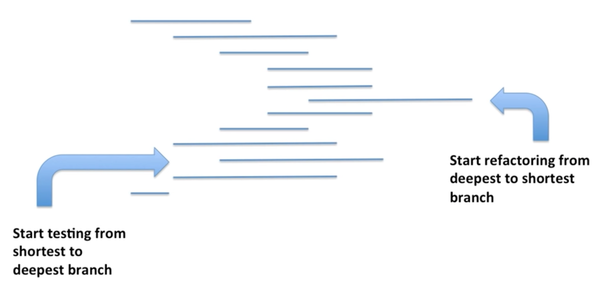

Are you working on a large codebase, with no test whatsoever, and no time is given to add some?

"Automated tests will help you work faster", people say, "they reduce your time-to-fix when an issue occurs". But when there's no test, someone needs to take hours to write them first. If you ask management, of course, there's no time for that: the project is already behind schedule! Next iteration, maybe 🤷‍♂️

The truth is: you are not really sure where to even _start_.

Should you write E2E tests first, so you can cover more critical cases faster? Or should you focus on unit tests, because you've heard they are faster to run and more useful feedback while you're coding? Or maybe something in between?

Changing Legacy Code is a specific situation that's very different from writing new code from scratch. You need to adapt your approach.

Hopefully, there's a way to quickly add tests on the code you need to change, so you don't even need to ask management permission first.

## E2E tests or unit tests?

End-to-end (E2E) tests exercise your application as a black box, from the end-user point of view. They typically require your app to be built and run in a production-like environment.

At first sight, you may think that they would be ideal since they would cover a lot of code with every single test.

In practice though, I find they take a lot of time to set up if you don't have some already. They also tend to run more slowly than you'd like and fail for many different reasons. Therefore, they are most suited to run on a CI than on your own machine while you're coding.

**Their feedback is too long to be useful during development**.

"Unit tests" definition is more debatable. I've found that people think differently about what a unit is. I prefer to talk about [isolated tests](https://understandlegacycode.com/blog/if-you-mock-are-you-even-testing/#isolated-tests). Nevertheless, I'm referring to the tests that are closer to the code, run fast, and are reliable.

Such tests are great while developing. Done properly, they don't focus on implementation details and help you guide the design of the code. They provide you with extremely quick feedback on the code. At first sight, they seem the companion you need to deal with this legacy!

In practice though, **it's hard to retrofit existing code into unit tests**. It's easy to get the "unit" level wrong and test implementation details you wish to refactor in a moment. Trying to force unit tests on code that wasn't designed with test feedback can be time-consuming and solidify the design too much: tests get in the way, making your refactoring attempts even more difficult!

Legacy Code is a special beast. In general, the most practical approach should be more nuanced. E2E or unit tests aren't the best candidates.

So, what's the best way to add tests on untested code?

## Close to the code, but not too much

In this old-still-gold video on "Testing and Refactoring Legacy Code", Sandro Mancuso is showing you how to address existing, untested code that's doing calls to a database:

<iframe width="560" height="315" src="https://www.youtube-nocookie.com/embed/_NnElPO5BU0" frameborder="0" allow="accelerometer; autoplay; encrypted-media; gyroscope; picture-in-picture" allowfullscreen></iframe>

In particular, he presents a strategy for adding tests to Legacy Code. I think it is excellent:

I generalized this tip and recommend the following mindset:

> Start testing from the outside of the code, then refactor from the inside.

OK, let's detail that a bit…

### Start testing from the outside

You don't know much about untested code.

Start writing tests from the highest level you want to work with is easier. It also helps you not tie tests to the implementation details too much. It's a similar mindset to the E2E tests, except that the level can be anywhere in the code that you need to work with.

The key idea is to quickly build a safety net to ensure that you capture the existing behavior of the code. The best way to do that is to use [Approval Testing](/approval-tests).

Approval tests are also known as Golden Master, Characterization tests, or, more recently, Snapshot tests.

Whatever name and tool you use to write them, Approval tests are composed of 4 steps:

1. An _Arrange_ step, where you set up what's necessary to run the test
2. An _Act_ step, where you execute the code
3. A _Printer_ step, where you generate an output string from the effects of the code
4. An _Assert_ step, where you compare the new output with the existing one

It's like writing unit tests, but much faster. You don't need to understand everything the code is doing at the moment. But you're building a test suite you can rely on, so you can safely refactor code and know instantly when something goes wrong.

It is a perfect compromise.

### Refactor from the inside

Once you have covered enough cases to be safe, you can start refactoring code.

The simplest (and usually fastest) way to do it is to tackle small chunks. Extract meaningful parts of the code that's covered with tests, and redesign them.

Because the tests are more coarse-grained, you have more _flexibility_ to craft new classes/functions. **Tests don't get in the way**, but they verify the overall behavior still works as expected. You can even replace some code with a whole new function that produces the same result!

As you're refactoring the code, it's a good time to write better tests for the "units" you extract. It's easier to do because the chunks are smaller. These tests will capture your understanding of what these smaller pieces do, making it easier to work with this code, and potentially re-use it in a different context.

When you don't have much time, **capturing the behavior of existing code with Approval Tests is the best way to get started**. Pick a coarse chunk of code that covers what you need to change. It will help you refactor this code safely so you don't waste time debugging when something breaks.

With practice, doing this may even be faster than not testing at all and getting things done with no bug!
