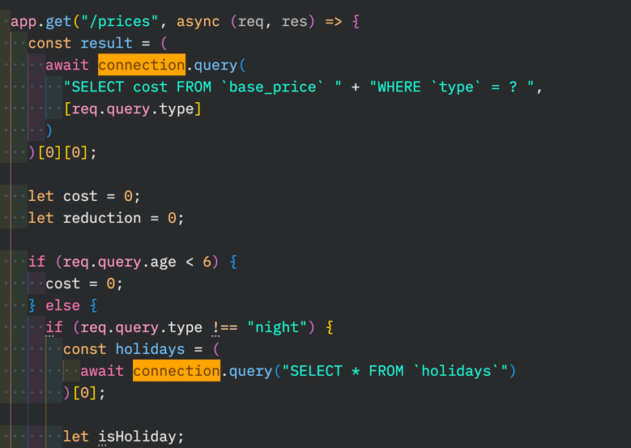

_This is a follow-up to [this post](https://understandlegacycode.com/blog/can-ai-write-tests-on-legacy-code/), where I was trying to see if AI could help me write tests on legacy code. Now that tests are in place, let’s see if AI can help me refactor the code faster…_

AI has become a hot topic in the past few months. Tools like [ChatGPT](https://chat.openai.com/chat) have been released for the world to play with, which has raised many interesting questions about how it will change the way we work.

My interest is piqued when it comes to **legacy code**.

Many of us are working on poorly documented, untested software that we have to change. Evolving this code without breaking things is a daily challenge. Would AI does that job better? I would actually be _excited_ if tools could do some of the grunt work, so I could spend more time understanding the Problem that is being solved instead of spending so long on the implementation details of the Solution that I need to change.

However, I’m _suspicious_. 🤨

AI makes mistakes. Yet, it sounds confident. If it doesn’t know, it may just make things up. If I don’t know what the code is doing, how can I hope to detect the lies?

In particular, there is this question:

> Can AI refactor the code for you?

## Yes, you can ask ChatGPT to refactor

Like many, I’ve played with ChatGPT. I gave it slices of code and asked it to refactor it with patterns, etc.


However, using ChatGPT creates friction in my development process:

- Sometimes (often?) ChatGPT is not available
- Sometimes, it stops generating code in the middle. You can reply “Continue” to resume the generation, but that’s still annoying (and you better know the trick)
- Sometimes, [the returned code formatting breaks down](https://www.reddit.com/r/ChatGPT/comments/zhraup/i_wrote_some_code_that_made_the_chatgpt_response/). It happened to me a few times already and that’s annoying.
- It requires me to switch context: get out of my editor to use my browser. It’s not a _big_ deal (browsing answers is probably the 2nd most common development activity after reading code), but it would be nice to have that from my editor…

But the most important unknown at this point to me is: **can I trust it?**

AI is wonderful for creativity. However, it has the nasty habit of making things up when it doesn’t know. When generating tests, we saw that it would come up with errors that become obvious when you read closer:


### Refactoring code is a risky operation

The risk is to introduce a regression. On the one hand, AI has the potential to refactor the code much faster than I could. On the other hand, it feels riskier than [using safe refactoring moves](https://understandlegacycode.com/blog/another-way-of-refactoring-untested-code/#step-one-refactor-using-safe-moves).

Let’s put it to the test!

Just like for my previous article, I will be using [Rubberduck](https://rubberduck.ai/): an AI-powered coding assistant for VS Code. Unlike the other ChatGPT-like extensions that I’ve found, this one is more than a simple proxy to OpenAI API. It provides concrete actions for use cases such as:

- Diagnose Errors
- Explain Code
- Generate Tests (we have seen that)
- Edit Code (this is what we are testing here)
- Find Bugs (!)

I appreciate its UX. And since [it’s open-source](https://github.com/rubberduck-ai/rubberduck-vscode), **I have been contributing to the extension myself**.

So let’s put it to the test…

## Refactoring the Lift Pass Pricing kata

We are using [this playground](https://github.com/martinsson/Refactoring-Kata-Lift-Pass-Pricing) that simulates what an actual legacy web application could look like, with fewer moving parts. It’s a realistic-enough sandbox to practice tools like Rubberduck.

Last time, we wrote the missing tests. We ended up here: [rbd-3-tests](https://github.com/nicoespeon/Refactoring-Kata-Lift-Pass-Pricing/tree/rbd-3-tests/typescript).

Now, let’s refactor the code so we can more easily implement changes. I’ve done this refactoring a lot, but today I’m gonna use Rubberduck to assist me.

The good news is: now we have tests to tell us if anything breaks in the process 🙌

This is the code we are dealing with ([source](https://github.com/nicoespeon/Refactoring-Kata-Lift-Pass-Pricing/blob/e219d22cf1555bbf276b24d681e07415fef0c658/typescript/src/prices.ts#L27-L92)):

```tsx
app.get("/prices", async (req, res) => {
  const result = (
    await connection.query(
      "SELECT cost FROM `base_price` " + "WHERE `type` = ? ",
      [req.query.type]
    )
  )[0][0]

  if (req.query.age < 6) {
    res.json({ cost: 0 })
  } else {
    if (req.query.type !== "night") {
      const holidays = (await connection.query("SELECT * FROM `holidays`"))[0]

      let isHoliday
      let reduction = 0
      for (let row of holidays) {
        let holiday = row.holiday
        if (req.query.date) {
          let d = new Date(req.query.date)
          if (
            d.getFullYear() === holiday.getFullYear() &&
            d.getMonth() === holiday.getMonth() &&
            d.getDate() === holiday.getDate()
          ) {
            isHoliday = true
          }
        }
      }

      if (!isHoliday && new Date(req.query.date).getDay() === 1) {
        reduction = 35
      }

      // TODO apply reduction for others
      if (req.query.age < 15) {
        res.json({ cost: Math.ceil(result.cost * 0.7) })
      } else {
        if (req.query.age === undefined) {
          let cost = result.cost * (1 - reduction / 100)
          res.json({ cost: Math.ceil(cost) })
        } else {
          if (req.query.age > 64) {
            let cost = result.cost * 0.75 * (1 - reduction / 100)
            res.json({ cost: Math.ceil(cost) })
          } else {
            let cost = result.cost * (1 - reduction / 100)
            res.json({ cost: Math.ceil(cost) })
          }
        }
      }
    } else {
      if (req.query.age >= 6) {
        if (req.query.age > 64) {
          res.json({ cost: Math.ceil(result.cost * 0.4) })
        } else {
          res.json(result)
        }
      } else {
        res.json({ cost: 0 })
      }
    }
  }
})
```

Let’s give it a naive shot.

## Ask Rubberduck to simplify the code

1. I select the whole code
2. I trigger the “Rubberduck: Edit Code 💬” command
3. I tell it to “Simplify the code”. Low-hanging fruit, nothing fancy.


It quickly opens a diff view and I can see it starts streaming a suggested change. When it is done generating the code, I am in front of a pretty rad diff view. Let’s pause for a second and see what we have here:

1. On the left, are my instructions for OpenAI. I can go back and edit it if I’m not happy with the suggestions (eg. maybe I forgot to mention a specific refactoring that I want).
2. Then, I have a decent diff view. Full disclosure: [I helped on improving it](https://github.com/rubberduck-ai/rubberduck-vscode/pull/11) 😄 I’m pretty happy with the syntax highlighting, it really helps understand what’s going on.
3. Finally, there is a big “Apply” button that I can click. If I do, the diff is applied.


Now, let’s analyze the suggested diff. I didn’t give any specific indications to Rubberduck. I could have asked for specific refactoring moves, but I wanted to see how it could help a developer who doesn’t know 50+ refactorings by their names 😜

So here, it did 2 things:

1. Pull up [the `reduction` variable declaration](https://github.com/nicoespeon/Refactoring-Kata-Lift-Pass-Pricing/blob/e219d22cf1555bbf276b24d681e07415fef0c658/typescript/src/prices.ts#L44). Not necessarily helpful. If anything, I would rather advocate keeping the declaration closer to its usage.
2. Declare a `cost` variable and push down the `res.json()` call to remove duplication. **This is super impressive.**

To refactor this code, we want to extract the pure logic out of the technical concerns. There are 3 technicalities we want to distill: `req`, `res`, and `connection`. They are sprinkled across our pure logic. Therefore, the first refactorings should push these references to the top and bottom of the controller. This is [a Peel & Slice refactoring](https://understandlegacycode.com/blog/another-way-of-refactoring-untested-code/#peel--slice).

The goal is to end up with a large chunk of pure logic that we can extract.


What Rubberduck did here, without any indication, was to suggest a change that will push `res.json()` to the bottom of the function. That’s a legit refactoring!

It even took care of that tricky line:

```diff
- res.json(result);
+ cost = result.cost;
```

Let’s apply the change. Then, let’s run the tests to see if anything broke.


That’s a successful change. And that was fast. Time to commit: [rbd-4-simplify](https://github.com/nicoespeon/Refactoring-Kata-Lift-Pass-Pricing/tree/rbd-4-simplify/typescript).

## Handle the remaining I/O

We still have `req` and `connection` on our way.

### Pull-up the request

So next, I’m asking Rubberduck to pull up all references to `req` at the top of the function. In fact, I already know what I want. Thus, I’ll ask it to [destructure](https://developer.mozilla.org/en-US/docs/Web/JavaScript/Reference/Operators/Destructuring_assignment) the references.

1. Select the code again
2. Trigger the “Rubberduck: Edit Code 💬” command, using the shortcut this time (`⌃ ⌘ E` on MacOS, `Ctrl+Alt+E` on PC)
3. I tell it to “Destructure req.query at the top of the function”, then hit “Generate”

After a few seconds of the AI streaming the suggestion into my editor (fascinating to watch), I can evaluate what has been done. And I must say the diff is solid:


I’m not very surprised: that’s a relatively trivial refactoring to make. But it usually takes a while to do. Even with automated refactorings and shortcuts, it would have taken me longer to clean up all the references to `req.query` than letting Rubberduck handle it.

I could apply the diff and run the tests right now… but I want to experiment with something!

See, after the generation is complete, I can go back and update the original instructions. What if I asked Rubberduck to do _both_ refactorings at the same time? If I was working with an actual legacy application, I probably wouldn’t take such a giant leap. But here the code is fully tested, so I feel like challenging the duck 😜

### Introduce an interface

Pulling up the `connection` reference is trickier. There is a request that is made to the database to fetch the holidays if the age is greater or equal to 6 and it’s not a “night” pass:



“Just pulling up” the variable declaration will change the behavior of the code. This _may_ be acceptable depending on the context, but not in this one. We are aiming for pure refactorings.

So we can’t just pass `result` and `holidays` as parameters to our pure logic function. We have to pass a collaborator whose role will be to retrieve the data we need when we need it. This is [the Repository pattern](https://martinfowler.com/eaaCatalog/repository.html).

But forget the fancy words. What matters is that we want to inject _something_ that will have methods that fetch data (an interface). I update the edit code query to express that to Rubberduck and hit “Generate” again:


It updates the suggested diff with all the suggestions included:


That’s not exactly what I meant. I was thinking about introducing a custom interface to abstract away the SQL implementation details… However, I also realize that it would technically work. Actually, there is no need for a `getConnection()` function (which doesn’t exist and isn’t in the diff, so that code would be broken). We could stop here and pass `connection` to the function. However, if we do so, then we depend on an interface we don’t own. I don’t recommend it.

At this point, I wasn’t sure if it was faster to explain Rubberduck what I wanted, or just do it myself. But I gave it a shot:


> 👨‍💻 _Destructure req.query at the top of the function._
>
> _Create a Repository interface with 2 methods: getBasePrice(type: string) and getHolidays(). Create a RepositoryUsingMySQL implementation of this interface. It should take the connection variable in the constructor and implement the 2 methods from based on the existing calls in the selected code._
>
> _Finally, instantiate the RepositoryUsingMySQL to replace the existing calls with calls to the methods instead._

Watching the suggestion being updated, I was surprised. You see, I wasn’t expecting it to understand all the nuances of what I meant. And yet, the declaration of the new interface and its adapter look legit:


Similarly, the original code was almost properly replaced:


I say _almost_ because it did what I said we shouldn’t do: pull up the fetch of the holidays.

Other things I notice when reading the diff:

- It forgot the `await`s that are necessary to wait for the database calls. That’s partly my fault: I didn’t mention both methods were async. But it didn’t “notice” the keywords were dropped either.
- It renamed the `result` into `basePrice`, which is indeed better. I didn’t mention that change, but I’m pleased to see it was able to figure it out!

I could keep tweaking the requirements and regenerate. But there’s very little to do left. So I’ll apply the change and fix up the issues manually.

Time to run the tests…


That’s good enough for a commit: [rbd-5-ready-for-extraction](https://github.com/nicoespeon/Refactoring-Kata-Lift-Pass-Pricing/tree/rbd-5-ready-for-extraction/typescript).

## Extract pure logic and simplify

I now have a [large chunk of pure logic](https://github.com/nicoespeon/Refactoring-Kata-Lift-Pass-Pricing/blob/358d4b2a13ab360c25453cdb4ef300d48a20b7a1/typescript/src/prices.ts#L31-L82) sandwiched between I/O. So the next step is to select that code and ask Rubberduck to do the extraction for me.

This is something that will be faster to do with automated refactorings. 100% guarantee. I wouldn’t use Rubberduck to do this. Instead, I would ask VS Code:


This will instantly create the function, resolving the parameters. It’s fast and relatively safe to do, even without tests.

But for the sake of the exercise, let’s ask Rubberduck:

> 👨‍💻 _Extract in a function named computePrice_

After a few seconds of streaming the suggestion, the result is disappointing:


I realize I should have mentioned extracting the function in the module scope. I could try to refine the instructions and generate the code again, but I’m quite convinced this is a waste of time.

**When the refactoring is already automated, use the automation.**

Let’s do that and move on: [rbd-6-extracted](https://github.com/nicoespeon/Refactoring-Kata-Lift-Pass-Pricing/tree/rbd-6-extracted/typescript).

### Further refactorings

At this point, we have done the hard work. Now we can tweak the extracted `computePrice()` function as we like. It’s a good candidate for writing tests against: it’s high-level enough to capture the whole logic (tests will resist refactorings), but it doesn’t require the whole database and HTTP requests to be tested. In fact, we could only keep a few of the 11 integrated tests we wrote previously, and cover the different variants with faster tests on `computePrice()`. But that’s a topic for another article.

Let’s ask Rubberduck if it could simplify the function. For instance, it could unnest all of these conditionals. I did a few refinements and this was my final prompt:

> 👨‍💻 _Simplify the code._
>
> _Unnest the conditionals as much as you can._
>
> _Use early returns for cost._
>
> _Use guard clauses when relevant._
>
> _Invert the "if type !== night" condition._

And [the generated diff](https://github.com/nicoespeon/Refactoring-Kata-Lift-Pass-Pricing/commit/848d771d54039dd4149b7deac8fb86d34e9143cb) is decent!

It’s nice that you can refine instructions until you get to a satisfying state. I think you should find a balance between doing this and some manual refactorings. For instance, I would rename that `d` variable myself because it would be much faster to hit F2 in VS Code than wait for Rubberduck to do it for me.

I launched the tests to verify the validity of these refactorings. I was expecting to maybe see some failing (hard to tell just from reading the diff), but the tests pass again ✅

I did some more changes myself, but I have to admit that **Rubberduck got me through the kata faster than usual**.

Final code: [rbd-7-refactored](https://github.com/nicoespeon/Refactoring-Kata-Lift-Pass-Pricing/tree/rdb-7-refactored/typescript).

## AI can really help you refactor code faster!

> Although it can make mistakes.

I would recommend writing tests _before_ using AI to refactor existing code—and we’ve seen [how AI can help you write these tests faster](https://understandlegacycode.com/blog/can-ai-write-tests-on-legacy-code/).

That being said, I was pleasantly surprised by what AI could do in a reliable way.

In particular, it is able to suggest large, composed refactorings, at scale. Extracting and destructuring a variable can be automated. But doing that for all references in a 200 LOC function takes time. The AI assistant really shines here!

The fact you can see the suggested diff and refine the instructions is also very powerful. That’s specific to Rubberduck though. It’s a much better DX than copy-pasting code in ChatGPT, or the other ChatGPT extensions I’ve seen out there 😉

Sometimes, it does not worth using AI to refactor code. In particular when your editor can automate for you. Automated refactorings are fast and safe. They rely on AST transformation to guarantee the change is valid. Learn your tools.

> For JS and TS devs using VS Code, check [my Abracadabra extension](https://marketplace.visualstudio.com/items?itemName=nicoespeon.abracadabra) #shamelessPlug 🧙‍♂️

To conclude, I think:

- Used as a complementary tool, **AI can speed up the development process**
- To refactor legacy code, **an AI assistant lower the barrier for developers**. You can refactor code even when you don’t know Martin Fowler’s refactorings catalog by heart. If you are an expert, however, the results are even better since your instructions are clearer (eg. “Use guard clauses”).
- **Rubberduck provides a great DX for editing code**. The diff viewer and the refinable instructions make it really easy to work with code without leaving the editor.

If you haven’t already, I happily recommend that you install [the Rubberduck extension](https://marketplace.visualstudio.com/items?itemName=Rubberduck.rubberduck-vscode) 🦆

You can also contribute to its development, [it’s an open-source project](https://github.com/rubberduck-ai/rubberduck-vscode/)!
