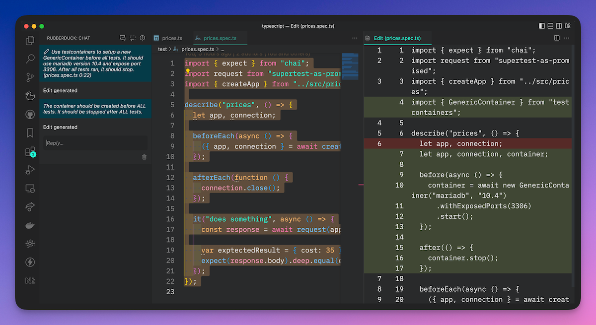

AI has become a hot topic in the past few months. Tools like [ChatGPT](https://chat.openai.com/chat) have been released for the world to play with, and this has raised a lot of interesting questions about how it will change the way we work.

My interest is piqued when it comes to **legacy code**.

A lot of us are working on existing, poorly documented, untested software that we have to change. Evolving this code without breaking things is a daily challenge. Would AI does that job better? I would actually be _excited_ if tools could do some of the grunt work, so I could spend more time understanding the Problem that is being solved instead of spending so long on the implementation details of the Solution that I need to change.

However, I’m _suspicious_.

[I've already wrote about this topic](https://understandlegacycode.com/blog/ai-test-generation-for-legacy-code/) and my experience wasn't great then. The generated tests weren't really helpful. I was mostly wasting time.

AI makes mistakes. Yet, it sounds confident. If it doesn’t know, it may just make things up. If I don’t know what the code is doing, how can I hope to detect the lies?

## ChatGPT vs. Rubberduck

That being said, I’ve also played with ChatGPT. I gave it slices of code and asked it to simplify it, refactor it with patterns, etc.


It works… but not always. I’ve found it creates friction during my development process, namely:

- Sometimes (often?) ChatGPT is not available
- Sometimes, it stops generating code in the middle. You can reply “Continue†to resume the generation, but that’s still annoying (and you better know the trick)
- Sometimes, [the returned code formatting breaks down](https://www.reddit.com/r/ChatGPT/comments/zhraup/i_wrote_some_code_that_made_the_chatgpt_response/). It happened to me a few times already and that’s annoying.
- It requires me to switch context: get out of my editor to use my browser. It’s not a _big_ deal (browsing answers is probably the 2nd most common development activity after reading code), but it would be nice to have that from my editor…

And then, I saw [Lars Grammel’s tweet](https://twitter.com/lgrammel/status/1620734494071480324?s=20&t=b8SYniIweOisuXehosTarw) about his new project: [Rubberduck](https://marketplace.visualstudio.com/items?itemName=Rubberduck.rubberduck-vscode), an AI-powered coding assistant for VS Code.

It says it can help you:

- Chat with OpenAI
- Diagnose Errors
- Explain Code
- Generate Tests (!)
- Edit Code (!!)
- Find Bugs (!!!)

Right from VS Code.

Interestingly, [its source code is open](https://github.com/rubberduck-ai/rubberduck-vscode)! Thus, **I've started to contribute**.

But here, I'll be using Rubberduck from my end-user point of view. So let’s try and find out what it can really do…

## The Lift Pass Pricing refactoring kata

[This is a coding exercise](https://github.com/martinsson/Refactoring-Kata-Lift-Pass-Pricing) that captures real-life software complexity (HTTP requests, database calls, external data…), without adding too much noise. I really like to use it to practice tools and techniques for refactoring legacy code.

For testing Rubberduck, I will tackle the TypeScript version.

The very first step is to run a tool like Prettier to standardize the shape of the code. No more noise in follow-up changes: [rbd-1-prettier](https://github.com/nicoespeon/Refactoring-Kata-Lift-Pass-Pricing/tree/rbd-1-prettier)

The end goal of the exercise is to change the API so the endpoint that returns lift pass prices can return the price for several passes instead of just one.

But the code is hard to re-use, so we would like to refactor it a little bit first.

But how do we know the code is still working as expected after we refactored it? In general, we want to write tests first.


So let’s see if the duck can help us write the missing tests faster… or not.

## First, make the tests run

First of all, we need to write some tests before we touch the code. For this kata, I usually go with:

- [`supertest-as-promised`](https://www.npmjs.com/package/supertest-session-as-promised) to run HTTP queries against the top-level application
- [`testcontainers`](https://www.npmjs.com/package/testcontainers) to set up the database and get it to run in the tests (it’s based on Docker)
- A script to fill the database with tests data (these are already provided in the kata)

But let’s ask Rubberduck!

### Ask Rubberduck to suggest how to test this code

To do so I need to:

1. Select the code I want to test
2. Use VS Code palette to trigger the command “Rubberduck: Start Chat 💬â€

This started a new chat and I could type in my question:


> 👨â€ğŸ’» _How can I write tests for this piece of code?_

> 🤖 Writing tests for this code can be a bit tricky, as there are a lot of conditions to consider. To make sure that all the conditions are tested, you'll need to create a test for each condition. For example, you could create a test to check that the cost is 0 when the age is less than 6, and another test to check that the cost is reduced when the age is between 6 and 15. You could also create tests to check that the cost is reduced on holidays and on Mondays.

OK, this is not very helpful. It’s just generic guidance…

I followed up with more details about what’s blocking me and got some advice.

> 👨â€ğŸ’» _This is an Express controller. There is also a database involved. Which TypeScript libraries can I use to test it?_

> 🤖 You can use the [Mocha](https://mochajs.org/) testing framework with the [Chai](https://www.chaijs.com/) assertion library to write tests for your Express controller. You can also use the [Sinon](https://sinonjs.org/) library to mock the database calls. This will allow you to test the controller without actually making a call to the database. You can also use the [SuperTest](https://github.com/visionmedia/supertest) library to make HTTP requests to the controller and test the response.

That’s more interesting!

✅ It’s good that it suggested SuperTest for testing the controller. If I wasn’t aware of this, it would have put me on the right track!

🚫 I think going for Sinon to mock the database calls is a mistake at this point. I will refactor the implementation details and I have no control over the `connection` API. Mocking it will make refactorings harder. I think a better approach here is to take a step back, consider this a black box, and set up an actual database.

I tried to ask follow-up questions. Rubberduck gave me an interesting option where we could use Sequelize in tests to setup the database:

> 👨â€ğŸ’» _I don't want to mock the database calls. Is there a library to set up the database and get it to run in tests?_

> 🤖 If you don't want to mock the database calls, you could use a library like [Sequelize](https://sequelize.org/) to set up the database and run it in tests. Sequelize is an ORM (Object-Relational Mapping) library that allows you to define models and perform database operations. You can use it to create a test database and run tests against it. For example, you could create a test database with the following code:
>
> ```jsx
> const Sequelize = require("sequelize")
> const sequelize = new Sequelize("database", "username", "password", {
>   host: "localhost",
>   dialect: "postgres",
> })
>
> const User = sequelize.define("user", {
>   username: Sequelize.STRING,
>   birthday: Sequelize.DATE,
> })
>
> sequelize
>   .sync()
>   .then(() => console.log("Database is synced"))
>   .catch(err => console.error("Error creating database"))
> ```
>
> Once the database is set up, you can use Sequelize to perform database operations in your tests. For example, you could create a user in the test database with the following code:
>
> ```jsx
> User.create({
>   username: "testuser",
>   birthday: new Date(2000, 0, 1),
> })
>   .then(user => console.log(user.username + " created"))
>   .catch(err => console.error("Error creating user"))
> ```
>
> Do you have any other questions about setting up the database and running tests?

I think this would work, indeed.

Note however that I couldn’t get the AI to guide me towards `testcontainers`, despite mentioning “Docker in testsâ€. Without AI, I would usually [search npmjs with the relevant keywords](https://www.npmjs.com/search?q=docker%20tests), which will expose me to it.

To me, this means **you should not just blindly listen to AI**—it would have been naive to think otherwise. But **combining its suggestions with your own experience and other sources can get you further, faster**.

If I didn’t know how to get started here, Rubberduck suggestions to use Sequelize would certainly have helped.

But let’s go with `testcontainers` anyway.

### Use Rubberduck to write the code for me

There is an existing test. To make it run, we need to:

1. Get a MariaDB up and running
2. Run `yarn start` to get the server running
3. Run `yarn test` to run the tests against the server

It may work to get started, but that won’t go far. If anything, this test can’t easily run on CI. The idea would be to start a Docker container where the whole thing can run reliably for each test run. That’s what `testcontainers` can do!

Let’s ask Rubberduck to update the tests for us, and see if it can save us some time writing the boilerplate code:

1. Select the whole existing test code that I want to edit
2. Use VS Code palette to trigger the command “Rubberduck: Edit Code 💬â€


Then, I type in my request, trying to give some specificities:

> 👨â€ğŸ’» _Use testcontainers to set up a new GenericContainer before all tests. It should use mariadb version 10.4 and expose port 3306. After all tests ran, it should stop._

After ~10s it generates a diff next to my code. I can inspect it and decide to “Apply†by clicking on a button at the bottom. I must admit that’s a way better flow than having to copy-paste code on ChatGPT. It feels **integrated** within my development process 😄


Looking at the suggested diff, it’s not bad. There are some good things:

- The imports are correct
- It did declare the `container` variable along with the others and initiated it
- It exposed the proper ports and started the container correctly
- It did stop the container

There are also some errors:

- The syntax to use MariaDB 10.4 is `GenericContainer("mariadb:10.4")`, not passing two arguments. Hopefully, TypeScript will catch that easily.
- I wanted the container to be started before ALL tests and stopped after ALL tests. Doing it between each test is unnecessary and costly. AI didn’t listen to my instructions here.

At this point, I have 2 options:

1. Tell Rubberduck about the changes I want, so it can refine the suggestion.
2. Apply the suggestion and do the manual tweaks myself.

On real code, I would go for option #2 since it would be faster—the AI still takes a few seconds to generate the code and I _feel_ I can do the change faster myself because I won’t wait. It also comforts me with the idea of using AI to assist me, but still own the changes and finalizes what needs to be done.

For the exercise though, I will refine the suggestion to see what it can do:

> 👨â€ğŸ’» _The container should be created before ALL tests. It should be stopped after ALL tests._



And that worked!

It’s very interesting how you can follow up on the chat to get a refined suggestion. It means you don’t have to get the first input right on the first try. The main limiting factor today is the ~10s it takes to generate the code again, which makes the feedback loop too long for just developing like that—I can **just** make the changes myself.

Happy with these changes, I clicked “Apply†to get the code in. I make a few manual tweaks:

- I forgot to ask Rubberduck to fix the syntax to call `GenericContainer("mariadb:10.4")`
- I’m explicitly typing `container` when it’s declared to get type-safety wherever it’s used
- I configure the DB environment variable and initialization script when starting the container

I guess I could have refined these points with Rubberduck, but I mostly realized them **after** I got the code in. That’s fine. Rubberduck got me the headstart I was looking for… TypeScript is getting me through the finish line ğŸ‘

### Run the tests

Now it’s time to verify if all of that is working!

I don’t have a MariaDB up and running. Nor is the app running. I only have Docker started on my machine. I hit `yarn test` and wait…


Failure!

Apparently, something is wrong with the exposed ports. And indeed, in this specific case, AI’s suggested syntax won’t be enough: `withExposedPorts(3306)`. The problem is that the port may not be mapped to the 3306 port on the host.

A quick search in [testcontainers docs](https://github.com/testcontainers/testcontainers-node) tells me that there is another syntax to bind the ports: `withExposedPorts({ container: 3306, host: 3306 })`. Another way would be to get the mapped port and pass it to the source code, but I don’t want to change the source code now. Let’s go with the first option.

I change the code and run `yarn test` again:


Success!

I think that illustrates something important: the code suggested by AI has a lot of unknowns and hypotheses. I need to combine it with other tools (static types, reading the API docs, my own knowledge, some sort of tests…) to validate them.

I think it’s important to find a way to _verify_ the suggested code soon after it was merged in.

That being said, the suggested syntax was fine and it helped my lookup for the relevant docs. If I wasn’t familiar with `testcontainers` API, that would have saved me quite some time!

Commit, push, and we are here: [rbd-2-testcontainers](https://github.com/nicoespeon/Refactoring-Kata-Lift-Pass-Pricing/tree/rbd-2-testcontainers)

## Then, write the high-level tests

This is often a difficult part.

What do you test? How do you get started? There is so much going on… I generally recommend using the test coverage to identify parts of the code that are not tested yet. [I’ve already detailed this process,](https://understandlegacycode.com/blog/3-steps-to-add-tests-on-existing-code-when-you-have-short-deadlines/) the main idea is to vary the inputs to capture the existing behavior

For this exercise, we have 3 parameters: `type`, `age`, and `date`. Spoiler, there are at least 11 scenarios to cover:

1. type="1jour" => then cost is day cost
2. type="night" => then cost is 0
3. type="night" & age < 15 => then cost is night cost
4. type="night" & age > 64 => then cost is 40% of night cost
5. type="1jour" & age < 6 => then cost is 0
6. type="1jour" & age < 15 => then cost is 70% of day cost
7. type="1jour" & age = 15 => then cost is day cost
8. type="1jour" & age > 64 => then cost is 75% of day cost
9. type="1jour" & age = 15 & any date => then cost is day cost
10. type="1jour" & age = 15 & date is Monday => then cost is 65% of day cost
11. type="1jour" & age = 15 & date is Monday and Holiday => then cost is day cost

Let’s see if Rubberduck can speed that up!

The first test is already given, let’s just rename it.

```diff
- it("does something", async () => {
+ it("returns day cost when type is '1jour'", async () => {
```

Now, let’s ask Rubberduck to generate some tests for us, and see if it can suggest useful scenarios quickly from the source code.

1. Select the code I want to test
2. Use VS Code palette to trigger the command “Rubberduck: Generate Tests 💬â€


After waiting ~1min it generates a new unsaved file with the test code:


The style doesn’t match the rest of the tests. It tried to write unit tests from scratch. But I can copy-paste the generated scenarios and adapt them. I feel this will be faster than re-generating new tests.

After copying the test cases, I select them and trigger another “Rubberduck: Edit Code 💬†action.

> 👨â€ğŸ’» _Use supertest to request the app and don't mock the response. Use chai library for the expect API._

After ~10s I get a diff that looks good. I click apply and I got a code that looks like this:

```jsx
// Original test
it("returns day cost when type is '1jour'", async () => {
  const response = await request(app).get("/prices?type=1jour")

  expect(response.body).deep.equal({ cost: 35 })
})

// Tests generated from Rubberduck
it("should return cost 0 when age is less than 6", async () => {
  const req = { query: { type: "day", age: 5 } }

  const response = await request(app)
    .get("/prices")
    .query(req)

  expect(response.body).to.have.property("cost", 0)
})

it("should return cost 0 when age is undefined", async () => {
  const req = { query: { type: "day" } }

  const response = await request(app)
    .get("/prices")
    .query(req)

  expect(response.body).to.have.property("cost", 10)
})

// …
```

But running the tests will fail. With a closer look, I realize there is indeed an error: the `req` object should actually be a `query` and not have a nested `query` attribute! I could use Rubberduck to fix all tests… but I decide to use VS Code multi-cursor instead since I can do it in a few seconds:


I decided to rewrite the original test to look similar to the others. This is when I notice something else is off: the type value is “day†but it should really be “1jourâ€.

That’s a legit mistake. The source code refers to the type “night†as a special one. AI figured another variant would be “dayâ€. Except that the valid values are in the database, and AI isn’t aware of this yet.

I replace all “day†occurrences with “1jour†and run the tests again:


Well, well, well… When looking closer, there are some obvious mistakes in the generated tests.

One test isn’t testing what it says it is testing:


In fact, this test is even wrong. I can see the body of the test is the same as the original one. The expected cost should be the base cost, and I can confirm that with the test failure. Let’s scrap this one!

As for the other tests, they fail because they consider the base cost to be 10:


But here again: the base cost is set in the database, and depends on the ticket type.

Therefore, I need to correct these expectations manually. The test's failure helps me figure out the proper behavior. Sometimes the label is wrong, sometimes it’s the expected output that’s incorrect. However, the variation of inputs is the interesting part! Let’s see the scenarios that were properly covered:


1. ✅ type="1jour" => then cost is day cost
2. type="night" => then cost is 0
3. ✅ type="night" & age < 15 => then cost is night cost
4. ✅ type="night" & age > 64 => then cost is 40% of night cost
5. ✅ type="1jour" & age < 6 => then cost is 0
6. ✅ type="1jour" & age < 15 => then cost is 70% of day cost
7. type="1jour" & age = 15 => then cost is day cost
8. ✅ type="1jour" & age > 64 => then cost is 75% of day cost
9. type="1jour" & age = 15 & any date => then cost is day cost
10. ✅ type="1jour" & age = 15 & date is Monday => then cost is 65% of day cost
11. type="1jour" & age = 15 & date is Monday and Holiday => then cost is day cost

That’s 8 scenarios out of 11!

Sure, the generated tests didn’t work. I also had to manually fix the syntax, most labels, and expected values. But I saved quite some time by **not having to manually figure out the different parameters that have to change**. Rubberduck found them all for me!

With this base, I would then use test coverage to see parts of the code that aren’t tested yet and figure out the missing variations to get them all.

From my experience, Rubberduck generates better tests when the source code doesn’t depend on external sources, like a database or a 3rd-party service. And yet, this was helpful to give me ideas and get me started. It may come in handy when dealing with unfamiliar code that I want to write tests for ğŸ‘

The final code is here: [rbd-3-tests](https://github.com/nicoespeon/Refactoring-Kata-Lift-Pass-Pricing/tree/rbd-3-tests)

## Extra: Rubberduck helped me with a random question

While writing this article, I pushed all the code to a forked repository, so you can follow along.

At some point, I couldn’t remember the git syntax to push the tags to that specific remote… So I just open a new Rubberduck chat and asked. It gave me the command I was looking for. All of that without leaving VS Code â¤ï¸


Well, thank you Rubberduck 👠🦆

## How is it different than ChatGPT? Ponicode?

It's **very similar** to what ChatGPT could do. The main difference to me is the UX:

1. No need to get out of my editor is nice
2. No fear of ChatGPT website being unavailable at the moment
3. No hassle crafting up the perfect prompt to get the answers I need (Rubberduck crafts the prompt under the hood)
4. And no little annoyances like AI stopping the prompt in the middle or messing up the code formatting
5. Oh, and 💯 for the diff view + "Apply" button

As for Ponicode, the experience is very different. [Ponicode wasn't capable of generating useful unit tests](https://understandlegacycode.com/blog/ai-test-generation-for-legacy-code/) on random code (and the code was simpler). The generated tests didn't help me figure out the different parameters I could use… It was also less versatile.

To be fair, OpenAI did bring a lot of new opportunities when they released their API. Their model is powerful, and the results are (finally) kinda usable on actual legacy codebases!

## AI can help you write missing tests faster…

> But don’t turn your brain off!

That would be my conclusion to this experiment. I was curious about what an AI assistant such as Rubberduck could do:

- **Can it just do the work for me?** Nope.
- **Can it help if I’m not an expert at refactoring unfamiliar code?** Yes, it gave valuable insights to get out of the analysis paralysis.
- **Can it make me go faster if I’m already familiar with the code/techniques?** Surprisingly, yes. There are parts of the process that always take some time, such as figuring out the different parameters to vary. While Rubberduck couldn’t write the exact tests for me, it generated a useful base to get started.

As a bonus, it gave me easy input to query OpenAI, right from my editor. I was able to prompt random questions while coding without having to switch to my browser ğŸ†

I would conclude this article with 2 thoughts:

1. [Rubberduck is open-source](https://github.com/rubberduck-ai/rubberduck-vscode). I encourage you to give it a try, report bugs and suggest improvements. I'm now contributing to the tool myself, it's really cool!
2. I have used Rubberduck to help me write missing tests on existing code… But now I’m curious about what it can do to help me **refactor** the code! So that will be the topic of my next post about it. Stay tuned!
