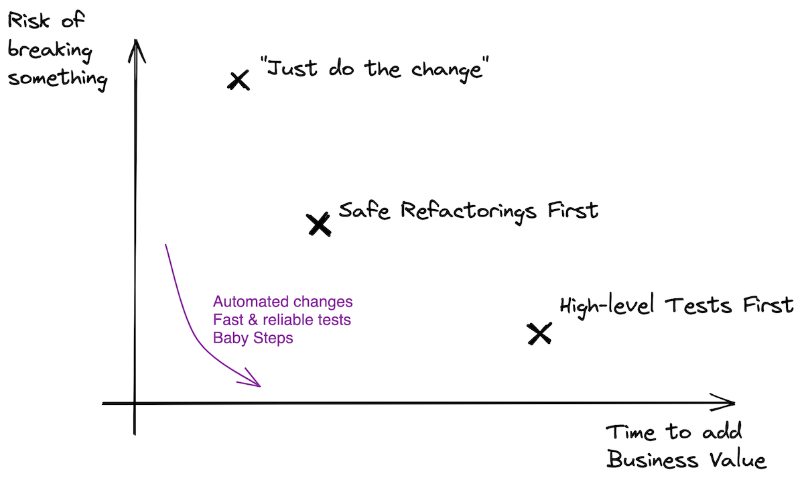

_This is concluding a 3-post series. You can read:_

- [Part 1](https://understandlegacycode.com/blog/one-way-of-refactoring-untested-code/), _where I presented you with a first approach (Test First)_
- [Part 2](https://understandlegacycode.com/blog/another-way-of-refactoring-untested-code/), _where I presented you with another approach (Refactor First)_

**Untested code.**

You are not the one who wrote it. Yet, it’s your job today to change it. It should support some new behavior. The question is: how do you make the change without breaking anything? 🤔

## Two approaches to refactoring Legacy Code

It’s the paradox of Legacy Code:

> I need to write tests, so I can refactor safely.
>
> But I need to refactor, so I can write the tests.
>
> 😵‍💫

[In the first article](https://understandlegacycode.com/blog/one-way-of-refactoring-untested-code/), I detailed one way of refactoring legacy code: **Testing First**. That is the classic approach. The one many experienced developers would recommend, including me:

1. **Write high-level, integrated tests** that will involve an actual MySQL database and HTTP calls
2. **Refactor** the Business Logic (Domain) out of the I/O (Infrastructure)
3. **Pull down most of the integrated tests** to write isolated tests on the Domain code instead

If you don’t have tests and you need to update that code, write the missing tests first.

Then, [I wrote another article](https://understandlegacycode.com/blog/another-way-of-refactoring-untested-code/) to illustrate another way of refactoring legacy code: **Refactoring First.** It goes like this:

1. **Refactor** the Business Logic (Domain) out of the I/O (Infrastructure) **using safe refactorings**
2. **Write isolated tests** on the Domain code

First refactor the code to make it easy to test, then write the missing tests.

So, which one should you use? Is one method better than the other?

As most things in life apparently: It Depends™. Here I will compare the pros and cons of each approach to give you the guidelines of which technique to use and when.

## Comparing both approaches

### When Testing First is better

**It’s the safest approach.**

Really. If you are touching a critical part of the software you are maintaining, spending the necessary time to put in place a safety net before you start working is indispensable. You need to be confident that nothing broke. The alternative to manually test scenarios will, in fact, be slower and riskier.

Doing that pre-requisite work will also help you **understand the code more in a safe way.** You will spend quite some time trying to run the code in a test environment. To make it happen, you will have to discover what are the annoying dependencies (eg. database, 3rd party server) and find a way to run these in an automated way.

At the end of the first step, your code will be covered with tests. Writing more of these tests will be easier.

Finally, because they are high-level, you will have **more freedom to refactor the implementation details** in step two. These tests won’t leave blind spots and won’t get in the way.

However:

- Writing these tests can be a challenge and take quite some time (which you may not have)
- Typically, you need to refactor the code so you can write the tests
- These tests will be slow and may also be flaky, which isn’t great
- It takes longer to proceed with this approach as you need to complete step #3 to be in a sweet spot—you shouldn’t keep the high-level, flaky tests around!

Therefore, often, refactoring first is better.

### When Refactoring First is better

If you are not working on a critical feature (like payments), then it’s a more pragmatic approach.

Because tests are missing, you want to reduce the risk of breaking something when you touch the code. To reduce risk, you can:

1. Lean on automated transformations
2. Take small steps
3. Verify behavior frequently

Automated tests will give you the latest. Without them, you should mostly transform your code using combinations of automated refactorings rather than large-scale manual ones.

It will get you to cleaner code, **faster than the first approach**. It gets the team started and moves in the right direction. It makes the code progressively easier to maintain and write tests for.

Since it’s much faster to execute than the first approach, I had better results at making it adopted by teams that are under the pressure of shipping new features. “Refactor As You Go” is a skill that can be learned and won’t look like you are just spending days writing tests.

Once you have taken care of the annoying dependencies, you are back in the happy land of testing pure logic 🦄 That logic may be convoluted, but it’s much easier to test! Thus, **this approach gets you most of the logic tested, faster.**

The tests you write there will be fast and robust since they are testing pure logic. Don’t mock too much to leave room for further, deeper refactoring.

However, this approach will leave you with some blind spots: the annoying dependencies that you carved out! In my experience, this is better than being paralyzed on untested code or not writing tests at all. You’ve left 20% of the code untested? Fine for now! The trick will be to write a few integrated tests on this later. Well, that’s a topic for another article. 😏

All things considered, I believe this is a pragmatic alternative to the recommended approach of writing the tests first, given that you have practiced your refactoring-fu.

## So, should I test or refactor first?

> Most of the time, I recommend people to Refactor First.

In practice, you know, It Depends™:

- How experienced is the team with testing?
- How good is the automation on the project? Can we easily run the app and its dependencies in a sandbox environment?
- Do developers know about Approval Testing?
- Do developers know their IDE automated refactorings?
- Which language are we dealing with?
- Is the team under strong pressure to deliver changes?
- How critical is the code being touched? How bad would it be to introduce a bug there?

Usually, refactoring Legacy Code involves changing the Legacy Culture. That takes time. Meanwhile, **the Refactor First approach is more pragmatic**. It helps the team to start improving the quality of their codebase quickly−at least, and it stops the bleeding. It takes some practice to learn and use automated refactoring moves, but that is easy to spread with pairing sessions and [refactoring katas](https://understandlegacycode.com/blog/5-coding-exercises-to-practice-refactoring-legacy-code/).

However, if the code being touched is critical and/or the team is willing to invest more time in paying off the technical debt, then **Test First is the safest approach**. It forces the team to make changes that will make the codebase easier to maintain overall (eg. being able to run the project in a container).

At the end of the day, both approaches are useful tools to have.

Experimented developers in the industry tend to recommend writing the missing tests first, and so do I. That being said, it’s not an all-or-nothing game. If Test First isn’t happening for you because it’s too hard to write integrated tests, then you may find Refactor First a more suitable approach to your context.

Both approaches can be practiced in coding katas like I’ve presented in the [Test First](https://understandlegacycode.com/blog/one-way-of-refactoring-untested-code/) and [Refactor First](https://understandlegacycode.com/blog/another-way-of-refactoring-untested-code/) articles.

And you, what is your preferred approach? Do you have another?

[Let me know!](https://twitter.com/nicoespeon)
