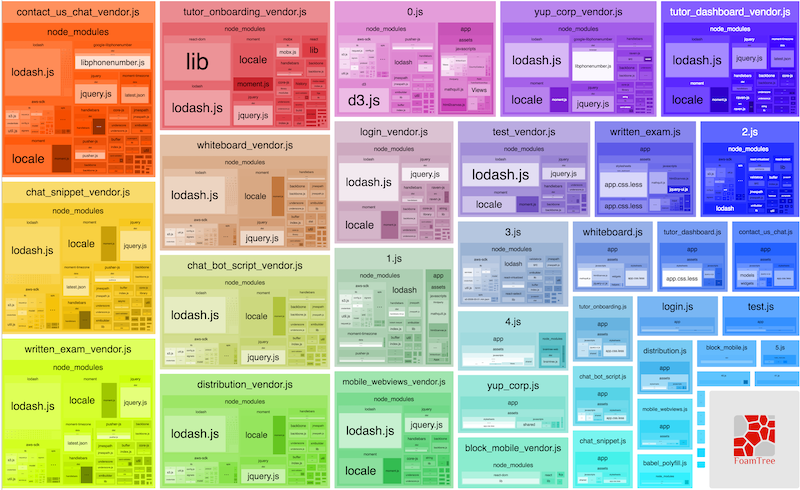
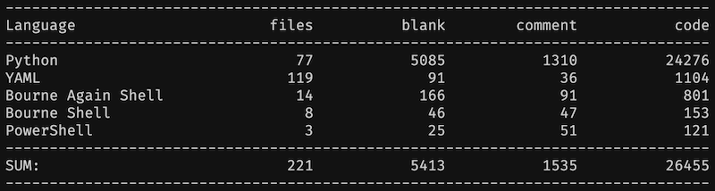
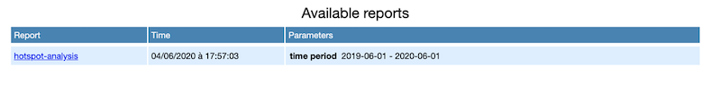
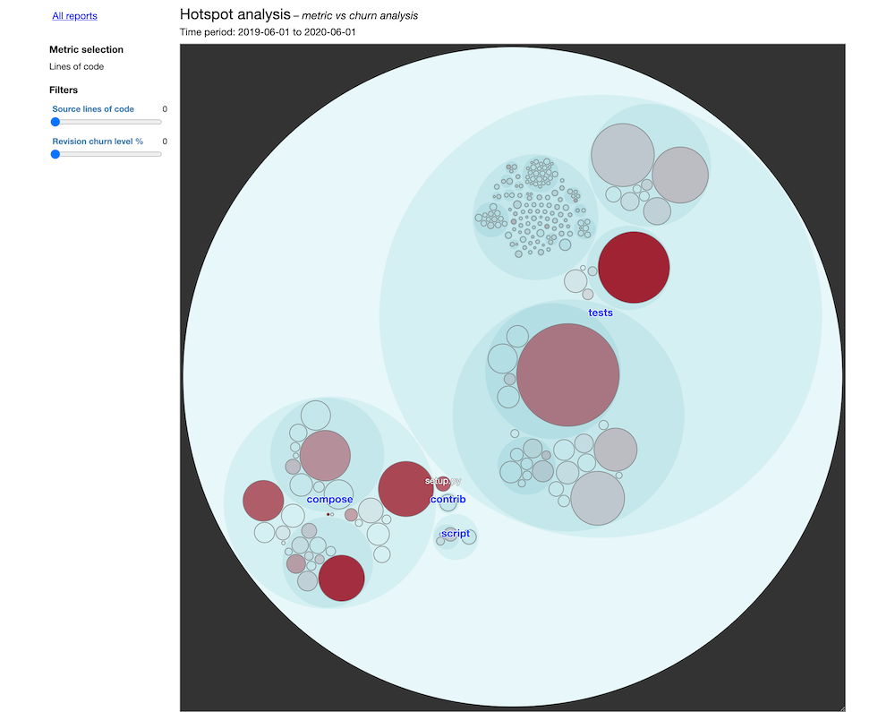
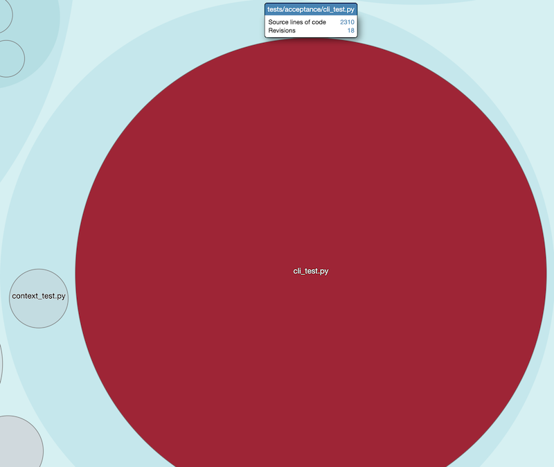

Do you feel powerless to address technical debt, because management doesn't seem to _care_ in fixing what's already there?

It's always about **new features** and **short deadlines**. As they say:

> "Clients won't give money for replacing something that works with something else that may work!"

Managers and developers have different drivers, but they're working for the same company. These conflicting points of view can be solved with better communication and [a few arguments can help](../5-arguments-to-make-managers-care-about-technical-debt/).

If only you could come up with a plan to make your team faster than ever, you'll get management support for sure! But measuring technical debt is hard and they don't understand technical details anyway…

Hopefully, there is one simple and efficient way to prioritize which tech debt to address first: [Hotspots analysis](../focus-refactoring-with-hotspots-analysis/).

The concept is simple enough for managers to understand the value. Some parts of the code are changed frequently. Keeping **these ones** clean has a major impact on your productivity. That's a great ROI for the business!

With Hotspots, you can build a reasonable refactoring plan to make a case for. It's a very pragmatic way to start doing _something_ 👊

But how will you explain that decent plan without losing them into technicalities of Churn and Code Complexity? Well… You can practice your presentation skills, or you can use "Enclosure Diagrams".

## Why are Enclosure Diagrams so great?

Enclosure diagrams help to visualize data as spaces contained inside others (usually rectangles).

They intuitively reveal 2 interesting aspects:

1. The hierarchy of things
2. The relative importance of things

Treemaps are the most popular kind of enclosure diagrams. If you ever generated the treemap of a webpack bundle, you already realized how helpful these are:



Enclosure diagrams to identify Hotspots of a system is an idea I discovered reading [Software Design X-Rays](https://pragprog.com/titles/atevol/) from [Adam Thornhill](https://www.adamtornhill.com/). This is an **excellent** book that showcases techniques to understand Legacy Code based on behavioral analysis. I will write a summary of its salient parts someday…

The great news is: an enclosure diagram will help you explain to non-technical people the impact and importance of your system Hotspots.

And here's the greater news: **you can generate one for your codebase within a few minutes!**

## Using `code-forensics` to generate Hotspots enclosure diagrams

Adam Thornhill created a tool to generate the diagrams: [code-maat](https://github.com/adamtornhill/code-maat).

That's great stuff, but [Silvio Montanari](https://github.com/smontanari) built a tool on top to make the process even easier: [code-forensics](https://github.com/smontanari/code-forensics).

This tool can give you a lot of insights from your codebase using behavioral data. Here, I'll focus on Hotspots. This is the one thing you need to make a case for refactoring Tech Debt.

Let's use it on a very concrete example 🤠

## Analyzing Docker `compose` Hotspots

Here's the [docker/compose](https://github.com/docker/compose) codebase.

I've chosen this one for 3 reasons:

1. It's very popular. Regardless of what language you're working with, you may have used (or heard) of Docker already.
2. I'm not familiar with the codebase. I bet you're not. Yet, we'll get insights within minutes out of it.
3. It seems big enough to gather interesting data.

Indeed, [cloc](https://github.com/AlDanial/cloc) says this repository has ~26k lines of code:



It's nothing compared to an actual Legacy codebase. But that's big enough to illustrate.

### Diving in, step by step

I'm decomposing every single step so there's no magic. I suggest you reproduce the steps on your side so you can _feel_ how it works.

#### 0) Pre-requisites

To run the analysis, you need to have installed:

- [Node.js](https://nodejs.org/en/download/) 4+ that should come with npm 3+
- [Java](https://www.java.com/fr/download/) 8+

For the record, I'm running the following analysis with node 13.5.0, npm 6.13.4, and Java 8. I'm using macOS, but that should work on Linux fine and probably on Windows too.

#### 1) Clone the `docker/compose` repository

```bash
git clone git@github.com:docker/compose.git
```

#### 2) Create a local repository where to host your analysis

```bash
make code-forensics-analysis && cd code-forensics-analysis
```

You should have this structure:

```
|__ code-forensics-analysis/
|__ compose/
```

#### 3) Initialize a node project

```bash
npm init -y
```

This should generate the following `package.json`:

```json
{
  "name": "code-forensics-analysis",
  "version": "1.0.0",
  "description": "",
  "main": "index.js",
  "scripts": {
    "test": "echo \"Error: no test specified\" && exit 1"
  },
  "keywords": [],
  "author": "",
  "license": "ISC"
}
```

#### 4) Install `code-forensics` dependency

It needs [Gulp](https://gulpjs.com/) 4+ to work, but don't install Gulp globally.

Instead, I recommend to install both locally. That's less side-effects to deal with:

```bash
npm install --save-exact code-forensics gulp@4.0.2
```

Here's what my `package.json` looks like now:

```json
{
  "name": "code-forensics-analysis",
  "version": "1.0.0",
  "description": "",
  "main": "index.js",
  "scripts": {
    "test": "echo \"Error: no test specified\" && exit 1"
  },
  "keywords": [],
  "author": "",
  "license": "ISC",
  "dependencies": {
    "code-forensics": "2.3.1",
    "gulp": "4.0.2"
  }
}
```

#### 5) Create a `gulpfile.js`

```bash
touch gulpfile.js
```

Fill it with basic configuration:

```jsx
require("code-forensics").configure({
  repository: {
    // Relative path to the `docker/compose` repository
    rootPath: "../compose",
  },
})
```

#### 6) Create a server to see your HTML reports

Update you `package.json` scripts to add a `start` command:

```json
{
  "name": "code-forensics-analysis",
  "version": "1.0.0",
  "description": "",
  "main": "index.js",
  "scripts": {
    "start": "gulp webserver"
  },
  "keywords": [],
  "author": "",
  "license": "ISC",
  "dependencies": {
    "code-forensics": "2.3.1",
    "gulp": "4.0.2"
  }
}
```

Then, run `npm start` to start serving reports from [`http://localhost:3000/`](http://localhost:3000/).

There's no report for the moment, let's create a first one.

#### 7) Run the Hotspots analysis

Scripts can be run with Gulp. As we installed it locally, we can access it from npm scripts.

Add this `hotspot` script to your `package.json` scripts:

```json
{
  "name": "code-forensics-analysis",
  "version": "1.0.0",
  "description": "",
  "main": "index.js",
  "scripts": {
    "start": "gulp webserver",
    "hotspot": "gulp hotspot-analysis --dateFrom=2019-06-01 --dateTo=2020-06-01"
  },
  "keywords": [],
  "author": "",
  "license": "ISC",
  "dependencies": {
    "code-forensics": "2.3.1",
    "gulp": "4.0.2"
  }
}
```

I've constrained the analyzed period so you can reproduce the same reports. You can omit `--dateTo`, but it's convenient to know you can reproduce your analyses at any time!

Also, I generally recommend analyzing **the past 12 months**. You don't need more.

Now, run `npm run hotspot`. Keep your server running in a terminal.

Open or refresh [`http://localhost:3000/`](http://localhost:3000/) to see the report appear:



If you open the report, here's what you'll see:



That's it. This is your enclosure diagram. You're done!

### Analyzing the data

Here's how the diagram works:

- Each bubble represents a folder or a file, following the codebase architecture.
- The size of a bubble corresponds to its complexity.
- The more red a bubble is, the most frequent it is touched.

Therefore:

> Focus on refactoring the big red bubbles first.

This is the message you will convey to your managers. The goal is not to clean the code for the sake of it, but to **take strategic decisions for the business**.

These big red bubbles are quite visual!

People will understand these are the critical bits to address. These are your top blockers for team productivity, based on the past 12 months' _actual_ work!

#### Digging into `docker/compose` Hotspots

The diagram is interactive. You can click on the bubbles to zoom in down to the file level.

We can see 2 major Hotspots in this codebase:

1. [cli_test.py](https://github.com/docker/compose/blob/master/tests/acceptance/cli_test.py), which is not a surprising pattern for me.

   I bet this has become the God Test that catches all bugs. I'd suggest to identify and extract related tests to make it easier to write and update them.

   

1. [cli/main.py](https://github.com/docker/compose/blob/master/compose/cli/main.py), which is also a typical pattern.

   Main files conveniently combine many different responsibilities. You need a main file. But the fact it's so frequently touched is an indicator that we're mixing different levels of abstraction there, in my opinion. Identify and extract these responsibilities will probably have the best impact on the codebase maintainability.

   

These 2 files combined represent ~3k LOC out of this ~26k LOC project.

Within a few minutes, you were able to prioritize work on the 10% that matters the most, without knowing much about the codebase.

Imagine what you can do with this skill on the codebase you're working with every single day.

Picture yourself presenting clear diagrams to management and win their support for the most foundational refactoring work you can do to improve your system.

Now, open your eyes and go generate the Hotspots diagram of your Legacy codebase! 👍
