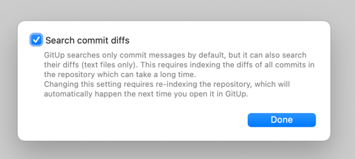

> Delete dead code.

This is common advice you may be familiar with. The rationale is legit: unused code adds cruft to the codebase, making it harder to read and reason about. Code usually becomes dead after the software has been changed or fixed. Sometimes, dead code is a residue of exploratory sessions, when we are trying to figure out how to implement something.

Sometimes the code is explicitly commented out. Sometimes, it’s unreachable (good IDE can tell you this). And sometimes, it’s tricky to tell whether or not it can be reached—if that’s your case, find a way to monitor when the code is called in production, wait, then get your answer from the logs.

Once you are confident some code is unused, **get rid of it**. Less code to read and maintain is easier to digest and less error-prone.

## But what if we need it?

Some people may ask:

> But what if we need it later? It could be useful as a reference.

This sounds like a valid concern, but generally expresses [our loss aversion bias](https://thedecisionlab.com/biases/loss-aversion)—the pain of losing something is psychologically twice as powerful as the pleasure of gaining. **We are afraid of deleting code!**

There are two antidotes to this, and you may have heard these counter-arguments yet:

1. [**YAGNI**](https://en.wikipedia.org/wiki/You_aren%27t_gonna_need_it). The sooner you cut the code, the sooner you reap the benefits of not wasting on maintaining, compiling, testing, and reading it. Moreover…
2. **You can get it back from source control**.

The 2nd point is the key to the “delete dead code” advice. With git, you won’t lose that piece of code. So why the loss aversion?

…

And that’s it. This is usually where the argument ends. Everything was said, no reason to argue more. I’ve sometimes heard this (sound) advice poorly packaged, using condescending words such as “your points are utterly irrelevant since…”—please don’t do that, it doesn’t help 😄

## So why people are still reluctant to delete code?

I’ve witnessed it with my own eyes. Experienced engineers, very aware of YAGNI, the smell of dead code, and yet falling for the siren of “let’s just comment it out for now”.

Thus, I dug deeper and after discussing I realized something: they know git could retrieve the deleted code, **but they don’t know how to find “some code” that was deleted “somewhere” in the past**. Keeping the code in the codebase feels easier since:

- You are more likely to bump into it when working in the relevant parts of the codebase
- It will pop up in your regular grep/searches

So the loss aversion problem isn’t fully addressed yet. At least, not until people feel confident it would be easy to retrieve the code at some point in the future, based on partial information.

> I know I could retrieve it… but it’s much harder.

The friction is the problem. After all, git blame can tell you the history of a given file or when some code was introduced… But what about code that isn’t visible since it was removed 3 months ago?

Great news: nope, you don’t need to remember which commit deleted the code to retrieve it!

If you are feeling doubtful about how to easily retrieve deleted code from partial information, let me show you how…

## How to retrieve deleted code from git logs

Ok, let’s pretend we are working on [the Abracadabra codebase](https://github.com/nicoespeon/abracadabra/)—it’s a VS Code extension that implements a bunch of automated refactorings for JS and TS that are missing in this editor…

As you can see, it has thousands of commits. I remember that, at some point, there was a concept of “cursor” that represented the user cursor and which you could put at given positions in the active document. It was removed a while ago, and I vaguely remember the name (`PutCursorAt` something). How could we retrieve the relevant code from all of the noise? 🤔

Let’s ask the git log:

```sh
git log --oneline -G "PutCursorAt"
```

It very quickly spits out the commits that contain code that matches the `PutCursorAt` pattern ([read more about `-G` option here](https://git-scm.com/docs/git-log#Documentation/git-log.txt--Gltregexgt)):

```sh
> git log --oneline -G "PutCursorAt"

36ee67ec Use Write to drop PutCursorAt logic
ac07e7b3 Update cursor to follow moved down statement
79f1bb43 Update cursor to follow moved up statement
(END)
```

Narrowed down to 3 commits. Not bad. In fact, commit `36ee67ec` seems to be the one I was looking for. [And here’s the diff](https://github.com/nicoespeon/abracadabra/commit/36ee67ec).

`git log -G` is your way to find code across the whole git history of the project. The `--oneline` option is here to make the output slim and to the point.

So you get the idea. Need to find the commit where we got rid of your “daily emails” feature? Try out `git log --oneline -G "daily-email"`.

Do you remember the name of the deleted file, but you are not sure where it was located?

```sh
git log --oneline -- **/dailyEmail.ts
```

## How to retrieve deleted code with even less friction

The git command line interface is powerful. But some GUI tools aren’t bad either.

In fact, I’ve found [GitUp](https://gitup.co/) to be particularly well made—although it’s only available on MacOS. It has a search box that you can use to find deleted code like you would do a regular search in your editor:

<iframe width="560" height="315" src="https://www.youtube-nocookie.com/embed/YvjkgWEJ1nc" frameborder="0" allow="accelerometer; autoplay; encrypted-media; gyroscope; picture-in-picture" allowfullscreen></iframe>

But to make it happen, you have to enable **Repository > GitUp Settings > Search commit diffs**.



There you go: frictionless retrieval of deleted code 🙌

Now you know. And if you come across a fellow developer who is reluctant of deleting some dead code because “deleted code is harder to find”, spread the word, show them this article. They will thank you 😉
