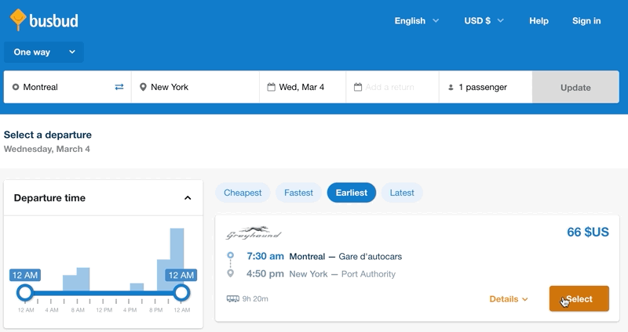
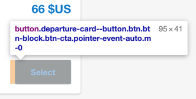
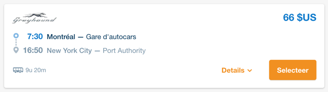
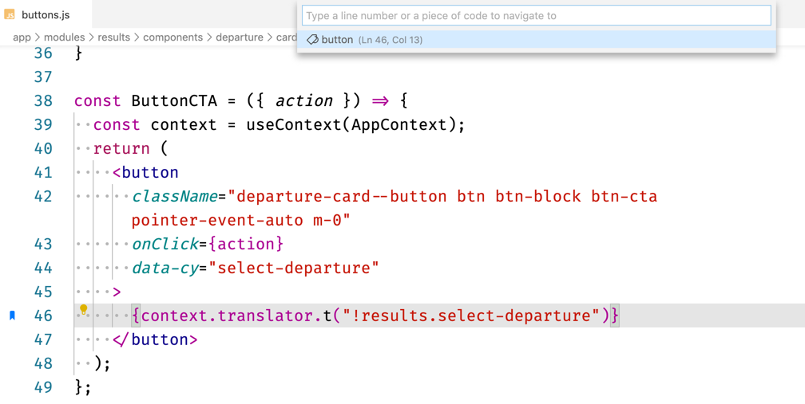

> Becoming acquainted with a codebase takes time. But how to even begin?

> It takes weeks before I feel safe making any change. I don't know of any way to make the job easy!

Let's talk about how you approach a legacy codebase.

You probably have some techniques to explore unfamiliar lumps of code. Some tooling maybe. Chances are you don't have good documentation—legacy code rarely has good documentation.

You also certainly know that **communication is key**!

Even if the author is long gone, it's always a great idea to talk to other developers, Product Managers, end-users, etc. When you talk to them, you learn what they know about it. Knowledge is gold. Having different points of view helps.

If you didn't ask anyone yet, start with that!

## Start with an existing feature

One that is related to the change you have to do.

If you're not sure which feature to start with, go talk to people again. Users are experts on how they use the system. Watch them do so to understand how the system behaves from the outside.

Now that you have a use-case in mind, your goal is to understand how THAT works.

But if you try to attack the codebase randomly, you'll be overwhelmed. It's too big. Too many things are going on.

**You need to focus!**

And the easiest way to focus is to start from something that you know. Something you can understand.

## Attack the system from its edges

You have a use-case in mind. That means you can get a handle on what the input of the system is. Or the output. Something you can see working with your own eyes!

### First, find a checkpoint

Say you're working on [Busbud website](https://busbud.com).

You need to modify some complex logic of the cart module. You're not familiar with that part of the code.

However, you can see that everything starts when you click on the "Select" button of a departure.

The first thing you can do is searching for the button in the code. How do you find it if you don't know the codebase? Look for unique things.

In the case of a web application, you have a Graphic User Interface. Thus, you have a text (which is not data). Use it to find the button.

If "Select" yields too many results, look for less common strings:

- Other text that appears next to the button (e.g. "Details")
- HTML tags or class names that seem specific to the element (e.g. `departure-card--button`)

- Be creative! Busbud is available in other languages. Switch to Dutch. I bet "Selecteer" is quite unique.

Once you've identified the button in the code, you have a checkpoint.

If your editor allows it, **create a bookmark** so you can return here when you need to.

Here's my bookmark of the matching code, using VS Code and the [Bookmarks extension](https://marketplace.visualstudio.com/items?itemName=alefragnani.Bookmarks):

### Then, follow the data with a debugger

If there is a button, there's a click handler.

The technique is to follow the code execution to discover more code. You have a checkpoint you understand. Step by step, you'll make that point bigger.

The best tool for the job is **a debugger**.

Modern code editors provide a debugger. If you don't know how to set that up, go search for documentation such as:

- [Debugging with VS Code](https://code.visualstudio.com/docs/editor/debugging)
- [How to debug with Webstorm](https://blog.jetbrains.com/webstorm/2018/01/how-to-debug-with-webstorm/)

They allow you to set a **breakpoint** in the code. A breakpoint will pause code execution when you reach it, so you can follow.

Once the execution is paused, execute the next step. Do you understand what's going on?

The way I learn what's happening is by **looking at the data available**. As I move step by step through the application, I can see where it goes and how it's changed.

As you understand more and more code, create new bookmarks. They mark the limit of what you know vs. the rest of the code.

Move on through the code until you reach the other edge of the system: the output.

### Iterate until you find what you're looking for

As you click on the button, some data is prepared until an HTTP call is made. It returns new data that is then transformed. Finally, the page gets updated.

The salient point of the process is the HTTP request and response.

Thanks to the debugger, **you now have a clear picture of what the data looks like at that point**.

And as you realize the logic actually happens on the server, you don't despair: you have the HTTP endpoint. Therefore, you have your first checkpoint in the server-side code. Start from the route handler!

## A few tips to do it right

Diving into an unfamiliar, large codebase is overwhelming.

> Next time you feel lost, start from the edges.

As you do so, follow this complimentary advice to stay productive:

1. **If you're lost, start over from your last checkpoint.** It's fine to restart the debugger.
2. **Add comments as you go.** Explain things that you learn and were not obvious.
3. **Do small and safe refactorings** when you understand things (e.g. rename variables).
4. **Use a piece of paper to help you think.** Draw, take notes. Get it out of your head so you don't lose track.
5. **Write down your goal and focus on that.** It's easy to get distracted with messy code. Don't fix what's not in the way.
6. **When new ideas pop up in your head, write them down.** Get them out of your head so you can focus.
7. **Do this work with another developer.** Together you'll have a higher chance to get the full picture and understand it faster.

If you follow this approach, you will get through most hairy codebases.
