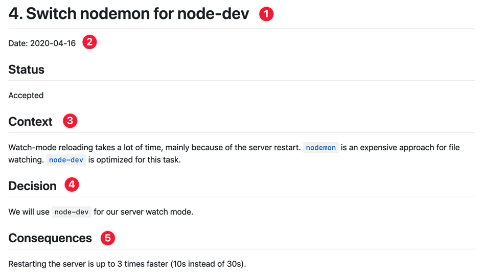
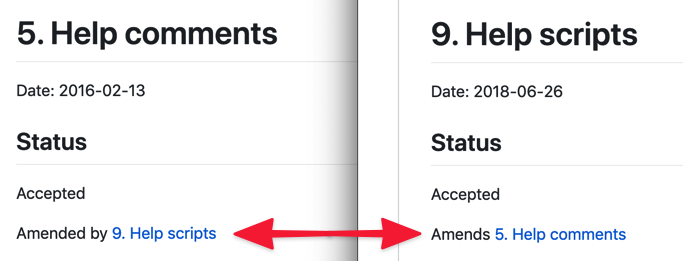

> How many of the original developers are still working on your project?

A common trait of Legacy Code is **knowledge loss**.

Legacy systems are many years old, sometimes many decades. That's more than the typical turnover for developers.

When the previous devs left, they bring with them their hard-won functional knowledge of the system. And there you are, left with a vast accumulation of undocumented sludge.

> Would you say that your system is well documented?

Sometimes there is documentation.

But if you're lucky enough to find one, you quickly realize it's partly incomplete or outdated. If only you could ask the previous developers what they had in mind when they implemented this feature that way!

Now, think about the future. How long do you think you'll work on that project? How many quirks and traps did you learn about that system? How many reflexes did you acquire?

If you document what you know, that will surely help future maintainers!

**But documentation needs to be maintained**. It's generally not synced with the code, so it has the annoying tendency to get out of date. Maintaining it takes time and energy. It's dispiriting.

Hopefully, there's something simple you can do to ease future maintainers' life that doesn't require to be maintained.

## Architecture Decision Records (ADRs)

ADRs document decisions. Their main goal is to explain _why_ a decision has been taken.

Across the project lifecycle, many decisions are taken:

- using XYZ library to make HTTP requests
- putting the tests in a dedicated folder
- using a custom implementation of a feature that is available in some libraries
- delegating code formatting to a specific tool
- etc.

The problem is that you don't know _why_ these decisions were taken. Or you don't remember. Thus, it's hard to revisit these decisions.

Maintainers typically have 2 approaches to address this problem:

1. Changing the way it works, taking the risk of unknown unknowns and breaking things
2. Keeping it the way it works and living with it

ADRs give context around the decisions that were taken, so you can revisit them.

And they are **dead simple to write!**

### ADRs are simple Markdown files

Nothing fancy.

It's a standard format that can hold hyperlinks and images. Of course, you can go for whatever format that makes sense for your team.

I recommend you **to version ADRs along with your code**. Create an `adrs/` folder at the top of your project and start capturing important decisions you take.

Prefix ADRs names with an incremented number: `0001-some-decision-taken.md`. It's easy to maintain and conveniently sort them by creation date.

### An ADR has 5 essential elements

1. **The title**. A short sentence to recap the decision taken.
2. **The date**. That's helpful to give context.
3. **The context**. This is where you'll explain _why_ you took that decision. Detail your constraints. Tell the reasons that make this decision be the best one available today.
4. **The decision**. That's the main point of the document: make that decision explicit for future maintainers.
5. **The consequences**. Based on the decision taken, what will change? Detail the upsides and compromises you're committing to.

That's it! 👐

There's a status. It's not essential. If you need different stakeholders to agree, you can track the process with different statuses.

However, the status becomes really interesting when you need to revisit a decision.

### Revisit a past decision = a new ADR

The point of ADRs is to help you understand quickly why a decision was made. With this context, you may realize that you have more knowledge/budget/tooling to take a different decision today.

Document that in a new ADR. It will supersede the previous decision.

Use the status to simply mark the relationship between the two ADRs:

- in the old ADR, indicates it's superseded by the new one (add a link)
- in the new ADR, reference the old ADR that is superseded (add a link too)

Doing so makes it easy to follow the evolution of the decisions.

### What kind of decisions?

ADRs are not just for major architecture decisions. Athough I wouldn't recommend writing an ADR just because you renamed a class.

Find the middle ground. Be aware of the decisions you take.

Here are a few examples of ADRs usage in projects, to get you inspired:

- [adr-tools/doc/adr](https://github.com/npryce/adr-tools/tree/master/doc/adr) from Nat Pryce
- [abracadabra/docs/adr](https://github.com/nicoespeon/abracadabra/tree/master/docs/adr) a personal side-project
- [form-builder/decisions](https://github.com/ministryofjustice/form-builder/tree/master/decisions) from the UK Ministry of Justice 🇬🇧

## Making it so simple that you have no excuse

Creating an ADR is quite easy. The boilerplate is fairly small.

If you want to make it effortless, install [the `adr-tools` CLI tool][adr-tools].

It gives you simple commands to init, create and supersede ADRs:

- `adr init doc/architecture/decisions` to configure this folder as the container for your records. It will also create a first ADR saying you're adopting ADRs 🤯
- `adr new Implement as Unix shell scripts` to create a new ADR when you take a decision
- `adr new -s 9 Use Rust for performance-critical functionality` to create a new ADR that supersedes ADR `0009-*` for you.

## A simple, efficient form of documentation

ADRs have been [formalized by Michael Nygard in 2011](http://thinkrelevance.com/blog/2011/11/15/documenting-architecture-decisions).

**They don't get outdated!** They are capsules of knowledge that haven proven to be tremendously helpful for project maintenance.

**They help code reviews**. They encapsulate in the versioned code the rationale behind the choices you made.

### Just do it 👊

Are you working on a Legacy system you inherited that's lacking documentation?

Here's what you can do when you get back at work:

1. Install [`adr-tools` CLI][adr-tools]
2. Run `adr new adrs`
3. Open a Pull-Request
4. Add the link to this article in your PR description
5. Discuss with your team the benefits of using ADRs

To make the most of it, keep your ADRs stupid simple. Don't be fancy. Keep the bar low, so they get written.

Future maintainers will appreciate you for that.

Your future self will love you for that.

[adr-tools]: https://github.com/npryce/adr-tools
