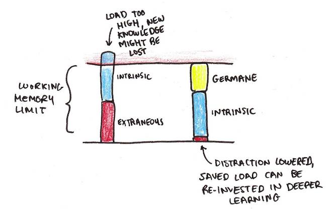

If you are looking to hone your refactoring skills, I have [a list of coding exercises to practice](https://understandlegacycode.com/blog/5-coding-exercises-to-practice-refactoring-legacy-code/). These coding katas are designed for working with Legacy Code. They are also a great playground to try new techniques.

Here, I want to give you some advice to make the most of it, based on my experience.

First of all, I will lean on this live stream from Sandro Mancuso: "Testing and Refactoring Legacy Code":

<iframe width="560" height="315" src="https://www.youtube-nocookie.com/embed/LSqbXorkyfQ" frameborder="0" allow="accelerometer; autoplay; encrypted-media; gyroscope; picture-in-picture" allowfullscreen></iframe>

The recording is a bit long (1h30), so here is my recap of what stood out for me and I think will be relevant to you.

Sandro is using [the Trip Service kata](https://github.com/sandromancuso/trip-service-kata). It's a great coding exercise to practice writing tests on an existing API that calls a database. He shares one excellent piece of advice:

**Start testing existing code from the shallowest branch, and start refactoring it from the deepest one.**


The best way to get started writing the test… is by trying to write the test. The code you try to run will probably fail. The failure message will guide you to identify what's blocking—usually, there is an annoying dependency.

## How to get around annoying dependencies

Sandro shows how to eliminate the database dependency that's in the way: **Extract Method and Override** refactoring.

[I've detailed this technique in another post](https://understandlegacycode.com/blog/quick-way-to-add-tests-when-code-does-side-effects/). Here is the gist of it:

So, you need to test the `TripService` class:

```js
class TripService {
  getTripsByUser(user) {
    let tripList = []
    let loggedUser = UserSession.getLoggedUser()
    // …
  }
}
```

But the `UserSession.getLoggedUser()` is in your way.

Simulating a logged user can be tricky. It will take some time. If you have a short deadline, you can't get sidetracked. Still, you want to do the best job you can!

Instead of going down the rabbit hole, let's apply the technique here.

### 1. Extract the problematic side-effect

```diff
class TripService {
  getTripsByUser(user) {
    let tripList = []
-   let loggedUser = UserSession.getLoggedUser()
+   let loggedUser = this.getLoggedUser()
    // …
  }

+ getLoggedUser() {
+   return UserSession.getLoggedUser()
+ }
}
```

By doing so, you are creating [a Seam](https://understandlegacycode.com/blog/key-points-of-working-effectively-with-legacy-code#identify-seams-to-break-your-code-dependencies): an entry point to change the behavior of the code in your tests.

### 2. Subclass the class you're testing

In your test file, you can extend this class:

```js
class TestableTripService extends TripService {}
```

At this point, using `TestableTripService` is equivalent to using `TripService`. But this indirection will be helpful in the last step.

### 3. Override the problematic method

```js
class TestableTripService extends TripService {
  getLoggedUser() {
    // Return what's convenient for your tests
    return new User()
  }
}
```

Now you can test the behavior of `TripService` through the `TestableTripService` class.

You can control what `getLoggedUser()` returns, hence you can easily test the different scenarios.

My preferred approach to control what is returned is to use a setter, so it's explicit:

```js
class TestableTripService extends TripService {
  getLoggedUser() {
    return this.loggedUser || new User()
  }

  withLoggedUserBeing(aUser) {
    this.loggedUser = aUser
    return this
  }
}

// Later in a test…

it("should throw when user is not logged in", () => {
  const tripService = new TestableTripService().withLoggedUserBeing(aGuest())

  expect.toThrow(() => tripService.getTripsByUser(anyUser()))
})
```

Repeat that for every problematic side-effect until you get your code under tests.

### What if you are dealing with functions instead of classes?

In languages like JavaScript or Python, it's very common to use a more functional approach.

If that's you, my advice is to embrace the functional way of doing it: _composition_.

Extract the side-effect in a function and pass it as a parameter. In your tests you'll be able to control what is returned:

```js
function getTripsByUser(user, getLoggedUser) {
  let tripList = []
  let loggedUser = getLoggedUser()
  // …
}
```

```js
it("should throw when user is not logged in", () => {
  const getGuestUser = () => aGuest()

  expect.toThrow(() => tripService.getTripsByUser(anyUser(), getGuestUser))
})
```

If you still have questions or doubts about this approach, I suggest you check out [the detailed blog post](https://understandlegacycode.com/blog/quick-way-to-add-tests-when-code-does-side-effects/) to see if it answers them 😉

## Use your tools to make test feedback faster

Tooling is also powerful. Sandro can move faster because he has integrated feedback from his tests, right in his IDE, along with the code.


This is IntelliJ IDEA (which was hosting the live stream). Depending on your language/editor, you may find alternatives (eg. [Wallaby](https://wallabyjs.com/) is a tool I like to use when working on JS codebases). It really helps me work faster with Legacy Code.

Another great practice I want to highlight here is how Sandro spends some time clarifying the intention of his tests. It doesn't take long, but extracting variables into well-named constants can really make your tests easier to read… and maintain!


## Commit frequently

Have you noticed that Sandro commits frequently during the whole process? In fact, it's as much more interesting to pay attention to _how_ he works than _what_ he does.

**Commit frequently.** Change design in baby steps, to keep most work working at all times. These are useful daily skills you can hone with a kata like the Trip Service 👍

## Use automated refactorings

It's always fascinating to see the combo of a statically typed language (Java) and an editor like IntelliJ which can automate most refactorings for you.

If you are more of a VS Code+JavaScript developer, you can get some of this goodness with my own extension: [Abracadabra](https://marketplace.visualstudio.com/items?itemName=nicoespeon.abracadabra).

## Adapt your practice to your level of experience

The best way to learn new things depends on your level of expertise. I recommend [reading this article](https://www.scotthyoung.com/blog/2022/01/04/cognitive-load-theory/) that nicely explains how your brain works.

**Novices learn best with a worked example that shows how to get to the solution.**

**Experts learn best with practice.**


If you never practiced refactoring katas before, I suggest you start with a worked example. Sandro Mancuso's video is a good support for that.

If you already have some experience, you should probably _practice_ more:

- Reduce the extraneous load by cutting all distractions—turn on focus mode and stop the flow of notifications to get in the zone.
- Use the extra cognitive load available to **deliberately make the exercise more efficient for you**. Take notes of what you are doing, what it implies, what makes it work or not… Trying to perform a specific refactoring manually, without looking it up, is another good example.



If that resonates with you, I would also recommend you check out [my notes on The Programmer's Brain](https://understandlegacycode.com/blog/key-points-of-programmer-brain/)​, by Dr. Felienne Hermans. It's a great book to understand how your brain works when dealing with unfamiliar code.

## To recap

So, to recap how to efficiently practice refactoring katas:

1. Start testing existing code from the shallowest branch, and start refactoring it from the deepest one
2. Use the "Extract Method and Override" refactoring move
3. Configure your tools to get faster feedback from tests
4. Lean on your editor's automated refactorings
5. If you are new to refactoring katas, follow worked examples, like Sandro Mancuso's live stream
6. If you are a veteran of refactoring katas, get focus time to practice deliberately, being aware of what you are doing and how you could improve. Take notes, they help.
