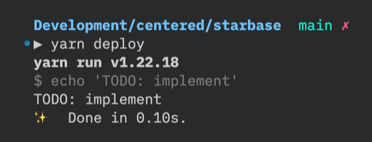
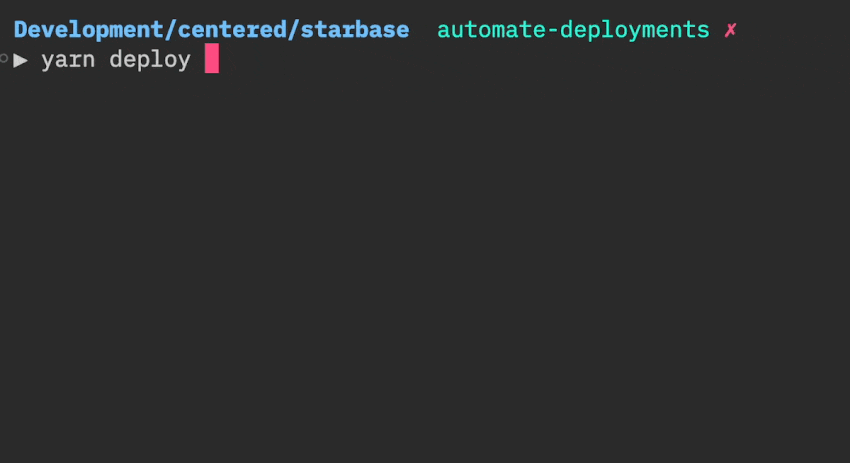
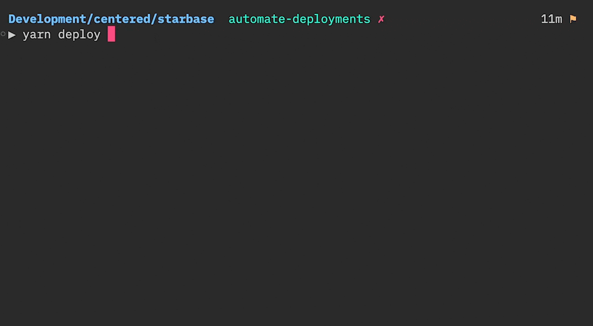
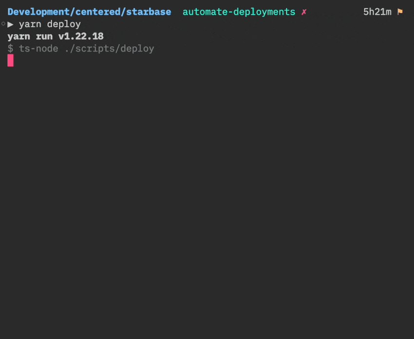

Something is wrong with the project I’m working on.

Or rather: it’s very risky!

If I stop thinking about the next feature to be developed and take a step back to assess how maintainable that project is, I realize there is a problem. And it has to do with the first step of handing over a legacy: any developer should be able to deploy changes to production. And I don’t believe that’s the case today.

Have you ever worked on software that only a few developers were capable of deploying? Maybe even a single person. The one who is always in charge of shipping the app to Production.

What if that person leaves the project? Goes on holiday? Gets sick?

> If I’m taking a week off, the team may call me to fix a failed deployment. I don’t like that!

If you aren’t confident you can deploy the project yourself, then you may have a problem. A typical symptom is when someone else tried to deploy the software but did a mistake in the process. They got burned and that was embarrassing. Yet, have you taken steps to solve that situation?

## There are so many steps involved to deploy our software!

If you are dealing with an old legacy project, you certainly have a lot of moving parts to deal with:

- Databases
- Special environment configurations
- External dependencies
- Custom libraries that need some special steps to build

You thought about **automating the deployment process**, but you are not a Docker expert. You have other things to do, and all of this work feels overwhelming!

So nothing changed. Deployments are still depending on that one person who knows it all. That’s risky.

That’s where my project is. Deploying the backend involves a few manual steps—not too much, but just enough to be subtle. And I think I’m the only one who actually knows all of the steps. I should fix that!

But wait, automating the deployments would be ideal… but is it realistic?

There may be a LOT of steps involved—some you may not even be aware of. Some may be really hard to automate in the first place. And it seems to be an all-or-nothing situation: how good would a deployment script be if it doesn’t deploy the whole thing?

Hopefully, I know a trick to get over that analysis paralysis situation!

A technique that will help us break the status quo. Something you can realistically do within 1h, even if you aren’t a Docker expert. Something that will give you the most bang for your buck.

**Fake it, until you automate it.**


## How to “fake it”

The first step is to think about the habit you want to create. What ideal behavior would the team ideally have?

Well, having a single command to deploy the software would be sweet. So let’s start here.

### 1) Create a simple deploy command

This project is a TypeScript one and the team is using [Yarn](https://yarnpkg.com/). Thus, I know the intuitive command would be something like `yarn deploy`. I will declare this command in the top-level `package.json` as if it was already working!

```diff
"scripts": {
+   "deploy": "echo 'TODO: implement'",
    "build": "turbo run build",
```

I can now run the command. It will do nothing… but it’s actually a very important step: from now on, everyone in the team can get into the habit of triggering this command when they want to deploy the code!



### 2) Call a deploy script from that command

The second step is to make that command run a command instead. We will need to perform actions and prompt text, so we should delegate that work to a script.

```diff
"scripts": {
-   "deploy": "echo 'TODO: implement'",
+   "deploy": "ts-node ./scripts/deploy",
    "build": "turbo run build",
```

```tsx
// scripts/deploy.ts
console.log("TODO: implement")
```

I run the command again to test it’s still working. It now takes a few seconds since `ts-node` has to compile the TypeScript file and run the logic, but that’s OK for my needs. The behavior hasn’t changed, but now I have a playground to do more!

### 3) Collect existing knowledge

Now, everything is ready to do the actual deployment work. But before we dive into the actual automation, it would be nice to know _what_ exactly should be automated.

Let’s walk before we run. My task is less daunting, and yet critical: collect the steps needed to deploy the software, and put them in the script.

This is the heart of this trick: **we are creating a single, reliable source of truth for deployments!**

A trick is to search for keywords, such as “Deploy”. At the moment, it seems that we have some documented steps in our `README.md`. I’m gonna move these into the script and update the README to point to the script. Here is the current documentation about deployments:

````markdown
## Deployment

For the backend:

1. Go to the root folder of this monorepo
2. Clean up the `lib/` folder to avoid deploying old code:

   ```
   rm -rf backend/firebase/functions/lib
   ```

3. Deploy all functions

   ```
   yarn functions deploy --only functions -P staging
   ```

Replace `staging` with `production` to deploy to Production

If it fails, it will tell you which functions failed to deploy.
Run the command again to deploy only these functions.
Do it until you were able to deploy everything!
````

When reading this, I realize a few things:

1. **Some of the information is outdated**. Eg. there is no need to clean up the `lib/` folder anymore, that is handled by the `yarn functions` script now.
2. **Some steps have conditions**. Eg. the target changes if you want to deploy to Production or Staging.
3. **Some information may be missing**. Eg. how to deploy the indexes and rules.
4. **Some information may be duplicated around**. Eg. I have found similar instructions in the `backend/firebase/README.md`.
5. **There may be more than my original scope**. Eg. there are docs on how to deploy the website, the desktop app, etc.

I’ll reduce the scope of all of this and aim to have a single command (`yarn deploy`) that will simply prompt the instructions to deploy with basic interactions (wait for user confirmation, ask choice questions, etc.).

As I move the instructions to the script, I will update the instructions: update what’s outdated, and add what’s missing.

### 4) Implement a basic script

You may decide to go with a library to help you do so. I don’t have yet a go-to CLI library that fits my needs for a TypeScript codebase. But at this point, I don’t need much. Hence, I’ll rely on Node.js native [readline](https://nodejs.org/api/readline.html) API.

Very quickly, I can craft something like this:

```tsx
import { stdin, stdout } from "process"
import * as readline from "readline"

const cli = readline.createInterface({
  input: stdin,
  output: stdout,
})

stdout.write("Starting deployment\n")
stdout.write("Press `Enter` to move to the next step\n")

cli.question("Step 1: do this", () => {
  cli.question("Step 2: do that", () => {
    stdout.write("System is deployed!\n")
    cli.close()
  })
})
```



It’s able to spit out instructions, one step at a time. It could already take some input from the user—although I may reach out to another library like [Inquirer.js](https://github.com/SBoudrias/Inquirer.js/) to have nicer prompts.

Before I fill it with content from the Markdown file, I will spend a little time refactoring the current code to make that change easy. Indeed: I will certainly have a lot of `question` to write, but I’m not happy with the fact each one augments the indentation level. That’s JS callback pattern, which means I can use [the Promise pattern](https://developer.mozilla.org/en-US/docs/Web/JavaScript/Reference/Global_Objects/Promise) to solve that, thanks to the async/await syntax.

I will also take that excuse to introduce a simpler, better API that I’d like to use. I’ll abstract away the implementation details, so this may evolve in the future when I need something better than the native readline to implement more complex automation!

```tsx
// The ideal API I want to use
export interface CLI {
  say(message: string): void
  prompt(message: string): Promise<void>
  exit(): void
}
```

```tsx
import { stdin, stdout } from "process"
import * as readline from "readline"
import { CLI } from "./cli"

// One implementation, using Node.js readline
export class CLIUsingReadline implements CLI {
  // Optional
  // I like to have static methods to instantiate instead of "new" expressions
  static create(): CLIUsingReadline {
    return new CLIUsingReadline()
  }
  private constructor() {}

  // That's all we need for now to implement the behavior we want
  private readline = readline.createInterface({
    input: stdin,
    output: stdout,
  })

  say(message: string): void {
    stdout.write(`${message}\n`)
  }

  prompt(message: string): Promise<void> {
    return new Promise(resolve =>
      this.readline.question(message, () => resolve())
    )
  }

  exit(): void {
    this.readline.close()
  }
}
```

```tsx
import { CLI } from "./lib/cli"
import { CLIUsingReadline } from "./lib/cliUsingReadline"

// The actual piece that's called and glue everything together
deploy(CLIUsingReadline.create())

// The logic that performs the deployment
async function deploy(cli: CLI) {
  cli.say("Starting deployment")
  cli.say("Press `Enter` to move to the next step")

  await cli.prompt("Step 1: do this")
  await cli.prompt("Step 2: do that")

  cli.say("System is deployed!")
  cli.exit()
}
```

I ran `yarn deploy` again, to test if everything still works as before. It does. At this, that’s all there is to manually test to verify all scenarios work. And notice how easy it would be to swap the readline CLI implementation with another one that would be more convenient in tests. That would allow us to automatically simulate scenarios depending on user answers when the script will become more involved…

But that’s not the scope of this post. Let’s move on!

Now that it’s easy to spit out instructions, let’s move the content from our Markdown to our script:

```diff
-  await cli.prompt('Step 1: do this')
-  await cli.prompt('Step 2: do that')
+  await cli.prompt('1. Go to the root folder of this monorepo')
+  await cli.prompt(`2. Deploy all functions with this command:
+    yarn functions deploy --only functions -P staging`)
+  cli.say(
+    `If it fails, it will tell you which functions failed to deploy. Run the command again to deploy only these functions. Do it until you were able to deploy everything!`,
+  )
```

That works!



Well, almost. I haven’t transcribed the part that says “depending on your target environment, the command is different”. Let’s prompt this question to the user and adapt based on the answer.

In practice, I’m getting close to reaching out to another lib that will handle nicer prompts for me as I _know_ it will get more complicated. But for the scope of this post, I only have a yes/no to handle. Thus, let’s do a simple one ourselves:

```diff
export interface CLI {
  say(message: string): void
  prompt(message: string): Promise<void>
+ choose<T>(message: string, choices: { match: string; value: T }[]): Promise<T>
  exit(): void
}
```

```tsx
export class CLIUsingReadline implements CLI {
  // …

  async choose<T>(
    message: string,
    choices: { match: string; value: T }[]
  ): Promise<T> {
    return new Promise(resolve =>
      this.readline.question(`${message}\n`, answer => {
        const choice = choices.find(
          ({ match }) =>
            match.trim().toLowerCase() === answer.trim().toLowerCase()
        )

        // Ask the question again until we got a valid answer
        if (!choice) {
          this.choose(message, choices).then(resolve)
          return
        }

        resolve(choice.value)
      })
    )
  }
}
```

```tsx
async function deploy(cli: CLI) {
  cli.say("Starting deployment…")
  cli.say("Press `Enter` to move to the next step")

  await cli.prompt("1. Go to the root folder of this monorepo")
  const target = await cli.choose(
    "Are you deploying to Staging (s) or Production (p)?",
    [
      { match: "s", value: "staging" },
      { match: "p", value: "production" },
    ]
  )
  await cli.prompt(`2. Deploy all functions with this command:
    yarn functions deploy --only functions -P ${target}`)
  cli.say(
    `If it fails, it will tell you which functions failed to deploy. Run the command again to deploy only these functions. Do it until you were able to deploy everything!`
  )

  cli.say("System is deployed!")
  cli.exit()
}
```

This works as expected, with basic interactions:



Finally, let’s not forget to update the README to tell everyone to use the new command instead:

````diff
- For the backend:
- 1. Go to the root folder of this monorepo
- 2. Clean up the `lib/` folder to avoid deploying old code:
-
-    ```
-    rm -rf backend/firebase/functions/lib
-    ```
-
- 3. Deploy all functions
-
-    ```
-    yarn functions deploy --only functions -P centered-staging
-    ```
-
-    Replace `centered-staging` with `centered-1580668301240` to deploy to Production

- If it fails, it will tell you which functions failed to deploy.
- Run the command again to deploy only these functions.
- Do it until you were able to deploy everything!
+ Run `yarn deploy`.
````

That’s good enough to be shipped!

### 5) Iterate

Let’s pause and reflect on what we have done here.

We used to have some outdated instructions for backend deployments in our README. It seems that no one was really reading these.

Now, we have a new command to run: `yarn deploy`

It sounds like a command that will do the deployment for us! Except it only spits out the same instructions, step by step.


Is that really worth it?

In my experience, it is. For 3 reasons:

1. It gets people into the habit of running a single command to initiate deployments
2. It’s a more obvious source of truth for putting the deployment instructions
3. Because it’s already an executable script, it makes it easier for us to automate some of the steps listed

Indeed, instead of telling the reader to run some command line, the script could run it itself:

```diff
export interface CLI {
  say(message: string): void
  prompt(message: string): Promise<void>
  choose<T>(message: string, choices: { match: string; value: T }[]): Promise<T>
+ exec(command: string): Promise<void>
  exit(): void
}
```

```tsx
// …
import { exec } from "child_process"

export class CLIUsingReadline implements CLI {
  // …

  exec(command: string): Promise<void> {
    return new Promise((resolve, reject) => {
      const run = exec(command)
      run.stdout.pipe(stdout)
      run.on("close", resolve)
      run.on("error", reject)
    })
  }
}
```

```tsx
async function deploy(cli: CLI) {
  cli.say("Starting deployment…")
  cli.say("Press `Enter` to move to the next step")

  cli.say("1. Going to the root folder of this monorepo")
  await cli.exec("cd $(git rev-parse --show-toplevel)")

  const target = await cli.choose(
    "Are you deploying to Staging (s) or Production (p)?",
    [
      { match: "s", value: "staging" },
      { match: "p", value: "production" },
    ]
  )

  cli.say(`2. Deploying all functions`)
  await cli.exec(`yarn functions deploy --only functions -P ${target}`)
  cli.say(
    `If it fails, it will tell you which functions failed to deploy. Run the command again to deploy only these functions. Do it until you were able to deploy everything!`
  )

  cli.say("System is deployed!")
  cli.exit()
}
```

Now we can talk about automation!

If some steps are difficult to automate, the script can still spit out the relevant instructions and let the user manually do that.

There is more to do. When I run the script and follow the instructions, I will have ideas on how the script could make the work a little easier for me next time (eg. the final step that tells me what to do in case of failure could be more explicit, or interactive). _That’s the point!_

I have put my team on the right track. I can stop here and push what I have done 🚢

## It pushes your team into the Pit of Success

By taking the deployment instructions and turning them into a script that simply spits out the steps one by one, you can make easy, yet huge progress toward deployment automation!

Actually automating deployments in a legacy codebase is often overwhelming. It’s the kind of task we prefer to dodge, even though we know it would be helpful 😬

However, writing such a script can be fun and tackled within an hour!

It’s simple, and yet it has a lot of merits:

1. **It creates a deploy command** that your team will get used to call
2. **It forces you to collect information** about the deployment process and update them
3. **It creates an executable source of truth** for deployments
4. **It creates clear next steps** for truly automating them: automate the steps that are still manual
5. **It splits the problem** of “automating deployments” into smaller steps that can be addressed incrementally

Therefore, it helps your team do the right thing. Pit of Success! They may do the rest of the work for you. It’s easier for everyone to bring the next brick to build the wall when they don’t start from a blank slate.

Hopefully, I showed you here it doesn’t take a lot of work to get _something_ to get started. 😉
