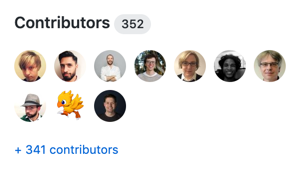
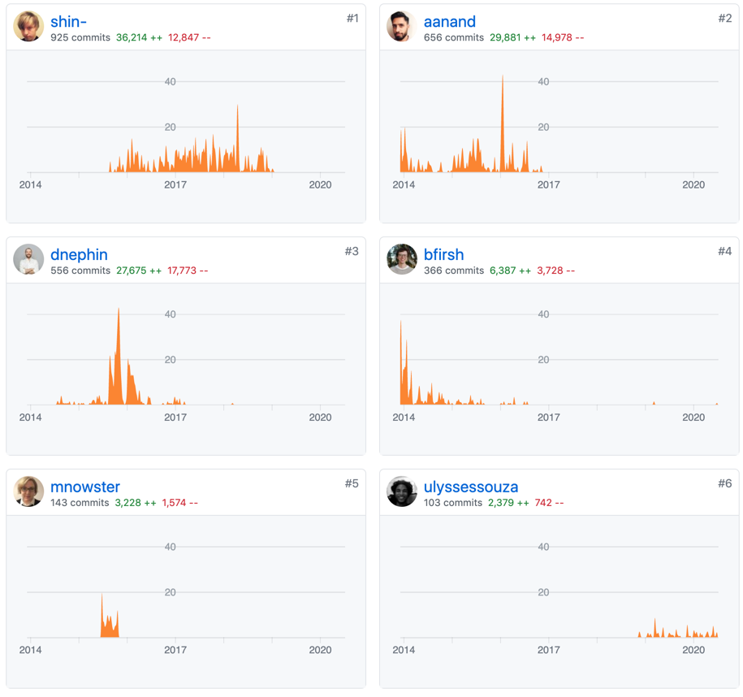
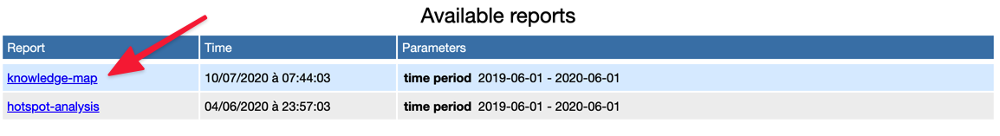
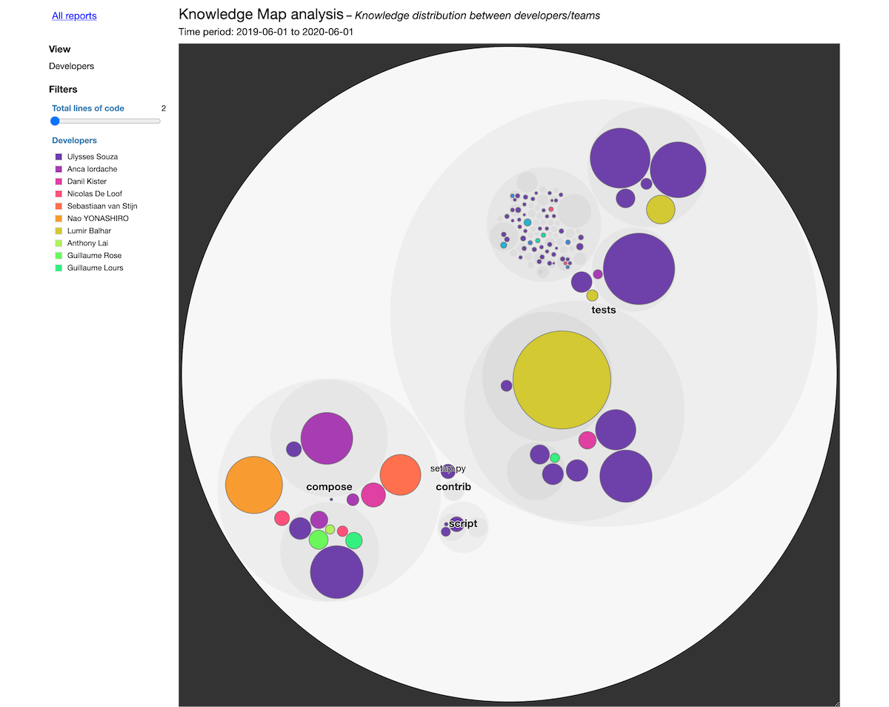
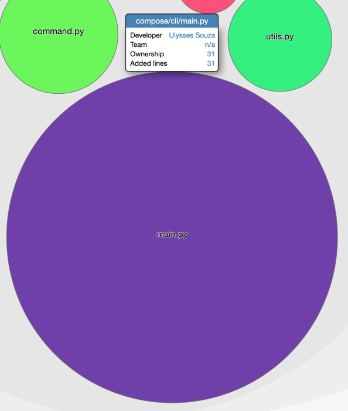
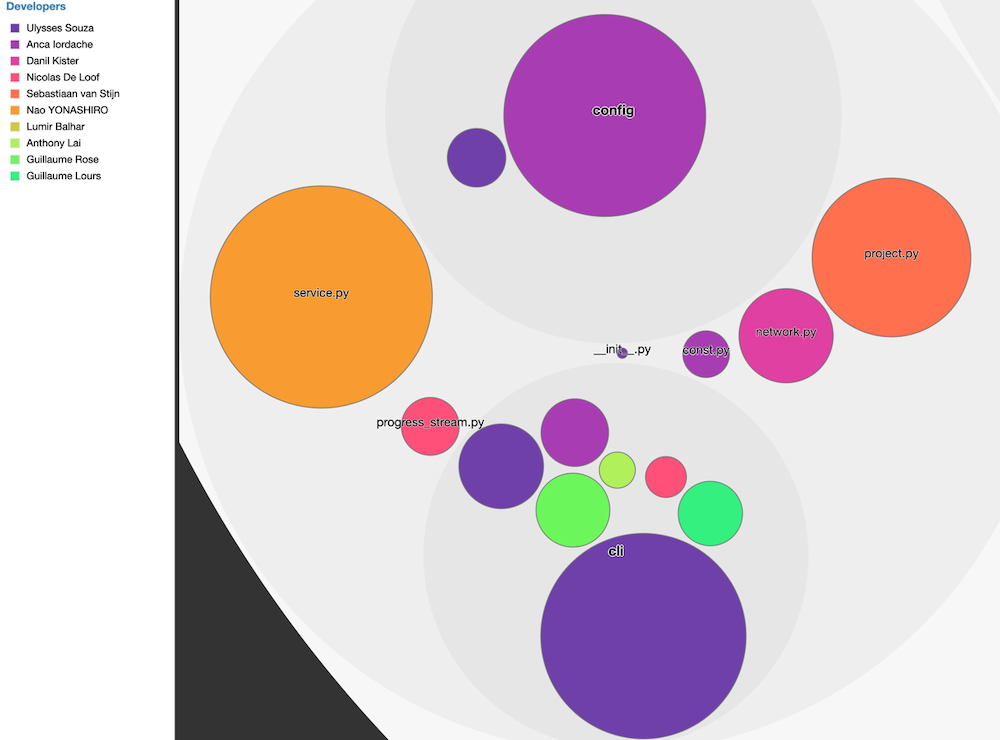

When you join an existing Legacy project, it can feel like a vast accumulation of undocumented sludge.

Hopefully, your teammates can help you get through it. But even after some months, you may have to change a part of the codebase you never touched before. Figuring things out is necessary, but takes time.

If you don't have a strong culture of pair-programming, you certainly feel that you can't just disrupt your team anytime you have a question. You have to spend some time figuring this out _on your own_!

OK, maybe after some time you finally reach out to your colleagues. But they're focused on their thing. They won't reply right away. So you keep trying to figure this out on your own while you wait for help…

## What if you could identify right away who would be the best person to ask?

If you could determine who's the best person to ask, you could reach them right away and stop wasting so much time!

Maybe you'll even realize this person has moved to a different project, thus asking your teammates wouldn't have helped you much!

All the information you need is available in your VCS history.

I'm not talking about `git blame` though. Its usage is too limited for what you need to do.

What you need is a _map_ of who knows best each part of the codebase you're working with.

And I have good news for you: **you can generate this map for your project in about 10 minutes**. Let me show you how to do that!

## Drawing a Knowledge Map

I've discovered the concept of Knowledge Maps in [Software Design X-Rays](../key-points-of-software-design-x-rays).

The idea is to leverage git metadata to retrieve the information you need about contributors. Then, you visualize this data with a useful enclosure diagram:


If you didn't, I suggest you first read [how we generated the Hotspots diagrams to convince managers to address Tech Debt](../convince-management-to-address-tech-debt-with-enclosure-diagrams/#using-code-forensics-to-generate-hotspots-enclosure-diagrams).

In fact, we'll use [code-forensics](https://github.com/smontanari/code-forensics) again to generate a Knowledge Map of any codebase in a matter of minutes.

When you're done, come back here and move on: we'll create a Knowledge Map of the [`docker/compose`](https://github.com/docker/compose) codebase!

## Drawing Docker `compose` Knowledge Map

`docker/compose` is still a very interesting project to analyze to demonstrate insights you can get from any codebase.

It's open-source, hence there are many individual contributors. As of July 10, 2020, there are 352 different contributors to the project:



If we take [a deeper look at the contributions](https://github.com/docker/compose/graphs/contributors), we can see the main contributors to the project in terms of commits:



However, I suspect [shin-](https://github.com/shin-) doesn't work on the project anymore as his last contribution was made in early 2019.

Who, among the rest of the team working on the code, will know the most about the code we want to touch?

Let's draw the Knowledge Map to find out!

### Getting started

First, follow [the 7 steps detailed in the Hotspots analysis](../convince-management-to-address-tech-debt-with-enclosure-diagrams/#diving-in-step-by-step) to get started with `code-forensics`.

When you're ready, here's what your `package.json` should look like:

```json
{
  "name": "code-forensics-analysis",
  "version": "1.0.0",
  "description": "",
  "main": "index.js",
  "scripts": {
    "start": "gulp webserver",
    "hotspot": "gulp hotspot-analysis --dateFrom=2019-06-01 --dateTo=2020-06-01"
  },
  "keywords": [],
  "author": "",
  "license": "ISC",
  "dependencies": {
    "code-forensics": "2.3.1",
    "gulp": "4.0.2"
  }
}
```

And your `gulpfile.js` should be:

```js
require("code-forensics").configure({
  repository: {
    rootPath: "../compose",
  },
})
```

### Run the Knowledge Map analysis

Add this `knowledge-map` script to your `package.json`:

```json{9}
{
  "name": "code-forensics-analysis",
  "version": "1.0.0",
  "description": "",
  "main": "index.js",
  "scripts": {
    "start": "gulp webserver",
    "hotspot": "gulp hotspot-analysis --dateFrom=2019-06-01 --dateTo=2020-06-01",
    "knowledge-map": "gulp knowledge-map-analysis --dateFrom=2019-06-01 --dateTo=2020-06-01"
  },
  "keywords": [],
  "author": "",
  "license": "ISC",
  "dependencies": {
    "code-forensics": "2.3.1",
    "gulp": "4.0.2"
  }
}
```

I've constrained the analysis to the same period. This means you will find the same results when you run the analysis.

Also, **1 year of data is enough**. If something hasn't been touched since chances are high that people don't really remember how the thing works anyway.

Now, run `npm run knowledge-map` to generate the report.

If you haven't already, start a server to visualize the generated report with `npm start`.

Open [http://localhost:3000/](http://localhost:3000/) to visualize it:



If you open the report, here's what you'll see:



### Analyzing the data

In the Hotspot analysis, we found out that [cli/main.py](https://github.com/docker/compose/blob/master/compose/cli/main.py) was a critical file that requires refactoring.

Say you want to tackle this task, who should you consult for help?



The Knowledge Map says that [Ulysses Souza](https://github.com/ulyssessouza) would be the best person to tell you because **he made the most contributions to this file in the past year**.

What if he doesn't know much about it? If so, then this knowledge is probably lost and it's even more critical for the team to dig into it.

Interestingly, you can see that different developers own different parts of the codebase. That's helpful to know who to ask for help regarding the code you have to change:



Now you know how to generate such a map for any codebase. The analysis is language-agnostic since it leverages VCS metadata.

Going beyond, there are a couple more insights you can get out of this analysis:

- **You can check if your teams ownership align with your organization** if you regroup individuals per team. You may realize that the Marketing team is owning a part of the Inventory codebase that has to do with emails, and you might want to revisit this collaboration.
- **You can spot knowledge loss** if you identify individuals that left the company. Are there critical parts of your codebase for which you've lost the main contributor?
- **You can proactively prioritize offboarding** if a fellow developer is leaving, by focusing on the critical parts of the codebase they own the most!

What will the Knowledge Map of your codebase tell you? Find it out by generating one. It will only take you a few minutes to set up!
