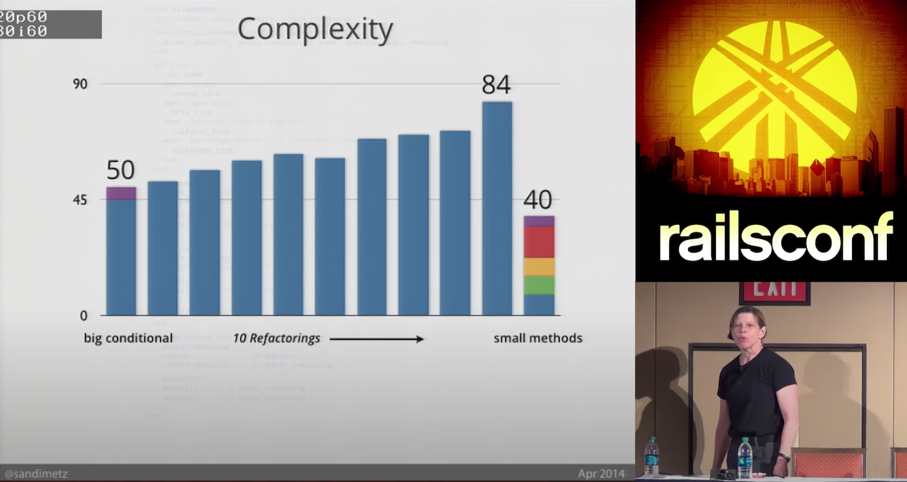

When you work with existing code that has no test, adding some is often a challenge. This code wasn't written to be executed in a different context than "production". It works™ under the right circumstances and environment, which are difficult to reproduce and automate.


[I have techniques](https://understandlegacycode.com/first-aid-kit/) to get such code under tests. Some of them require to do minimal changes to the existing code, so we can write the tests.

When I present these, someone eventually raises this interesting question:

> Is it fine that we create these extra parameters just for the tests?

That's a wonderful question to have! It shows that you care about the maintainability of the code in the future. You don't want to make the mess even worse, do you?

The code is in a poor state. We want to write tests so we can change it safely, faster. But doing so often makes the code looks… worse. How does it look like to turn this code:

```js
export function getPurchaseExport(id) {
  // 200 lines of logic, http requests, logging, etc.
}
```

Into the same code, but with external dependencies passed as parameters?

```js
export function getPurchaseExport(
  id,
  httpClient,
  sequelize,
  moment,
  logger,
  sentry
) {
  // The same 200 lines, but easier to test 🤷
}
```

Usually, the question pops at some point in your head. I think it's an important one to address.

## Yes, it's fine to change code for the sake of testing

For once, I don't have an "it depends" answer to give here. I've experienced both approaches enough times to have a good opinion on this. Yes, it's OK to do the change so you can test the code. Even if it looks worse _for now_.

The rationale here is the following:

- I don't know any other approach that would bring benefits in the future. Some tools may numb the pain for a while, letting you go in the wrong direction longer. Eventually, you have to come back from a worse state.
- The remaining alternative is to… do nothing. That's dangerous. Doing nothing is the easiest approach, but it harms the codebase more because it makes it harder and harder to come back.

When it comes to Legacy Code, it's very easy to be paralyzed by the amount of work that is required to put things back on track. Ideally, you'd refactor the whole thing for a design that makes more sense. Maybe you'd rewrite all of it! In real life, you don't have time for that.

I've learned that you can't afford to not do anything because it wouldn't be perfect. That's not productive.

> Don't make it perfect. Make it a little bit better, every day.

Why does it feel like we're making the code worse though? Because of the symptoms. Injecting dependencies explicitly to some code will make it clear that it does too much. We don't like seeing a class/function take 8 parameters. It will raise a red flag to most developers reading this code.

Yet, having 8 _implicit_ dependencies is worse. It looks better because it's hidden. But that hidden complexity bites you whenever you need to change the code. It creates friction, preventing changes. The act of writing tests highlights this pain because you have to deal with the friction now. By making it visible, we create opportunities to address the root cause. Resist the temptation of hiding the problem.

## You can preserve the API for clients

Note that you can always add some proxy, so you can start cleaning the code without impacting all the clients of this code:

```js
export function getPurchaseExport(id) {
  return getPurchaseExportAndDoOtherStuff(
    id,
    httpClient,
    sequelize,
    moment,
    logger,
    sentry
  )
}

export function getPurchaseExportAndDoOtherStuff(
  id,
  httpClient,
  sequelize,
  moment,
  logger,
  sentry
) {
  // The same 200 lines, but easier to test 🤷
}
```

I did 3 things here:

1. I extracted the whole body of the original function into another one. This new function isn't used by clients and takes its dependencies as explicit parameters.
2. I gave [an honest name](https://understandlegacycode.com/blog/improving-legacy-function-names/#its-fine-to-use-and-but-your-journey-doesnt-stop-here) to this function. It does more than getting the "purchase export". I don't know what yet, but I want to make that clear. I'll rename it as I understand this function better.
3. I exported it, so I can access it in tests. This is not ideal, but it is fine because it's my way out. If I'm concerned clients would start using this code, I can extract it in a different file that wouldn't be exposed at the module level. Or I could give it a more explicit name.

What matters is that we are addressing the root cause. Until we are done, we do compromises. It is fine as long as we make it clear, and we keep moving in the right direction.

## It becomes worse before it becomes better

In her talk [All the Little Things](https://www.youtube.com/watch?v=8bZh5LMaSmE), Sandi Metz tackles [the Gilded Rose kata](https://understandlegacycode.com/blog/5-coding-exercises-to-practice-refactoring-legacy-code/#1-the-gilded-rose). When she starts refactoring the code, she makes it look worse.

Actually, it doesn't just look worse. _It is worse._ The intermediate result is much more complex than the original code. And yet, this intermediate complexity leads to ultimate simplicity.



And here's the gist of it: you need to know (or believe) that the intermediates refactorings will lead you to simplicity to keep moving towards that direction. Otherwise, you won't dare do the necessary changes, because they seem to make the code worse. You can't see it's only temporary.

At this point, here is the advice that helped me the most:

1. **Practice in a safe playground**. Use a coding exercise to practice refactoring techniques and experience how it feels—[I've listed 5 great exercises here](https://understandlegacycode.com/blog/5-coding-exercises-to-practice-refactoring-legacy-code).
2. **Clarify the end goal.** Especially when working with a team. Explain what's the intention behind the intermediate refactoring, and how you plan to get here roughly. Explain how the things that look worse, for now, will ultimately be simplified (e.g. responsibilities will be split, so this code will only compose other, well-tested functions).
3. **Keep track of the work**. Have an open issue for the remaining work. That helps to realize you already have work in progress before you decide to start another refactoring.
4. **Make little refactorings part of your daily habits**. Once you trust yourself that will move the needle towards the end goal every time you touch the code, you don't need to keep track of the work so much. That takes time and practice, but ultimately makes working with legacy codebases less frustrating.

Give them a try, they may help you too 👍
