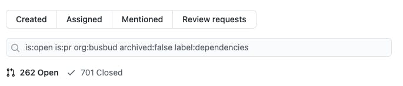

How do you keep your dependencies up-to-date?

How do you prevent the foundations to rot as time passes?

How do you recover a project that's already lagging behind many major versions of critical dependencies? 💀

It may feel like a daunting task, but there's a strategy that worked best for me. Let's talk about dependency freshness for a bit…

In my experience, it is common for a legacy project to be lagging behind multiple versions of its dependencies. That's not a surprise: **keeping things up-to-date takes energy!**

Furthermore, legacy codebases tend to have accumulated a lot of dependencies over the years. It's a mass of packages that takes a lot of energy to keep up-to-date. However, that energy is never taken into account in the maintenance budget—it's always about new features to implement and bugs to fix.

This really becomes a problem when it's too late. Some day, some infrastructure change may force you to upgrade the version of PHP/Ruby/Node.js/etc. you're running on. Only then do you realize some old dependencies you have are not compatible! Now you have a pressing deadline and no visibility on the amount of work required to make everything work again!

That's a recipe for disaster. A lot of stress and painful upgrades.

And I'm not even mentioning other factors such as vulnerabilities discovered in some package one of your old dependencies depends on.

So, what can you do about it?

## Automatic upgrades: pros and cons

Open-source has popularized tools like [Dependabot](https://dependabot.com/) that will automate some of the work for you:

- They'll constantly monitor new releases of your dependencies
- They'll open Pull-Request to upgrade these dependencies when needed
- All of this is configurable, so you can tailor the behavior

However, in my experience, this doesn't work so well for the legacy system you have to maintain. The main reason is that most of the energy isn't spent on detecting and upgrading the dependencies. Most of the energy is spent making sure the upgrade didn't introduce a regression in the system!

Therefore, I see all too often Dependabot integrations that just add more pressure to the teams. They open dozens of PRs a month. Yet, these aren't part of any product backlog, since it's _purely technical_. The team tries to address them on the side _when there's time_.

The truth is there's never enough time. The PRs accumulate:

The problem in this situation is that there's no real strategy in keeping dependencies up-to-date. This is a mistake.

The best way I know to keep dependencies up-to-date in any project is **to dedicate a little bit of time, regularly**. It's like the dentist: not taking care of this for years can get you in big trouble. But do a little check every now and then and you'll barely notice!

Dependabot integration can help you with the technicalities. But it won't replace a proper strategy from the team to maintain the dependencies.

**I recommend spending 1h on dependency upgrades every week.** Especially if you're working with a legacy codebase full of outdated packages!

Adapt to your situation. It's better to do smaller upgrades often than to spend a full week doing that. 1h/week gets the team into the habit of doing it. On top of keeping dependencies up-to-date, it's a great habit to build! Also, 1h/week will likely go unnoticed. You should not ask permission to update the dependencies!

Finally, there's one tool I really like to drive this kind of dependency-freshness initiative: [libyear](https://libyear.com/).

## Libyear: a simple tool to measure dependency freshness

I love libyear because it does one thing and does it well: it gives you a **simple** measure of software dependency freshness. It is **a single number** telling you how up-to-date your dependencies are.

It can run on many languages (.NET, Python, PHP, JS, Java…). It's a nice indicator to follow the progress you're making! This helps the team feel the impact of their continuous work. It also helps communicate the progress to non-technical stakeholders.

**I believe we should celebrate the work of people who prevent fire.**

Imagine the day when production is about to break because some dependencies aren't compatible with the required infrastructure. Senior engineers will work hard to save the day, spending extra hours in the evening/weekend to fix up the incompatibilities as much and fast as they can. They'll surely get (deserved) shoutouts from the whole company for recovering from this delicate situation!

These people are impressive.

You know who is more impressive? The people who prevent this delicate situation to ever happen in the first place! A team that decreases their libyear score by investing a little bit of time every week deserves even more praises 👏

It's a difficult concept to apprehend. That's why **showing the libyear score trend going down** helps convey the message.

Add thresholds, explain what would happen if nothing is done, celebrate!

### Freshli: libyear score over time

And if you want these graphs to be generated automatically for you, friends at [Corgibytes](https://corgibytes.com/) are developing [Freshli](https://github.com/corgibytes/freshli-lib): a tool for collecting libyear scores over time. It's still alpha, but these folks are experts in maintaining legacy systems: they are actively using it!

## The recipe

So, before getting burned by outdated dependencies, I suggest you give this recipe a try:

1. Schedule a 1h/week slot of upgrading dependencies.
2. Be the champion. Open the event to any who wants to join, but do it anyway if no one is joining you!
3. Use [libyear](https://libyear.com/) to identify which packages to upgrade first (focus on the "most outdated, least used" to start with easy wins).
4. Put libyear scores over time in a graph to share progress with all stakeholders. You may use [Freshli](https://github.com/corgibytes/freshli-lib) to help you.

And let me know how it goes! I'm always looking forward to your personal tips and feedback on the matter ❤️
