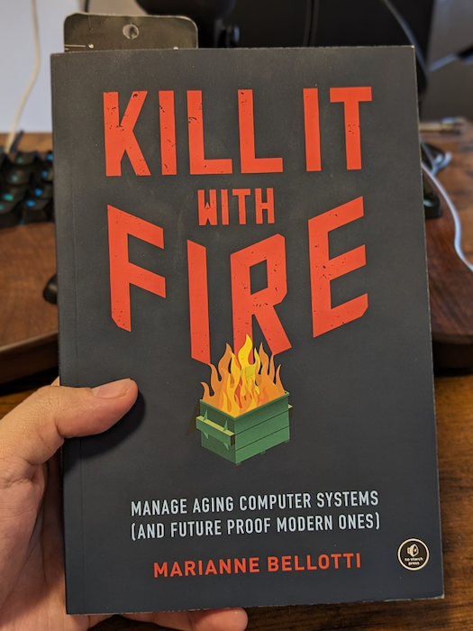

If you ask developers what they would do with that tangled legacy codebase they are dealing with, many of them will probably reply:

> Kill it with Fire. Let’s rewrite the whole thing on a modern stack.

But don’t be fooled. While [Marianne Bellotti](https://twitter.com/bellmar) picked a provocative title for [her book](https://www.goodreads.com/book/show/54716655-kill-it-with-fire), she exhaustively explains why this is not the best approach and what to do instead.

Should you grab a copy and benefit from her experience in the field? Certainly.

Need more details? Let me highlight some of the salient points of the book.

## Why do we end up with legacy systems?

> Legacy technology exists only if it is successful. Technology that isn’t used doesn’t survive decades.

This is a good reminder that we are talking about valuable code. One that may be modernized, but that can’t just be thrown away.

It’s interesting to notice that **the tech community rewards explorers**. In an organization, you may come across in-house frameworks, tooling, and other abstractions to make code reusable, even when it doesn’t have more than one use case…

> Engineers are motivated to create named things. […] If the named thing turns out to be popular, the engineer’s prestige increases, and her career will advance.

We tend to overestimate failures from legacy systems and underestimate the time it would take to complete a rewrite (and the gains we would get from it).

**People often assume that new is better, but that may not be true**. New practices imply more complicated technology, which can be more prone to failure. You should not blindly jump to new things just because it’s new. But you should not let things rot either, or you will have to migrate decades of new patterns and interfaces people got used to… at once!

So what justifies a modernization project?

1. **The code is difficult to understand**. Decisions have been lost or are not relevant today.
2. **Qualified engineering candidates are rare** — the technology stack may be a hiring issue.
3. **Hardware replacement parts are difficult to find**.
4. **The system can no longer perform efficiently**. A performance issue is a nice problem to have because the organization has a strong motivation to put money into modernization work.

Again, beware of modernization for the sake of chasing new technology. Such a project is complicated enough, don’t add too many unknowns to the mix.

## But why modernizing a legacy system is hard?

Why can’t we just “kill it with fire” and start over? Well, technical issues are not easy to deal with, but the people problems you will face are even harder!

A legacy modernization project takes at least months, usually years. **It’s difficult to keep developers excited and focused for that long on such a project**.

> The number one killer of big efforts is not technical failure. It's loss of a momentum.

If you think modernizing an existing software is easier because the app can be used as specs, you will be disappointed. The truth is that you have lost the context of the decisions that were taken. Years of intertwined changes and nuances that you are blind about. You can’t expect to just build the same app, but better.

Marianne has a few recommendations to make it easier:

1. **Reduce the scope and ambition**. You can’t tackle everything at once. Go one problem at a time, leave the rest for later. Don’t add new technologies to the mix if not justified.
2. **Reduce the number of big decisions your modernization projects need**. Define a target metric and let the individual contributors make most day-to-day decisions to avoid killing the momentum. E.g. lean on existing programs, projects, or technologies.
3. **Spend some time trying to recover context**.
4. **Use tools and automation to support your work**. E.g. static analysis of the codebase, maybe AI-based tools. They can help you go faster, but be careful of bad surprises if you just let them do the work.
5. **Don’t underestimate the little performance gains**. 5, 10, or 20% here and there may compound and yield bigger changes.
6. **Find a balance between coupling and complexity**. Loosen the coupling and the system becomes more complex. Increase the coupling to reduce the complexity. In other words: keep things simple until there is a benefit of decoupling them.

A good way to track progress and determine when you are “done” is to define Success Criteria:

1. **Define your goal**. E.g. move service onto its deploy pipeline
2. **Define the timeframe for evaluation**. E.g. one quarter
3. **List the Success Criteria that confirm you're heading in the right direction**. E.g.
   - Time to deploy drops by 20%
   - The number of deploys in a week goes up
   - Any single person on the Service team can initiate and manage a deploy

## What can you do to help?

Whether you are joining an ongoing legacy modernization project or you are starting one, pay attention to attempts to fix things that are not _really_ broken. For example, this monolith may be doing its job just fine.

Parts of it may benefit from being extracted, but do you need to split the whole thing into a myriad of micro-services? Probably not.

This is more likely to end up as a half-finished initiative. It will leave the system in a worse state. [I’ve worked on such a system](https://understandlegacycode.com/blog/ship-of-theseus-avoid-rewrite-legacy-system/#in-my-current-project-were-dealing-with-that) where a rewrite attempt was initiated but not completed, and all of the original developers were gone. If you start a modernization project, get it through the finish line. The secret is to take smaller steps.

Things you can usually start with:

1. Build out and mature automated test suites
2. Set up a strong monitoring system
3. Put in place an efficient system to respond to incidents

### If you are a Tech Leader

Are you a Tech Lead, Engineering Manager, CTO, or equivalent? Then, you can help modernize the legacy _culture_ of your organization.

**Social recognition is critical**. If your organization does not recognize efforts to maintain a legacy system, these efforts will fade out. E.g. if your demos and meetings only focus on new features and big launches, then no one will spend time preventing fires from happening because they will go unnoticed. A solution: schedule a 10-minute block at the end of every meeting for “kudos”. **Make maintenance work visible**.

**Beware of reorganizations, they are traumatic**. They are the equivalent of “full rewrites” for engineering leaders. Reorganizations are incredibly disruptive and can be demoralizing. Use with caution. Instead, choose a structure that facilitates communication between the teams that need to get the job done.

If you create a war room, make sure to put the right people in it. The goal is to reduce the distance conversations travel between the people who get the job done, not to have middlemen reporting for their team.

Sometimes, when you are facing issues that go beyond the boundaries of your organization's teams, you may want to create a Code Yellow:

> A Code Yellow is a cross functional team created to tackle initial critical to operational excellence. The purpose is to create momentum.

Such teams are small, focused, and temporary. The goal is not to fully resolve a problem, but to get out of a critical area. Identify a leader who will be the central point of contact for the company. Give them access to all the resources they need to get the job done.

Finally, it’s common for companies to run post-mortems on failures, to learn from them. Think about running **post-mortems on successes**. Document what happened on how you succeeded.

### If you are an Individual Contributor

You can’t convince leadership to invest resources in maintenance? **You may need a crisis**.

Rework your argumentation to highlight facts and risks about the existing system. You may need a bit of storytelling. Explain what this means for the business. Take something that is unreported and could be bad for the organization, and explain it from a non-technical standpoint.

**Think about opportunity costs**. Calculate the money saved if the system was doing X better. This can give you the arguments you need to explain why you won’t spend time adding new features instead. If you are successful, it will get you buy-in for similar maintenance work later.

If your organization has defined SLOs or SLAs, then think about the impact of modernization efforts on these metrics.

**Don’t be afraid of breaking stuff**. It’s impossible to improve a large legacy system without breaking something along the way. If your team can quickly recover from a failure, it may inspire greater confidence in your team’s capability to modernize the system.

**Breaking things on purpose is also a great way to regain knowledge of the system you are dealing with**. If no one remembers what something is doing, why not turn it off and see what happens? In many contexts, you will either:

1. Have someone complain and learn what this system is impacting after all. Document it after you have turned it back ON.
2. Have no news about it, thus have saved time maintaining and migrating some parts of the system.

If that feels uncomfortable, consider:

- Setting up some logs and monitoring. Is this route ever called in Prod? Add a log, push to Prod, wait a few days or weeks, and decide.
- If that system goes down by itself, will someone notice early enough?
- Before deliberately killing a system, see if you can turn it back ON if necessary.

Remember that it’s better to learn how something is working when you are in control rather than the day it breaks unexpectedly at 2 AM on a Saturday 😉

> We get better at dealing with problems the more often we have to deal with them.

## Preventing this from happening

The best way to modernize a legacy system is not having to run a dedicated modernization project. Instead, maintenance efforts are part of the business-as-usual tasks and are celebrated along with new features.

Marianne also points out that **many problems come from trying to build complex systems right away**. People forget that each additional layer of complexity requires a monitoring strategy and process to be maintainable over time.

E.g. a message queue may be more scalable to make two services communicate, but a simpler solution with a tight coupling between these new services will probably get you better results to start with and migrating to a message queue later is straightforward.

> **Don't build things for scale before you have to scale.** Build something you will have to re-design later. […] Build something wrong and update it often.

Adopt a continuous delivery mindset: if something hurts, do it more often. Deploy to production more frequently. Upgrade your dependencies on a regular basis. The more you postpone these, the more likely it will go wrong.

Finally, many problems arise when the implementers of a decision cannot directly _feel_ the impact of such decision. Thus, as a general rule:

> The discretion to make decisions should be delegated to the people who must implement those decisions.

These gems of wisdom really spoke to me as they resonated with my own beliefs and personal experiences. Marianne shares more: Murder board exercises, 4+1 architectural view models, reflection on Conway’s law, Design Thinking for modernization teams… She surely did a great job articulating all of these ideas into “Kill It with Fire” 🔥

If modernizing legacy systems is something you are paid for, I think you should [buy a copy of her book](https://www.oreilly.com/library/view/kill-it-with/9781098128883/). Even more so if you are a tech lead or a consultant.
