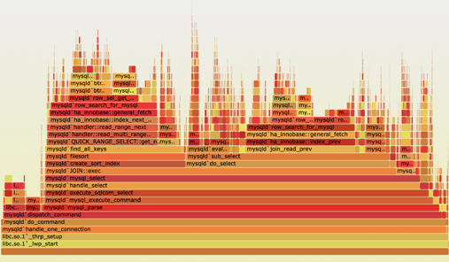

Becoming acquainted with a legacy codebase is a process that happens over time. But how do you even begin? How do you approach a codebase you're not familiar with, that's poorly tested and not really documented?

In my experience, trying to jump in and read code without a goal beyond learning the code is generally unproductive. And yet, this is what most of us do because we don't really know a better way 🤷‍♂️

This is where [The Legacy Code Programmer's Toolbox](https://leanpub.com/legacycode) shines!

In his book, [Jonathan Boccara](https://twitter.com/JoBoccara) focuses on techniques to _understand_ a legacy codebase. He gives you concrete techniques to get into the code.

I think it's a useful complement to the must-read [Working Effectively with Legacy Code](../key-points-of-working-effectively-with-legacy-code) from M. Feathers. Let me share with you what stroke me the most, to give you a glimpse of what's inside the book.

## First, adopt a productive attitude

When you dive into some Legacy Code, it's very natural to have WTF thoughts: Who the f\*\*\* wrote this? Why is this so convoluted?!

This reaction is instinctive: you're not familiar with the code, and with the context you have you realize it will make your work way harder than expected.

But as a professional, you need to overcome this reaction. It doesn't bring anything good anyway. Regardless of the quality of the code, remember that:

- It has been around a long time and worked well enough to pay for your salary.
- It is filled with bug fixes and knowledge that you don't have at the moment. It's common to underestimate what the code actually does.
- People who wrote it did that in a different context, with less knowledge than you have now.
- Many people have worked over it for many years, it's a patchwork of knowledge and context.

Therefore, here are 2 great takeaways if you're in such a situation:

1. **Don't complain if you are not intending to improve the code.** Complaining out loud feels relieving at the moment, but it is counter-productive on the team's morale. If you have a Senior/Tech Lead position, this is even more critical: don't spread a bad, primal, non-constructive attitude to juniors like it's normal. Adopt a zen attitude to inspire them!
2. **Consider that the code you're working on is _your_ code.** You inherited it, you need to take ownership. You're in charge now! Accept that it has flaws. You won't fix them all. But you'll do the best you can to make it better.

I know this is hard. To be frank, I'm working on this myself. I realized that complaining about what is wrong doesn't solve the problem and nurture a painful aura around the codebase. Instead of focusing on what isn't right, I look for what is fine and put my energy on what needs to be done—after all, I'm paid for solving problems for people!

## Then, use these 10 techniques to understand Legacy Code

I like how Jonathan is presenting concrete techniques that you can use. I already knew some of them, but this list inspired me and I found some gems.

Briefly, the 10 techniques are:

1. **Choose a stronghold**. Find a place in the code you understand very well, and expand your knowledge from here. Make connections with surrounding code and expand your understanding like you'd disperse the fog of war in video games.

   

2. **Start from the inputs and outputs of the program**. The program must take inputs and produce outputs somewhere. Find them. They can become your stronghold. I described this technique [in another blog post](../dive-into-an-unfamiliar-codebase-from-its-edges).
3. **Analyze well-chosen stacks**. Use a debugger and put a breakpoint deep in the stack of a typical use-case of the app. The call stack will give you a good picture of what's being executed. Flame charts can help you see the dependencies.

   

4. **Work your way backward from the function's outputs**. It resonates with previous advice: start from the outputs of the system. If your system is a complex function, start from the `return` statements. Look for the side-effects.
5. **Identify the terms that occur frequently**. It will quickly give you insights about what the function is about. Highlight these words in your IDE and see if you can identify patterns. [I also wrote about this technique in detail](../reveal-long-methods-structure-with-online-word-counter) after learning it from the book.
6. **Filter on control flow**. Just focus on the flow keywords (e.g. `if`, `else`, `switch`, `try`, etc.). It quickly reveals the high-level structure of the code.
7. **Distinguish the main action of the function**. Copy the function in a draft and play with it. Remove lines that don't look to be the main action. It doesn't have to compile, the idea is for you to quickly understand the critical part of the function.
8. **Use practice functions to improve your code-reading skills**. These are big functions with complex implementations, but almost no dependency. They are easier because they're self-contained, even if the code is dirty. Use [one of the refactoring katas I recommend](../5-coding-exercises-to-practice-refactoring-legacy-code) to practice that!
9. **Decouple the code**. Extract methods from a big function. Rename variables. Interacting with the code teaches you a lot about it because you're not passively reading it.
10. **Team up with other people**. Bringing someone else also brings a different point of view. Explain to them what you've learned, it will help you connect the dots. Also, working with a peer makes you less distractable, which I find really helpful on Legacy Code—big lumps of spaghetti code can be a real motivation drainer 🐌

## Finally, share knowledge to make things improve

Legacy Code is painful to work with because it's so difficult to grasp what it actually does. Documentation quality is usually not great and original developers are often long gone.

Jonathan presents a couple of suggestions for you to reduce this knowledge handicap with time.

One specifically resonated with me, as I think it's a great idea: the Dailies!

**Dailies are 10-minute presentations on a specific topic, delivered every day to a team, for 10 to 20 days**. Keeping it short makes it digestible for the attendees. Across a few weeks, they'll learn a lot of things on that topic. Knowledge spreads!

Any developer can animate Dailies. If you have multiple teams, it's even more efficient to have a developer animate Dailies to other teams, to foster cross-team collaboration.

Topics can be really diverse:

- A programming language
- Software practices like testing, refactoring or debugging
- Something specific to your business (e.g. "how we process payments")

I tried this at my company (Busbud). I delivered 10 short presentations on working with Legacy Code to another team I'm not working with. The feedbacks were very positive. Dedicating 10 minutes a day was quite easy for them. Over 10 sessions, they learned a couple of tricks they started using. **It was much more practical** than a big 2h workshop with all of this information!

If you want to try it too, I suggest you read [Jonathan's blog post](https://www.fluentcpp.com/2017/04/04/the-dailies-a-new-way-to-learn-at-work/) about it. It helped me set this up.

## Conclusion

We spend most of our time working with Legacy Code. And yet, there are not so many books on the matter.

[The Legacy Code Programmer's Toolbox](https://leanpub.com/legacycode) is one of them. If you're looking for tips and advice on how to get into an unfamiliar codebase, I recommend you to read this one.

I liked this book because it has concrete tips to approach a Legacy codebase. Today, I'm working on a similar resource to help you start rescuing such a codebase! Where to start? What to do when you have a short deadline?

I'm bundling up the most useful and actionable tricks I know into the concrete guide I wish I had.

**Interested? Leave me your email** so I can tell you when it's available 👇
