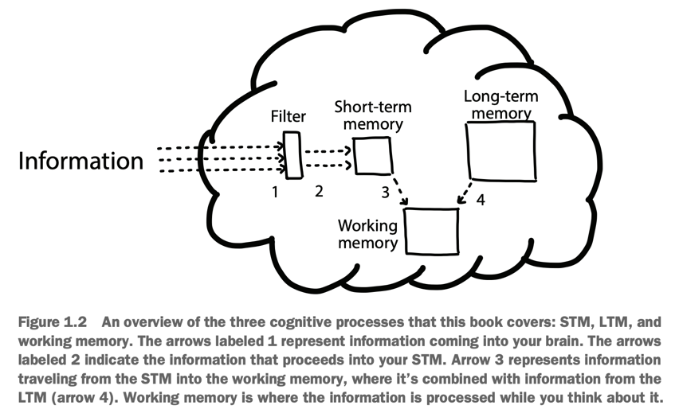
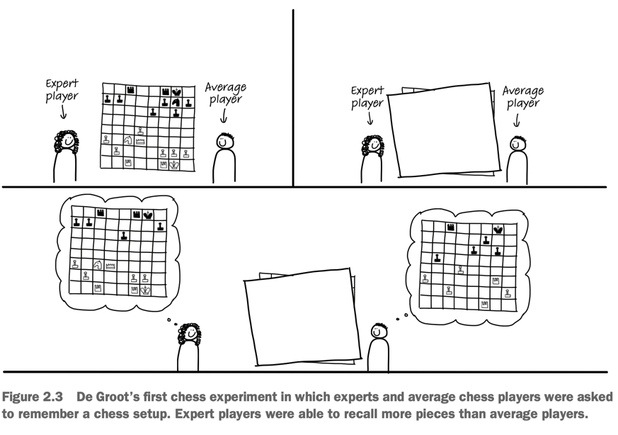
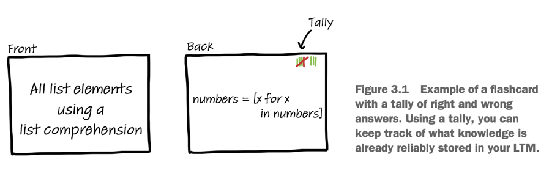

[The Programmer's Brain](https://www.goodreads.com/book/show/57196550-the-programmer-s-brain) from [Dr. Felienne Hermans](https://twitter.com/felienne) is a satisfying read with some practical advice to help you approach unfamiliar codebases.

Felienne approaches code from a cognitive perspective, which is an interesting approach. I learned a few things about how the brain works. I also found a few gems that apply to Legacy Code, in particular:

- how to get better at reading complex code
- how to make code easier to read
- how to improve developers onboarding on a project

I think this is a good read, and here's why…


## Getting better at reading complex code

Different parts of your brain collaborate when you are reading code:

- Long-Term Memory (LTM),
- Short-Term Memory (STM),
- and Working Memory.

If you get confused by some code, it may be due to:

1. You lack some knowledge (LTM). That's typical when you are not familiar with the language you are using, you are still discovering its syntax.
2. You lack some information (STM). That would be the case if you are very familiar with a language, but new to the codebase. You may come across confusing functions names and don't know what they are doing.
3. You lack some processing power (working memory). That's the case when there is a lot of nesting and temporary variables to juggle with, for instance.



Your STM is limited. It flushes the information after ~30s and [can only hold ~7 things at once](https://en.wikipedia.org/wiki/The_Magical_Number_Seven,_Plus_or_Minus_Two). It's like working with a computer that has 1 byte of memory! Hopefully, your brain has techniques to overcome these limitations…

### Chunking

Experts don't read code as beginners do. They see **patterns**. Chunks that make sense to them.

When they see a chunk, they don't need to recall the individual details that compose the chunk. This allows them to process more code at once, given that this code uses chunks that can be recognized.

This is similar to chess masters who can recall chess setups more easily than beginners. They actually can't do any better if the pieces are positioned _randomly_, at places that wouldn't make sense. But if it's not random, they will catch typical patterns they are familiar with.



**That's why learning and using design patterns help!** When you become familiar with chunks like _Observer_ or _Chain of Responsibility_, you can go through such code much faster. It's not just OOP, functional programming also has jargon and patterns. Getting familiar with typical monads can help you be better at Functional Programming!

I think it also helps becoming familiar with the idioms of the language/framework you are using (e.g. React hooks). To do so, **reading open-source code can help**.

You can also use comments and space to create artificial chunks in code. That's what people instinctively do when they put a comment above a chunk of code. That's also what TDD practitioners do when they distinct `Given`, `When`, and `Then` steps in code.

```jsx
it("should include fees in total price", () => {
  // Given
  const price = 4
  const quantity = 2

  // When
  const total = calculateTotalWithFees(price, quantity)

  // Then
  assert(total).toBe(12)
})
```

Going further, you can extract each chunk into its own, well-named function.

### Leave beacons in your code

**Names play an important role in reading code faster**. Names like `left` and `right` are beacons that will help you recognize you are visiting a Tree structure—given that you have the knowledge of such a structure in your LTM.

**Leave beacons in code**: when you got this _aha!_ moment, improve the name in a way that captures what you learned and was missing before. That will help future you (and the others).

Again, comments can serve as beacons for when you're not 100% sure about a name yet, but you still learned something. Refine iteratively. Don't try to grok everything at once.

### Use flashcards to learn new syntax

Googling things up is totally fine. Everybody does that, including experts.

Yet, if you always Google things up right away, you don't help your LTM remember things. Thus, you are not helping future you read code faster.

Instead, the next time you feel the need to Google up some syntax you forgot, spend a few seconds **actively trying to remember the syntax**. Even if you don't recall, the fact of trying will strengthen your memory and you may recall the syntax the next time!

Another thing you can do is **[to use flashcards](https://en.wikipedia.org/wiki/Flashcard)**.

On one side, you put the question or syntax you are familiar with. On the other side, you put the information you are trying to learn (the one you Googled).

Take 10min each day to go through your cards. When you guess the answer right, space the repetition a bit. Within a few weeks, you'll have learned the new information for good!

To help you do so, you can use applications like [Anki](https://apps.ankiweb.net/), [Cerego](https://www.cerego.com/), or [Quizlet](https://quizlet.com/).



### Draw a dependency graph

[That's a topic I also covered](https://understandlegacycode.com/blog/safely-restructure-codebase-with-dependency-graphs/).

It's not so much about having an exhaustive dependency graph of the code. It's about the process of actively drawing the graph.

Omit what doesn't matter. Create an imperfect model that captures what you care about. Drawing a graph helps your brain see chunks. It supports your working memory by offloading information.

I think [our tooling could be improved](https://buttondown.email/hillelwayne/archive/syntax-highlighting-is-a-waste-of-an-information/) to support us with that. But you can always print code, circle variables, methods, and link them. You may even [uncover the structure of long methods by doing so](https://understandlegacycode.com/blog/reveal-long-methods-structure-with-online-word-counter/).

### Exploratory Refactoring

That's a topic I covered in another article: [30min of Exploratory Refactoring can get you unstuck on complex code](https://understandlegacycode.com/blog/demine-codebase-with-exploratory-refactoring/).

Dr. Hermans doesn't _explicitly_ recommend doing so in her book, but she explains how abstractions may make code harder to read for developers who are not familiar with the codebase yet. These abstractions are helpful chunks for the more senior developers, but they may not be helpful for those who recently joined.

If you are the one struggling, [defactor the code](https://understandlegacycode.com/blog/refactoring-and-defactoring/#defactoring) for a bit. The goal is not to ship these changes, but to _learn_ what the code does. Get these chunks in your LTM.

Exploratory Refactoring has this subtle nuance that makes the difference: while defactoring the code, you don't need to keep it working. That should relieve pressure on your working memory, so you can focus on _learning_.

The key is to **learn code by interacting with it.** It's much more efficient than passively reading and jumping around. Start a 30min timer, start touching that cryptic code, and stop worrying. You'll reset the changes very soon, but you will have learned a TON!

## Writing code that's easier to read

### Naming is key

Naming is hard, but better names will make a huge difference in code maintainability.

I feel it could help to remind you that you don't have to get names right on the first try. [Good naming can be an iterative process](https://understandlegacycode.com/blog/improving-legacy-function-names/#6-iterative-steps-to-build-a-good-name). Don't find a perfect name for this confusing method, just find a _slightly better_ one!

**Having consistent names across the codebase help readability**. To improve the situation, you can start by discussing it with your colleagues. Nothing fancy:

1. Gather a few examples of variable patterns that can be found (eg. `listOfX` vs. `Xs` vs. `XCount`).
2. Discuss together, agree on a mold.
3. Document that mold in the README, as a light code standard.
4. Iterate from that.

There is even a tool to help you do so in Java: [Naturalize](https://groups.inf.ed.ac.uk/naturalize/).

### Learn refactorings

There is a correlation between the number of [Code Smells](https://en.wikipedia.org/wiki/Code_smell) and the number of bugs a program contains. That's because **code smells harm recognition**. It's harder to work with such code, thus it's easier to do mistakes. For instance: a long parameter list overloads the capacity of your working memory.

Thus, refactorings can help you read code better.

Let's consider bad names again. Typical offenders would be:

- Methods that do more than they say
- Methods that say more than they do
- Methods that do the opposite of what they say

In Java (again), [LAPD](https://www.veneraarnaoudova.com/linguistic-anti-pattern-detector-lapd/) can help to detect these.

When you come across one, rename it to something _slightly better_. That's easier to do if "renaming" is a move you can safely do with your eyes closed.

**Rename** is a core refactoring. Most editors have automated it. Learn to use the automated rename (eg. if you're using VS Code, it's `F2`). It will speed up your thinking and prevent you from creating bugs. It's like driving without having to consciously think about the pedals and the wheels as individual components!

In my [Refactoring JavaScript](https://refactoringjavascript.dev/) course, I teach you how to deliberately practice this move (and others) so it becomes second nature to you.

### What to do when you are interrupted

You probably know that: distractions play havoc with your productivity.

> Programming while having Slack open is not the best way to get work done.

Felienne presents studies that show:

1. It takes an average of 15-20min to get back into code after being interrupted.
2. The average programmer will have just one uninterrupted 2h session in a day.
3. Programming requires a warm-up to get in the zone.

That really strikes a chord with me because personal productivity is something I'm passionate about.

That's why I'm using and working on [Centered](https://centered.app): to help developers get into a Flow state faster, block distractions, and feel better at the end of the day!

Yet, you can't _really_ remove all interruptions. You will get interrupted. You will have to stop working to go to a meeting, or simply end your day and go spend time with your family.

Here are 3 things you can do to support your brain:

1. **Brain dump** what you have in mind. If someone pings you, say "give me 30s" and use that time to jot down what's in your brain. A piece of paper or code comment would do.
2. **Add TODOs**. This supports your "prospective memory" (the one for things in the future). If you capture the things you need to do later, it will be easier for you to retrieve them and not forget anything. [I wrote about TODOs best practices](https://www.osedea.com/en/blog/should-you-put-todos-in-the-source-code).
3. **Label your subgoals**. In code, I recommend you break down the problem you are solving in smaller steps. Use pseudo-code or comments to do so. These give you subgoals, a natural stop point. It gives you the flexibility to start and finish something before that next meeting in 40 minutes!

I'm writing this and I'm pleased to realize how [Centered](https://centered.app) can help to do that:

- It turns on DnD when you are flowing
- It tells others about it, making interruptions less likely
- It gives you a shortcut you can trigger from anywhere to capture thoughts
- It gives you a way to anticipate incoming meetings and plan work sessions of different size

If that sounds intriguing, give it a look.

[Ping me](https://twitter.com/nicoespeon) if you have any questions. 👋

## Better onboarding for developers

In a typical onboarding process, a senior developer throws a lot of information to the newcomer. Then, they ask the new developer to complete some tasks.

This sucks, we can do better.

Even if the newcomer is quite experienced, there is a high cognitive load that's caused by:

1. A lack of relevant chunks of information
2. A lack of automatized skills that would be relevant

In short: the newcomer will certainly miss the reflexes and implicit knowledge to complete their task reasonably.

We could just shrug our shoulders and think:

> 🤷‍♂️ Well, that's the case for everyone. That was the case for me and here I am today.

But Dr. Hermans proposes a few concrete things you can do to improve the process, based on how the brain works:

1. **Prepare flashcards** for the newcomer to teach the important concepts of your system
2. **Limit tasks to one of the following**: transcription, exploration, comprehension, searching, or incrementation.

For instance, ask the new developer to either:

- Implement a certain method, giving clear instructions on what it should do (transcription)
- Explore a part of the codebase to get a general sense of how it works (exploration)
- Summarize a part of the codebase, some class or some function, in natural language (comprehension)
- Find a class that implements a certain interface (searching)
- Add a feature to an existing class (incrementation)

It's also quite efficient to read code together and ask them to summarize what they understood. Pair on implementing the next feature together.

**Understanding is a better welcome task than building or fixing bugs**.

## Conclusion

This summary of the salient points is quite long already… and there are many parts I didn't even mention! Sajaniemi's 11 roles for variables, the different ways to model problems, Feitelson's three-step model for better names, etc.

I really recommend you to [buy and read that book](https://www.felienne.com/book).

To conclude, I'll highlight a key insight I got from reading this book:

> You don't become an expert by doing expert things.

We often consider junior developers should just "try out and explore". That's how I learned to program, after all.

But Felienne has shown me that there is a better, faster way. And that is to lean on past developers' experience, avoid the mistakes and detours they took, so new developers become proficient faster and push the limits of what we know beyond that.

You can do that by pairing. Get the new developers to read code with accompanying explanations. They will learn faster than by experimenting on their own.

And that is a golden piece of advice I will apply the next time I can 🏅
