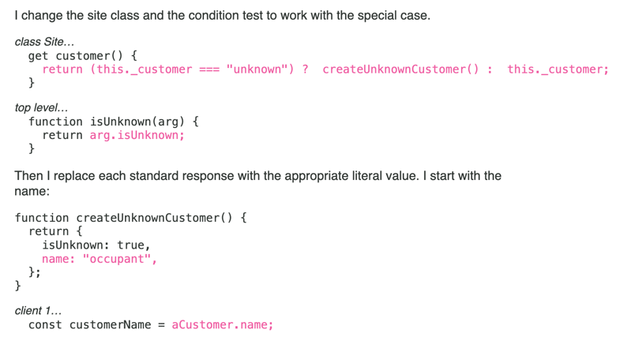

Do you often find yourself fighting with the intricacies of legacy code or navigating through convoluted programming structures?

Then this article is for you!

In his popular “[Refactoring](https://refactoring.com/)” book, Martin Fowler collects an impressive catalog of moves that can transform the way you approach code maintenance and evolution.

If you haven’t read it and you are not sure what to expect, I’ve written down a high-level summary of what you will find here. Hopefully, that gives you a better sense of what it is all about. Read on!

## Defining “Refactoring”

“Refactoring” is an abused word. Many developers would say “refactor” when they mean “rewritten” a piece of code. It’s quite vague.

But Martin Fowler has a precise definition of what he means when he says “refactoring”:

> A refactoring is a change made to the internal structure of the code that doesn't modify its observable behavior.

Therefore, if you change the behavior of the code, you are not _refactoring_. Refactoring preserves bugs too. If you fix a bug, you are not _refactoring_.

However, you can (should) refactor the code, and then fix the bug. This is what Kent Beck means with this other gem:

> for each desired change, make the change easy (warning: this may be hard), then make the easy change
>
> — [Kent Beck](https://x.com/KentBeck/status/250733358307500032?s=20)

Bonus point: commit refactorings in isolation from the other changes. Fowler suggests you think about it as the Two Hats of the programmer. Either:

1. Put your _Refactoring_ hat on, and you don't change any behavior until you commit
2. Put your _Changing Code_ hat on, and you are not refactoring—the refactoring step helps make this small and easy

## Before you refactor

To know if you have successfully refactored, you must know if the behavior has changed.

Things that will help you with that:

- **Automated tests**. If you don’t have any, you should first spend time writing them on the part you intend to refactor. Testing legacy code can be tough. If you struggle with this part, you may be interested in [this process I’ve documented](https://understandlegacycode.com/blog/3-steps-to-add-tests-on-existing-code-when-you-have-short-deadlines/), and in [Approval Testing](https://understandlegacycode.com/approval-tests) in general.
- **Static types and linters**. Anything that can give you early feedback about something that doesn’t work anymore will increase your confidence in refactoring.
- **Take small steps**. Fowler’s refactoring moves illustrate that to perfection. Each move is detailed as a step-by-step recipe that keeps the code in a working state as much as possible. Baby steps compound into bigger changes, but reduce the risk of getting it wrong.

He also mentions that you don’t need to clean up _everything_. Once you have learned some refactoring moves, you might be tempted to apply them everywhere. Don’t.

Focus on the behavior changes you need to make. Use refactoring moves to make these changes easy first. Don’t refactor for the sake of it.

An interesting side-effect of mastering refactorings is that you feel more comfortable leaving duplication in code. Duplication is simple to solve, simpler than wrong abstractions. With practice, you will wait until you have found the proper abstraction before you refactor.

## When to refactor?

Martin Fowler suggests key moments like:

- **Before adding a feature**. Make it easier to add that feature. It’s often a good idea to first ship a PR that only contains refactorings, then a smaller one with the actual change.
- **To understand how some code works**. Actively interacting with Legacy Code helps you understand what it does better than passively reading it. You may not keep this refactoring though. Knowing refactorings move makes you less afraid to do that! Check out [Exploratory Refactoring](https://understandlegacycode.com/blog/demine-codebase-with-exploratory-refactoring/) for more details.
- **You may negotiate time to have some planned refactoring**. This is helpful when you have bigger refactoring tasks that would take long to do in small chunks. I recommend running a [Hotspots Analysis](https://understandlegacycode.com/blog/focus-refactoring-with-hotspots-analysis/) first to identify the best candidates (bigger ROI).

Another interesting question is: when NOT to refactor? Martin Fowler suggests you don’t waste time on:

- **Ugly code that doesn't need to be changed anyway.**
- **Something that would be easier to rewrite**. It's a tricky decision to make though. I recommend timeboxing yourself: 1 hour on refactoring and 1 hour using a Strangler Fig approach, which approach went further? Go with that.
- **For the sake of Clean Code**. Productive programmers refactor to keep changing behavior fast, not for the beauty of it.

## A catalog of refactoring moves

The rest of the book is really that: a catalog of 61 refactoring moves, detailed step by step. They are categorized by their nature:

- Core refactorings (e.g. extract, inline, rename, split phase…)
- Encapsulations (e.g. replace temp with query, hide delegate…)
- Moving features (e.g. move function, slide statements…)
- Organizing data (e.g. split variables, change reference to value…)
- Simplifying conditionals (e.g. decompose conditional, introduce special case…)
- Refactoring APIs (e.g. separate query from modifier, remove flag argument…)
- Dealing with inheritance (e.g. pull up method, collapse hierarchy, remove subclass…)

The second edition of the book uses examples in JavaScript, although not all moves are common or idiomatic JavaScript code (there are a bunch of class-related moves that you won’t really come across regular JS code). Yet, even if you are coding with a functional language, many moves will still be relevant.

Interestingly, Martin Fowler also lists a catalog of Code Smells: visible symptoms that could indicate issues with the code at hand. He describes the problems they cause and lists the refactoring moves you would use to clean them. For instance:

- **Data Clumps**: when you see the same parameters being passed along together around: they probably would be better joined into a single abstraction. Using a class allows for encapsulating the behavior, preventing duplication.
  - _Refactorings: Extract Class, Introduce Parameter Object, Preserve Whole Object_
- **Primitive Obsession**: Very common. It's frequent that we only leverage primitives instead of introducing richer concepts. Once there's enough code, look for the missing abstractions and introduce these concepts to remove duplication and simplify code.
  - _Refactorings: Replace Primitive with Object, Replace Type Code with Subclasses, Replace Conditional with Polymorphism, Extract Class, Introduce Parameter Object_

And so on…

This is not a book you would read once, get inspired, take some notes, and store on a shelf. Instead, this is a resource you would keep next to you in the trenches. Do you identify something that looks like a smell? Look it up! Then check the moves that could help and follow the steps!

It’s a cookbook, really. You are the Chef 🧑‍🍳

## Limits of the book

If you are looking for negative criticism about this book, this is the only one I could make: the format itself.

Martin Fowler did a good job of highlighting step-by-step changes to the code

But still, it’s a book. It’s static. You may struggle to wrap your head around the code changes that are actually made.

I would also argue that you would learn refactoring moves better by actively _practicing_ them. For that, I recommend you use a coding kata. For that, I listed [5 katas tailored for refactorings](https://understandlegacycode.com/blog/5-coding-exercises-to-practice-refactoring-legacy-code/).

As I mentioned earlier: the examples are in JavaScript. However, not all of these moves are relevant to this language. For JS specifically, I've figured a better learning path. I’ve even started working on a refactoring course that would be tailored for JavaScript developers, but I have paused it for now. If that sounds interesting to you, [ping me on LinkedIn](https://www.linkedin.com/in/nicolas-carlo-095b243b/) or [Twitter](https://twitter.com/nicoespeon) 😉

You can also subscribe to my newsletter to receive regular tips on legacy code and be notified when my Refactoring JS course is out.

Finally, I want to mention [Refactoring.guru](https://refactoring.guru/refactoring/techniques). It’s a good catalog of refactoring techniques that you can read online. It contains code examples in different languages. They also have a course. I’ve completed it and it’s ok—it lacks interactivity and it doesn’t have a great learning path, but the content is solid and the examples are helpful.

## This book is a reference

At the end of the day, [Martin Fowler’s Refactoring](https://refactoring.com/) is a reference for any developer who needs to deal with existing code. It helps improve your coding skills in general by adopting excellent practices that will be useful in your career.

On a day-to-day basis, it’s more of a catalog containing your bread-and-butter moves for restructuring code without breaking it.

In my experience, being able to separate structural changes from behavior ones is a rare skill to have. And a useful one when working with legacy code. This book can help you acquire this skill.
