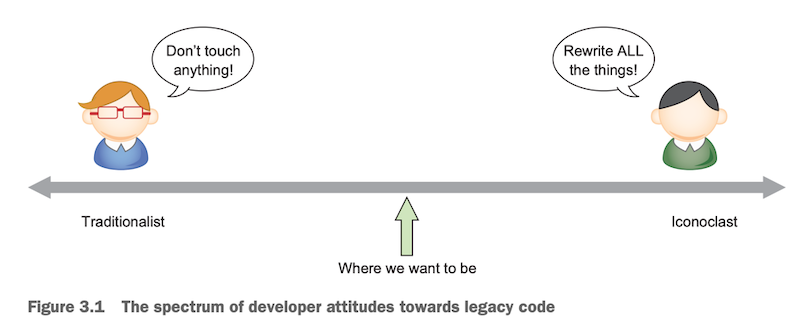

A common issue with working on Legacy software is to find where to start. You know how it goes: you try to fix something and realize something else prevents you from doing that. So you start changing that too, but then it goes again.

Quickly, you feel like you have been sent to battle [the Hydra of Lerna](https://www.britannica.com/topic/Hydra-Greek-mythology), except that they didn't tell you beforehand! You're Hal trying to fix the lightbulb in the kitchen:

<iframe width="560" height="315" src="https://www.youtube-nocookie.com/embed/AbSehcT19u0" frameborder="0" allow="accelerometer; autoplay; encrypted-media; gyroscope; picture-in-picture" allowfullscreen></iframe>

Hopefully, there are techniques to get that under control. I can only recommend you to have a look at [the Mikado Method](https://understandlegacycode.com/blog/a-process-to-do-safe-changes-in-a-complex-codebase/) if you don't know how to use it already.

But there's more. And this is where "[Re-Engineering Legacy Software](https://shortener.manning.com/E26o)" shines in my opinion! I like how [Chris Birchall](https://twitter.com/cbirchall), the author, focuses on _how to get started,_ concretely. It's not a well-known book, which is surprising considering how common and difficult working with Legacy systems is, and how few books exist to help you do that.


In this post, I want to highlight the salient points of this book, to give you an idea of what to expect, and share some of the gems I found useful. Let's dive in!

## It's also about the Legacy Culture

Chris defines Legacy projects as ones that are "difficult to maintain or extend". He also says that it's not just about code, it includes everything!

We often underestimate the impact of the environment. Sure, code may be a mess to deal with, but if it takes hours to run the test suite, chances are developers won't write so many tests in the end.

When developers are afraid to make changes, bad things happen. It's just a matter of time. Long feedback makes everything painful. Time is wasted, and so are opportunities.

Communication is key. It's all too common to foster a culture that prevents knowledge from spreading:

- we like to work solo
- we organize teams in silos
- we put our headphones on not to be disturbed

Now, [entering a Flow state](<https://en.wikipedia.org/wiki/Flow_(psychology)>) where we can really be productive is a precious, very rare thing in our job. You have to fight against a world of interruptions. But I think we are overlooking 2 critical aspects in our attempts to be productive:

1. **It's important to save (quality) time for collaborating with others**. That's what good daily stand-ups rituals are meant for—too bad they are turned into not-so-interesting daily reports to the Project Manager.
2. **You can enter a state of flow while working with others**. That's what happens when you're pairing with one or many of your colleagues, and you don't realize time is passing because you're crunching through the code.

Back to the book: Chris reminds us that code reviews, coding together, teaming up with different people, or even taking a coffee break with people from other teams are all activities that help knowledge spread.

Hence, you should keep promoting a culture of quality a little bit every day.

## Be somewhere between the Traditionalist and the Iconoclast

A **Traditionalist** is someone who stands by "if it ain't broke, don't fix it". Now, you shouldn't refactor for the sake of it. But adopting this attitude all the time doesn't help, as nothing will ever get better.

If your teammates feel refactoring is a waste of time, you should try to collaborate more to expose them to the benefits. Start with a 15-30 minutes session. Show them how small refactorings can actually make code simpler to work with.

An **Iconoclast** is someone who despises Legacy Code so much that they want to clean up everything. Not all code is worth fixing.

If you find yourself or a colleague rewrite others' code without agreeing with the team first, that's a warning sign of a collaboration issue. Code reviews can help discuss what's worth fixing. You can also agree as a team on the parts of the code that doesn't worth spending time refactoring for now—[Hotspot Analysis](https://understandlegacycode.com/blog/focus-refactoring-with-hotspots-analysis/) will help you find these.



The desirable attitude is somewhere in between. As in most things in life: extreme positions come at a cost that can be counter-productive to the original intent. **Be pragmatic, pick your fights.**

## Refactor vs. Rewrite is a false dichotomy

Full rewrites are almost always a bad idea unless you are in the following situation:

- You tried and failed to improve the codebase quality just by refactoring
- You want to change the paradigm based on what you learned

Otherwise, a better approach is to aim for an incremental rewrite. [The Strangler Fig pattern](https://understandlegacycode.com/blog/avoid-rewriting-a-legacy-system-from-scratch-by-strangling-it/) helps you do that. This will blur the lines between refactoring and rewriting, and that's OK. It will help you get feedback faster on the project and reduce the risk of breaking critical behavior.

Make the plan clear for non-technical stakeholders. Focus on the business value of such a project to get support from your organization.

A piece of good advice from Chris is to document your strategy to make it clear for everyone before starting the project. Pick a part of the system you want to rewrite. Write in details:

1. The goals, for developers (e.g. faster development) and managers (e.g. modern and usable UI)
2. End-user benefits (e.g. 2 new major features will be implemented after the rewrite)
3. New features that would be added, enabled by such a project
4. Existing features that are preserved
5. Existing features that are removed (e.g. the Map Editor is a nice-to-have and may be re-implemented later)
6. Will you favor timeliness or feature completeness?
7. How do you plan to phase releases? (e.g. 2 releases a month to gradually switch off the old system)
8. How much the old system should be treated as a specification for the new one? Should you rethink the features whenever possible?

At Busbud, I'm currently leading a similar project: migrating the _Cart_ module of our application. I've used Chris's advice to prepare for it and get my organization's support on this. Our strategy is to release changes every few days, progressively refactoring the current implementation to migrate towards a new, more generic one. This will fix a lot of discrepancies and bugs in the end-user experience. It will also unlock many ambitious features that can give us a competitive advantage.

So far, it works! 👍

## Get rid of unreliable tests

Refactoring is essential, but doing it without tests is risky. Reliable automated tests make it easier (and more likely) for the team to refactor continuously.

Now, there is such a thing as _toxic tests_. It's the kind of test that's typically brittle, unreliable, and will fail randomly. Or maybe tests that don't test anything—which is more common than you think when you have to write tests _after_ the code is written.

These are worse than not having tests. They give you **a false sense of confidence**. They waste your time and hinder your progression.

If a test is randomly failing, either fix it now or delete it. You know that kind of test: the one that makes you re-launch the CI because "sometimes it fails, but that's OK"—and now you have to wait again for everything to go green. It's better to consider you have no test (and you need to write a reliable one) rather than preserving a test that keeps wasting your precious time.

## Automate all the things

A good chunk of the book is dedicated to improving your project workflow and infrastructure.

Chris is right: first, you need to make it easy to run, test, build, and release the application. This is foundational for all the remaining work. Once this is tackled, you can focus on improving the Legacy.

It will be tedious to put in place if it's not. Especially if there's little or no documentation. Make sure you fix that: **write short documentation and put it next to the code**. A [README.md](http://readme.md) is perfect. For example:

```markdown
# My example software

A brief explanation of what the software is.

## Dependencies

- Java 7 or newer
- Memcached
  ...

The following environment variables must be set when running:

- `JAVA_HOME`
  ...

## How to configure

Edit `conf/dev-config.properties` if you want to change the Memcached port, etc.

## How to run locally

1. Make sure Memcached is running
2. Run `mvn jetty:run`
3. Point your browser at `http://localhost:8080/foo`

## How to run tests

1. Make sure Memcached is running
2. Run `mvn test`

## How to build

Run `mvn package` to create a WAR file in the `target` folder.

## How to release/deploy

Run `./release.sh` and follow the prompts.
```

If your Legacy system has nothing like it, I recommend you follow the following plan:

1. **You document the steps from what you know**. Write down the checklist of things to be done to run/test/build/deploy the app. You may realize you don't know all the steps, that's great! Find out the missing steps and gather all the knowledge in this document.
2. **Start creating scripts to automate the different steps**. Start small. The trick is that you don't have to actually automate the execution right now. It's fine for the first iteration of the script to simply pause and tell the user what to do _manually_. The script is here to guide the user in completing the action, replacing the documentation.
3. **Progressively automate every step that can be**. Thus, when you run the script, you have fewer things to do yourself. You can improve that incrementally. That allows you to automate what's easy quickly, and leave the complicated parts for later. It's fine if the script sometimes pauses and just tell the user to do something _manually_.
4. **At some point, you may achieve full automation**. You can probably hook the script execution to some CI system, so it runs without having to launch it manually.

Chris insists on the importance of automating your deployments as soon as possible. In general, you should aim for increasing the automation of every step of the workflow, for all kinds of environment you have (local, preview, staging, uat, production…).

Progressively automate what you find doing manually over and over will save you time to focus on other topics, and reduce the risk of doing a mistake in the process.

## Conclusion

"[Re-Engineering Legacy Software](https://shortener.manning.com/E26o)" was a great surprise for me. Besides the usual recommendations on working with Legacy Code, it contains useful examples of techniques you can use in your day-to-day work.

I gave you a glimpse of what really stroke me, but there's more in the book. If you use tools like Ant, Fabric, Vagrant, or Ansible, then you will have a lot of concrete examples. Chris illustrates the theory with a simulated story where you start working on a Legacy project. This is cool as you can follow along and write Ansible scripts with him ⚙

This is a good book on working with Legacy software.

### A 35% discount on Manning books

After I published this book review, Manning Publications proposed me to share with you a promo code. That should give you 35% off their books.

If you want to get a copy of "Re-Engineering Legacy Software", I think that will be handy. It also works with any of their products, in all formats. 

Here it is: `brnica35` 🏷 

Enjoy, read books, and take care of yourself!
