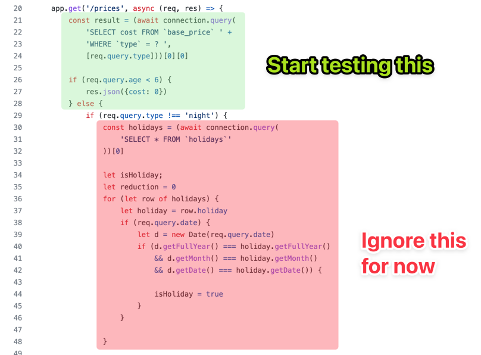
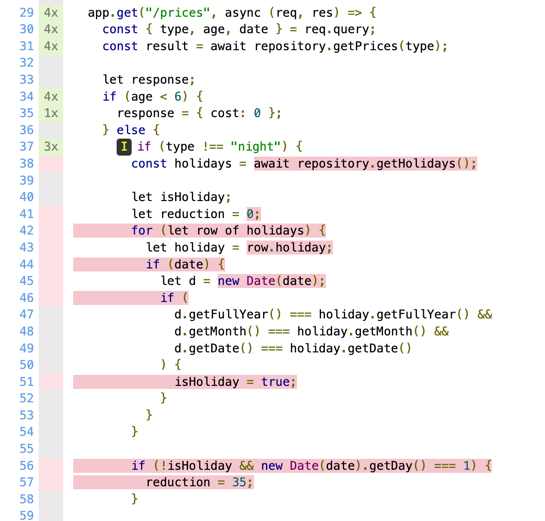

**Untested code.**

You are not the one who wrote it. Yet, it's your job today to change it. It should support some new behavior. The question is: how do you make the change without breaking anything? 🤔

If you are a recurring reader of this blog, you know that you can train for such a situation. For instance: [the Lift Pass Pricing refactoring kata](https://github.com/martinsson/Refactoring-Kata-Lift-Pass-Pricing) is a fun playground to experiment that smells ski trips and mountain hikes ⛷️


It's a _refactoring_ kata, which means you start from a _working_ software. The code already calculates the pricing for ski lift passes. But there's a new feature request: getting the price for several lift passes, not just one. This is your task!

The exercise is available in many languages, so you can pick the one you are the most familiar with.

I experimented with different approaches to solve this exercise. I will present you with 2 that worked well, and compare them. So, the next time you face a similar situation at work, you will know what to do! 😉

In this article, I'll detail how to perform the _classic_ approach (which is really good). In a follow-up one, I will show you an alternative.

Let's dive in…

## The recommended approach

The kata README will give you some hints on what to do:

1. **Write high-level, integrated tests** that will involve an actual MySQL database and HTTP calls
2. **Refactor** the Business Logic (Domain) out of the I/O (Infrastructure)
3. **Pull down most of the integrated tests** to write isolated tests on the Domain code instead

## Step Zero: make the tests run

We want to modify how the software works. The thing is: we don't know what this code is doing today. Who can tell all the edge cases that are already covered? Does this feel like your daily job? Great, that is precisely what we are practicing here.

A great way to learn what the code does is to run the code under different situations and see what the actual behavior is. By capturing these situations in automated tests, we can re-run them again and again, faster than if we were to do it manually.

But before we can have automated tests, we need to be able to run them. And this first step can be quite a challenge. Thus, we practice.

With the approach I’m presenting here, we don't want to touch the code until we have tests in place. This means we need to write _integrated_ high-level tests that exercise the app, almost like an actual user would do. Therefore, we need to:

1. Start the application
2. Execute the test code against the running application

If you think about it, we really want to automate what we would do if we were to test the app manually.

With TypeScript, I went for the following tools:

- [`supertest-as-promised`](https://www.npmjs.com/package/supertest-session-as-promised) to run HTTP queries against the top-level application
- [`testcontainers`](https://www.npmjs.com/package/testcontainers) to set up the database and get it to run in the tests (it's based on Docker)
- A script to fill the database with tests data (these are already provided in the kata)

To run the tests, I like to leave as few manual steps to the developer as possible. Docker will help me encapsulate all of the infrastructure details, so anyone has the same environment running. In this case, I want to leave only two requirements for anyone to run the tests:

1. Have `docker` installed and running on their machine
2. Run `npm test`

The test code looks like so:

```tsx
import { GenericContainer, StartedTestContainer } from "testcontainers"
import { createApp } from "../src/prices"

describe("prices", () => {
  let app, connection, container: StartedTestContainer

  // Before all tests, set up the environment
  before(async () => {
    container = await new GenericContainer("mariadb:10.4")
      .withExposedPorts(3306)
      .withEnv("MYSQL_ROOT_PASSWORD", "mysql")
      .withBindMount(`${__dirname}/database`, "/docker-entrypoint-initdb.d")
      .start()
  })

  after(function() {
    container.stop()
  })

  // Before each test, start the app
  beforeEach(async () => {
    ;({ app, connection } = await createApp({
      port: container.getMappedPort(3306),
    }))
  })

  afterEach(() => {
    connection.close()
  })

  // Now we can run tests…
})
```

Before _all_ tests, we use Docker to set up an environment with a database where the app can run. On actual legacy projects, this is usually more involved and it may feel daunting. However, the progress you make on automating how to run your legacy app will have benefits that go beyond testing. **Invest time in your deployment pipeline, it's worth the trouble.**

Notice that we tell Docker to execute a script that will set up our database. Usually, we fill the database with different scenarios, as we discover them. In this kata, [they are already provided](https://github.com/martinsson/Refactoring-Kata-Lift-Pass-Pricing/blob/master/database/initDatabase.sql). Here it is:

```sql
# database/initDatabase.sql
DROP database IF EXISTS `lift_pass`;
CREATE database `lift_pass`;
USE `lift_pass`;

CREATE TABLE IF NOT EXISTS lift_pass.base_price (
    pass_id INT AUTO_INCREMENT,
    type VARCHAR(255) NOT NULL,
    cost INT NOT NULL,
    PRIMARY KEY (pass_id),
    UNIQUE KEY (type)
);
INSERT INTO lift_pass.base_price (type, cost) VALUES ('1jour', 35);
INSERT INTO lift_pass.base_price (type, cost) VALUES ('night', 19);

CREATE TABLE IF NOT EXISTS lift_pass.holidays (
    holiday DATE NOT NULL,
    description VARCHAR(255) NOT NULL,
    PRIMARY KEY (holiday)
);
INSERT INTO lift_pass.holidays (holiday, description) VALUES ('2019-02-18', 'winter');
INSERT INTO lift_pass.holidays (holiday, description) VALUES ('2019-02-25', 'winter');
INSERT INTO lift_pass.holidays (holiday, description) VALUES ('2019-03-04', 'winter');
```

Then, before _each_ test, we will create a new app. This will be slower than starting the app once, but it will ensure individual tests will be independent of each other. Having tests that cascade into each other is a common mistake in my experience. The time you save is usually offset by the time you lose when 12 tests fail for no apparent reason and you need to understand why 🥴

If we were writing to the database, it would be a good idea to reset it between each test too. In this case, though, we only _read_ from it. So we are done.

So far, so good… Can we run our tests?

Almost.

Since we have to set up a whole environment and a database when we launch the tests, they will take a few seconds to run. Especially for the first run, since Docker will download all the images it needs. Thus, I had to extend the timeout in the `package.json` to ensure this is fine:

```diff
  "scripts": {
    "start": "tsc && node .",
-   "test": "mocha -r ts-node/register --recursive test/**/*.spec.ts",
+   "test": "mocha -r ts-node/register --recursive test/**/*.spec.ts --timeout 15000",
    "compile": "tsc"
  },
```

Now we can run `npm test`. Great! Let's write some…

## Step One: write the high-level tests

When it comes to untested code, I recommend starting to write tests that cover the parts that are not nested. **Start testing the trunk of the logic.** We'll dive into the different leaves later.



Now, I don’t have a silver bullet for finding which tests to write. It depends on:

- **Your knowledge of the software.** What the code is supposed to do? Can you talk with another person who knows? In this case, [the README](https://github.com/martinsson/Refactoring-Kata-Lift-Pass-Pricing/blob/master/README.md) explains that we should expect to receive cost from a given set of parameters when we call the API.
- **The hardcoded values in the code.** Look for magic strings and numbers. They are usually interesting values to exercise. In this case, there are a few values like the query type (`"night"`), ages (`6`, `15`, and `64`), and also the data from the SQL script (`"1jour"`, `"winter"`, etc.).

I generally keep a piece of paper next to me when doing this. Whenever I think about some scenario that could be interesting, I write it down. That way, I can stay focused on the test I'm currently writing. Yet, I don't forget what I wanted to do next.

Then, after writing a few obvious tests, the main question that will guide us will be: do we need to write more, or are we safe to start refactoring?

The best way I know to answer this question is **to use the test coverage**. With JavaScript and TypeScript codebases, I use [`nyc`](https://www.npmjs.com/package/nyc). It plugs nicely on top of the test runner:

```diff
  "scripts": {
    "start": "tsc && node .",
    "test": "mocha -r ts-node/register --recursive test/**/*.spec.ts --timeout 15000",
+   "coverage": "nyc npm run test",
    "compile": "tsc"
  },
```

This can generate an HTML coverage report, which I open in a web browser while I work:



There are 2 scenarios at this point:

1. **If the source code is not executed**, we need to add tests to cover it.
2. **If the source code is executed**, we can increase our confidence it’s _actually_ tested by introducing deliberate mistakes (eg. comment out code, change a value, etc.). If no test has failed after we did that, we need to add more tests!

I covered this whole process in more detail [with this article](https://understandlegacycode.com/blog/3-steps-to-add-tests-on-existing-code-when-you-have-short-deadlines/).

In the end, the high-level tests may look like so:

```tsx
import { expect } from "chai"
import request from "supertest-as-promised"
import { GenericContainer, StartedTestContainer } from "testcontainers"
import { createApp } from "../src/prices"

describe("prices", () => {
  let app, connection, container: StartedTestContainer

  // … tests setup described earlier

  // Remember, we restart the server between each test
  beforeEach(async () => {
    ;({ app, connection } = await createApp({
      port: container.getMappedPort(3306),
    }))
  })

  afterEach(() => {
    connection.close()
  })

  // Query the API and write assertions on the response
  it("returns 35 for 1jour", async () => {
    const response = await request(app).get("/prices?type=1jour")

    expect(response.body).deep.equal({ cost: 35 })
  })

  it("returns 0 for night", async () => {
    const response = await request(app).get("/prices?type=night")

    expect(response.body).deep.equal({ cost: 0 })
  })

  it("returns 19 for night and age is 14", async () => {
    const response = await request(app).get("/prices?type=night&age=14")

    expect(response.body).deep.equal({ cost: 19 })
  })

  // etc.
})
```

Once we have tests in place, it's time to refactor the code.

## Step Two: refactor the code

At this point, we have done the most complicated part. Now we have tests that can tell us, within a minute, if we make a mistake when refactoring the code.

We don't have to test all scenarios manually after each change we make. Therefore, we are more likely to run tests frequently and perform ambitious cleanups. We are also less likely to introduce a bug!

Now, we could decide to completely rewrite chunks of this code with a [Parallel Change (aka Expand & Contract)](https://martinfowler.com/bliki/ParallelChange.html) strategy. We would re-implement the tested behavior from scratch. In an ideal scenario, we then progressively replace the code with the new one while keeping the tests green all the time (which means we can stop at any time). Eventually, we may have to rewrite the whole chunk at once and only swap the implementations once it’s ready. The smaller we can make the rewrite scope, the better.

I'm not gonna detail how I would refactor this code here since the exact refactoring is not the point—that would deserve its own article. In the end, the refactored code could look like so:

```tsx
async function createApp({ port }: { port: number } = { port: 3306 }) {
  const app = express()

  let connectionOptions = {
    host: "localhost",
    user: "root",
    database: "lift_pass",
    password: "mysql",
    port,
  }
  const connection = await mysql.createConnection(connectionOptions)

  // Repository is an interface we defined. This is a MySQL implementation of it.
  const repository: Repository = createMySQLRepository(connection)

  app.get("/prices", async (req, res) => {
    // The core logic was extracted in a function, leaving the network & DB stuff here
    const cost = await computePrice(req.query, repository)
    res.json({ cost })
  })

  return { app, connection }
}
```

All along the refactoring process, **the automated tests will support our work.**

However, the tests we have are good… but they could be better. Indeed: they take quite some time to run. In my case, I have to wait for ~20s to run the 15 tests. It’s faster than what I could manually do myself. Yet, I can’t run these in a watcher while I work. Not only they would be a bit slow to my taste, but I would be afraid to mess up with the database and the environment if they restart in the middle.

Oh, and these tests may also fail for reasons that are independent of the code itself (eg. an issue with the network, the database…). We reduced that risk by automating the creation of the whole environment with Docker. But I’ve seen that happening, and it’s very frustrating!

On the other hand, I want to point out that these tests don't bother with the implementation details. **They don't get in the way of our refactorings**. We are free to change the architecture of the code, without having to rewrite the tests themselves. Interesting, right? 😉

So, let’s see how we could make these tests better.

## Step Three: pull down the tests

After we refactored the code, we created an opportunity to make the tests feedback **faster**. For now, all the different possible scenarios are going through the whole integrated app, from the network call to the database.

They don't have to. 🤯

Sure, keeping a few integrated tests will increase confidence that everything is correctly connected. But all these test scenarios are testing slightly different variants of the business logic.

When refactoring, pay attention to extracting that business logic so it could be tested independently. What we want are very fast, very reliable tests.

The trick is **to test the pure logic independently from the real DB and HTTP layer**.

It’s valuable the whole thing works in integration, but it has a cost (it’s slow and flaky). You don’t need to pay that cost for _every variation_ of the behavior you want to test. Thus, you will write tests that cover the Domain logic you extracted. These are _isolated_ tests. These tests run faster.

I recommend having separate commands to run _integrated_ and _isolated_ tests.

I like to run the isolated tests in watch mode, reloading them all the time as I work. You can’t easily do so with integrated tests because they are slower and may mess up the DB:

```diff
  "scripts": {
    "start": "tsc && node .",
+   "test": "npm run test:unit && npm run test:int",
+   "test:unit": "mocha -r ts-node/register --recursive test/**/*.unit.spec.ts",
-   "test": "mocha -r ts-node/register --recursive test/**/*.spec.ts --timeout 15000",
+   "test:init": "mocha -r ts-node/register --recursive test/**/*.spec.ts --timeout 15000",
    "coverage": "nyc npm run test",
    "compile": "tsc"
  },
```

### 🧑 But wait! Wouldn't these isolated tests get in the way of future refactorings?

They might! It depends on how you write them.

Writing isolated tests does NOT mean that you would create a test per function that you extract. I like to write mostly coarse-grained isolated tests. These tests are isolated from the actual DB and network, but they won't assume much about the rest of the implementation.

[Writing maintainable tests is a tough topic.](https://understandlegacycode.com/blog/if-you-mock-are-you-even-testing/) People have different definitions of what qualifies as a _unit_ test or an _integration_ one. I have stopped talking about “unit” tests myself. I'm not gonna dig into this here. My point is to present you with different approaches to refactoring some Legacy Code. 😉

In the end, the goal is to test the `computePrice()` function isolated from the network and the database. This way, we can quickly verify all the variants that could lead to different prices. Like so:

```tsx
describe("Compute Price", () => {
  describe("when type is night", () => {
    it("returns 0 if age is below 6", async () => {
      const price = await computePrice(
        { type: "night", age: 5, date: ANY_DATE },
        new RepositoryUsingMemory()
      )

      expect(price).to.eq(0)
    })

    it("returns 0 if age is not provided", async () => {
      const price = await computePrice(
        { type: "night", date: ANY_DATE },
        new RepositoryUsingMemory()
      )

      expect(price).to.eq(0)
    })

    // etc.
  })
})
```

We don't bother to mock whatever smaller function would compose `computePrice()`. This way, it's still easy to refactor how the price is computed under the hood. Yet, we are using an in-memory repository instead of the MySQL one. Other kinds of tests (called [contract tests](https://blog.thecodewhisperer.com/permalink/getting-started-with-contract-tests)) make sure we can substitute the MySQL repository with the in-memory one.

By doing so, the original code only just needs to plug the business logic that computes price with the proper implementation details of production (eg. `req`, `res`, and the SQL repository). Therefore, we only need a few high-level, integrated tests to ensure it is properly doing its job.

And this, my friends, is how I cover _most_ of the code logic with **fast and reliable tests**.

Adding a new feature can now easily be covered with tests. It’s quite simple to create new variants for price computation. It means you can move on fast, without breaking things along the way, nor having to manually verify that you didn’t.

I know: there are many parts I didn’t cover in detail here. But I gave you the overall recipe that puts any legacy code chunk under tests. 👨‍🍳

Or rather: I gave you _one_ recipe!

I told you earlier that I was experimenting with 2 different approaches. This is the first and most classic one.

[In the next post](https://understandlegacycode.com/blog/another-way-of-refactoring-untested-code/), I show you **another way of tackling this exercise**. Then, we will compare together what are the pros and cons of both approaches.

With more tools in your belt, I hope you will have more options the next time you face some gnarly, untested code out there!
