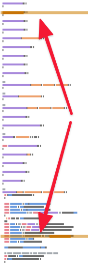
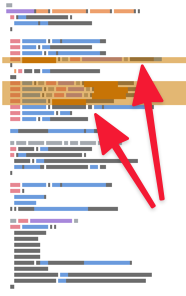

Refactoring Legacy Code can be a daunting task.

Sometimes, Technical Debt is so big that it feels like the application has become impossible to maintain. Implementing new features takes an eternity and always create regressions.

> "Wherever we try to start refactoring, it pulls the rest of the app!"

Refactoring is a challenge because you're not really sure how to clean the mess in the first place. Also, you don't have infinite time to do so.

Paradoxically, there's always pressure to ship more. Even though it's harder and harder to make any change without breaking things in this codebase, you still need to show that you're moving. Sure, implementing features take longer, but you can at least fix these 5 bugs by the end of the Sprint, can't you?

If you're reading this blog, you should have realized that I recommend you to continuously refactor. You have to ship things, that doesn't mean you can't make the code a little bit better as you're doing so. Progressively, you're making it easier to tackle more ambitious refactorings!

> "But I'm not even sure where to begin with!?"

If that's your thinking, then I've great news: you can begin from anywhere.

More precisely: you should begin from the code you have to touch.

And here's one technique you can apply anywhere to make the code easier to reason about.

## The Principle of Proximity

Did you know that your brain is not so great at memorizing things? If you never heard of that, well [studies show](https://en.wikipedia.org/wiki/The_Magical_Number_Seven,_Plus_or_Minus_Two) that your mind can only deal with ~7 items at once. Your computer RAM does a better job than your short-term memory.

Hopefully, there are ways to handle more than that. **Chunking** is one way your brain can do that.


This is what you do when you remember a phone number: you don't learn each digit individually in order, but you make groups of them. These groups should make sense, but that's how you improve your short-term memory, by making it more efficient.

## The Principle of Proximity, in code

This memorization technique can help you the same with code. It's easier to understand code if you can chunk it into meaningful blocks that actually make sense. Functions and classes are here for that.

Say you're working on a large function or class. It's easier to think about that code if things that are related are close together:



When things are far from each other, it's harder for you to think about them as a chunk. That's a cognitive load that makes it harder to think about this code.



When things are close together, you can visualize them as a chunk.

Here are the things you should keep close together:

- A variable declaration from its usage
- Functions that are used together
- Copy-pasted functions that are almost the same, but not completely

In general, everything that _changes_ together is best kept together.

That's what Adam Tornhill calls the **Principle of Proximity** in [Software Design X-Rays](../key-points-of-software-design-x-rays):

> Functions that are changed together should be moved closer together.

This principle should trump any other kind of code organization or convention. It's how your brain works best. Therefore, there's on small refactoring you can apply to any part of the code you're working with.

## Proximity Refactoring

When you identify a variable that is declared at the top of the function but is only used 10 lines below, move it closer from its usage! It makes the code easier to read. It makes it simpler to identify chunks of code that could be extracted into their own functions.

**Proximity Refactoring is sliding things so there is less distance between them**.

It's a [Slide Statement](https://www.refactoring.com/catalog/slideStatements.html) refactoring. It's kinda low-risk most of the time. Therefore it's a quick win!

It prepares the ground for more ambitious refactoring. I suggest you do that when you're reading code, just like you would rename variables to improve code readability.

I recommend you ship this refactoring **independently from other changes** to avoid messing up the Pull Request diff. It keeps the change simple to review and low-risk.

## Going further with chunking

Once you've moved close together things that are related, your brain can start identifying chunks. Chunks are great!

In code, a chunk is typically a function or a class that would group functions together. It's also **an abstraction**.

In general, you want to preserve the same level of abstraction across the code you're reading.

Here's a C# example from Software Design X-Rays:

```c#
private void NetworkWorker()
{
  while (true)
  {
    UpdateScheduledEvents();
    lock (NetworkLock)
    {
      for (int i = 0; i < Clients.Count; i++)
      {
        var client = Clients[i];
        PeriodicIoFor(client);
      }
    }
    if (LastTimeUpdate != DateTime.MinValue)
    {
      if ((DateTime.Now - LastTimeUpdate).TotalMilliseconds >= 50)
      {
        Level.Time += (long) (DateTime.Now - LastTimeUpdate).TotalMilliseconds / 50;
        LastTimeUpdate = DateTime.Now;
      }
    }
    if (NextChunkUpdate < DateTime.Now)
      NextChunkUpdate = DateTime.Now.AddSeconds(1);
    Thread.Sleep(10);
  }
}
```

You can read and figure out what this code is doing. But it's a bit hard because you have mixed levels of abstractions.

On one hand, you have high-level concepts like `UpdateScheduledEvents()`. But you also have all the implementation details of tracking the time to refresh with dates and all. Either you have the implementation details, either you stay at a higher abstraction level.

In this case, a higher abstraction level would actually help:

```c#
private void NetworkWorker()
{
  while (true)
  {
    UpdateScheduledEvents();
    PeriodicIoFor(Clients);
    TrackPlaytimeOnCurrentLevel();
    TrackTimeToRefresh();
    FlawedThreadDeactivation();
  }
}
```

This code should be easier to reason about. You get a high-level view of what it does. You can see the different chunks, and that will help you narrow down where the bug is.

If you dig into a specific chunk, you hit the implementation details level. The good news is: you'll have a limited amount of information to deal with.

**Good abstractions make it so your brain doesn't have to deal with too many details at once!**

You can help make any code easier to abstract by regrouping things that are related together. Start with that!
