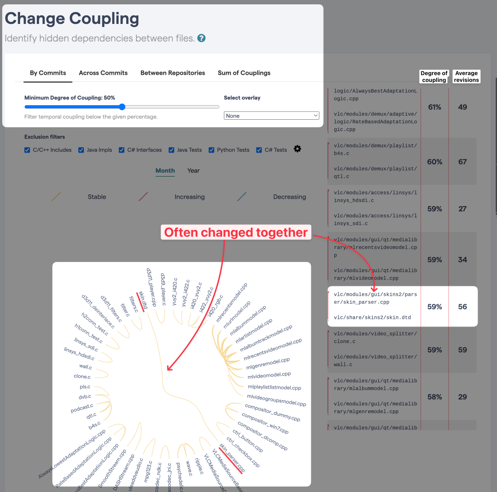

Do you sometimes have a hard time seeing _where_ that new function should go?

Legacy codebases typically have folders such as `lib/`, `services/`, `helpers/`, `common/`, `utils/`, etc. I've worked with a codebase that had both a `common/common/` and a `utils/helpers/` folder… It can be confusing 🤪

This may look silly today. But the truth is that they were created _over time_.

Usually, this happens because different developers weren't sure about where to put some new piece of code. Thus, they came up with different solutions. Fast forward a few months and here you are: not able to articulate where the code should _really_ go.

Wait… shouldn’t some of the code in `lib/` be in `services/` instead? Or should they rather be merged into a single folder? In the end, is there a better way to organize these files and recover from this mess now?

There are different approaches indeed. Let’s see…

## Merge everything and let patterns emerge

Instead of trying to reverse engineer what all of the developers were thinking, **you could merge all of these files into a single folder**. From here, you may see patterns emerge and start creating new folders to regroup related things.

In general, this doesn’t _feel_ good.

It sounds like it will just create a bigger mess. Yet, it’s a way to move forward. In fact, it’s a much better approach than staying still and doing nothing about the problem. It solves the issue of not figuring out where things should go.

It does create a mess though. However, it’s normal for large-scale refactorings [to look messier until it gets much better](https://understandlegacycode.com/blog/is-it-ok-to-change-code-for-testing-sake/#it-becomes-worse-before-it-becomes-better). If you trust the process and carry on the cleanup until the end, it will pay off.

In my experience, you first need to **clarify what your target looks like, with your team**. You can only get there with teamwork 🤝

## Package code by feature + _shared_ folder

The key idea is to **regroup files per feature**. Think “business use-case”. Instead of separating files per technical concerns (eg. components, controllers, models, views, services, API, etc.), you do split them per business concern (eg. payment, login, catalog, etc.).

Then, you create a single `shared/` folder for the common elements that are being re-used across multiple features. These components are usually more generic. They could eventually be extracted into another package.

```
some-project/
|__ payments
|__ login
|__ registration
|__ browse
|__ search
|__ shared
   |__ logging
   |__ tracking
   |__ networking
```

Here is a trick that will help you achieve this kind of structure: **it’s fine for code to be duplicated between the different features**.

Code that looks alike may not be _actual_ duplication. If features are distinct, chances are that the code may evolve for different reasons. In doubt, wait before extracting what you think “may be duplicated”.

Remember: [a bad abstraction is worse than duplication](https://understandlegacycode.com/blog/refactoring-rule-of-three/).

> But what if I’m starting from a legacy project that wasn’t structured like that?

Then it will take a bit of time to get there.

Just like for the previous approach: it will be messier before it gets better. Old legacy codebases have more inertia for change. It’s doable, but it takes more constant energy to get there. What you need is:

1. **Set a clear direction**, agreed with the majority of the team
2. **Get the team to push in this direction** a little bit every day
3. **Track progress** and celebrate milestones

## Use git to detect Change Coupling

Another interesting approach would be to gather insights from how developers interact with the codebase. This is a technique called _Behavioral Analysis_ that I’ve learned in [Software Design X-Rays](https://understandlegacycode.com/blog/key-points-of-software-design-x-rays/). This technique can detect Change Coupling in your codebase.

The core idea is to move closer the files that are changed together.

This information is present in version control metadata. The project git log is a gold mine that can tell you how things are actually done behind the curtain. This move is called “Proximity Refactoring”.


How do you make it happen in practice?

By yourself, tools like [code-maat](https://github.com/adamtornhill/code-maat), [code-forensics](https://github.com/smontanari/code-forensics/wiki/Coupling-analysis) (based on the previous one), or [tumbleweed](https://github.com/redgreenio/tumbleweed) (for Java) can help you identify Change Coupling.


For open-source projects (or if you can afford a budget to tackle your Technical Debt), I recommend using [CodeScene](https://codescene.com/blog/software-revolution-part3/). It is an all-in-one solution that can even detect coupling across different repositories — handy if you are dealing with legacy microservices.

Check out [my own analysis of the VLC media player codebase](https://codescene.io/projects/38265/jobs/1046958/results/code/temporal-coupling/by-commits).

You can see files that are often changed together for a good reason:

- There are located close together in the source code since they share similar responsibilities
- They represent the source code and its related tests

But some coupling may catch your attention:



These files are changed together ~60% of the time. And yet, they are located far from each other.

```
vlc/
|__ modules/
| |__ gui/
|   |__ skins2/
|     |__ parser
|       |__ skin_parser.cpp
|__ share/
  |__ skins2/
    |__ skins.dtd
```

This is an insight. It could be worth having a closer look and seeing if `skins.dtd` shouldn’t be moved closer to the related parser. Or maybe a part of the `.dtd`. In any case, this “shared” part of the code seems to have a strong bond to a specific feature. A strategic _Proximity Refactoring_ could increase cohesion.

Main benefit: make it more obvious that these files should often change together. Contributors are less likely to forget about it. It would also reduce the scope of "things to consider" when changing this part of the source code.

This is how git can tell you how to (re)organize your files. The key is:

> What changes together should be close together.

Of course, Change Coupling can only give you insights. In the end, it’s up to your team to determine what makes more sense for your context 😉
