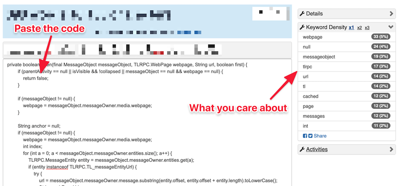
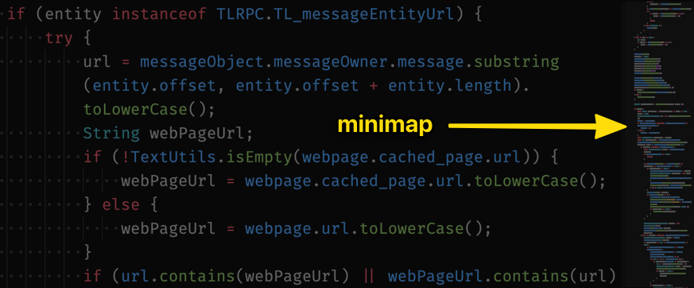
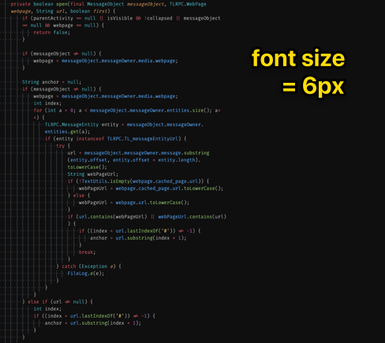
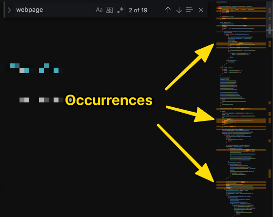
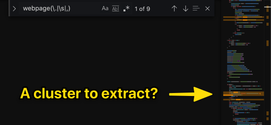
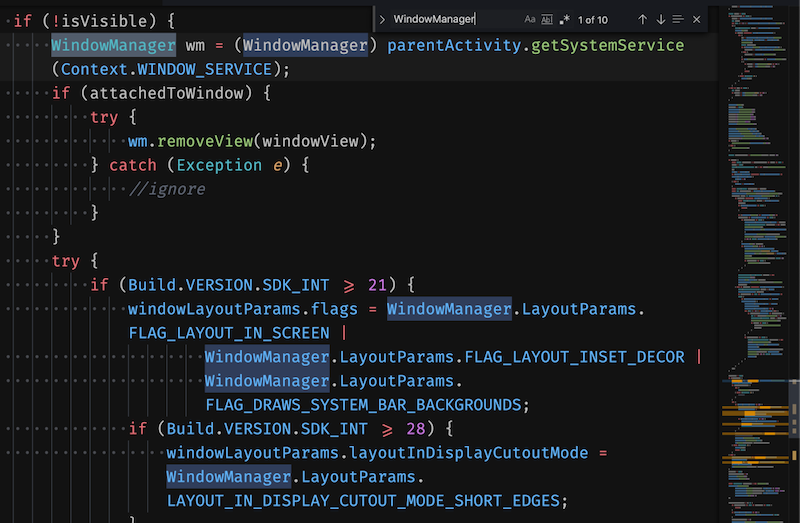

Dealing with Legacy Code means coming across very big methods that can feel overwhelming. Let's have a look at [this messy one][the-code].

It's a 210 LOC long method of a 13.6 kLOC class. The signature itself is not super explicit:

```java
private boolean open(final MessageObject messageObject, TLRPC.WebPage webpage, String url, boolean first) {
  // 200 LOC later…
  return true;
}
```

When you realize that your change needs to happen \*wave hands\* somewhere in such code, where do you even start?

You kinda have to understand what it does.

But because it's so big, it can be a real slog! I can already hear you sigh at the idea of spending hours, trying to make sense out of this. Your motivation took a serious hit…

> "I don't know of any way to make the job easy!"


What if you knew a trick to identify great candidates for extraction in seconds? You could start to make a dent and get the motivation boost you need for more ambitious refactorings.

Maybe you doubt that you could apply any theoretical advice to your codebase because it's REALLY a tangled mess.

But look at the code I sent you before. You don't know the codebase and it's clearly a challenge!

If you can get something out of THAT in a few minutes, you surely can do something with the code you're maintaining every day.

## A simple technique to reveal the structure

Let's face it: trying to jump in and understand the code by reading it from top to bottom is **a waste of time**.

Sure you can try. But you probably can't afford that. It's unproductive.

You need a technique to make sense out of the code rapidly. This technique is described by Jonathan Boccara in [The Legacy Code Programmer's Toolbox](https://www.amazon.fr/Legacy-Code-Programmers-Toolbox-Developers-ebook/dp/B07Y6T2VN1) and it doesn't require any fancy tool!

It's a 3-step recipe:

### 1) Identify the most frequent words

Without digging into the code, you want to know what is it about. Counting the frequency of words is a quick way to do that!

Don't go fancy, use an online counter like [wordcounter.net](https://wordcounter.net)

Copy-paste the body of [the code][the-code] in the tool.



_⚠️ You might not want / be allowed to send your code to such an online tool. In this situation, find a script you can run locally (here's [one in JavaScript](https://github.com/fengyuanchen/wordcounter)). You can also write your own (here's [a tutorial in Python](https://codeburst.io/python-basics-11-word-count-filter-out-punctuation-dictionary-manipulation-and-sorting-lists-3f6c55420855)). Thanks [Steve (Gadget) Barnes](https://github.com/GadgetSteve) for pointing this out!_

The information that matters is **keyword density**.

The tool is not case-sensitive, but it doesn't matter much.

You might have some useless triggers, like `null`. These are not interesting at the moment, you can ignore them.

Focus on the identifiers that are the most frequent. In this case:

1. `webpage`
1. `messageobject`
1. `tlrpc`
1. `url`
1. `cached`
1. `page`
1. `messages`
1. `windowmanager`

### 2) Use your IDE to highlight the structure

Open the code in your favorite text editor. Take a step back, zoom out.

If your text editor has a minimap, that's perfect 👌



Alternatively, reduce the font-size of your editor as much as possible.

You don't want to _read_ the code, you want to fit as much code as possible on your screen.



Then, take a word from the previous list and search for it. Highlight all the occurrences of this keyword in the code.

For example with `webpage`:



### 3) Identify the patterns

Now that you have a bird view of the code, you can highlight the structural patterns of the code.

There are 2 patterns you should look for:

1. **The keyword is used across the whole method**. That means it's a central concept for this method. That's a valuable piece of information to keep in mind.
2. **The keyword is only used in a portion of the code**. That means you can probably extract that portion into a logical chunk. Go find out!

#### Trying it with `webpage`

This is the most frequent keyword.

Interestingly, it yields some false positives (e.g. `webpages` because it's a substring, `TLRPC.WebPage` because it's not case sensitive…). Don't hesitate to tweak your search to exclude them.

In this case, `\swebpage(\.|\s|,)` gives better results.

It seems there's a small cluster:



If you jump to this cluster, you'll find it sets `req.url` and `req.hash`.

```java
req.url = webpage.url;
if (webpage.cached_page instanceof TLRPC.TL_pagePart_layer82 || webpage.cached_page.part) {
    req.hash = 0;
} else {
    req.hash = webpage.hash;
}
```

You can probably extract that into a honest `setReqUrlAndHash(TLRPC.WebPage webpage)`. It's not a big step, but it's definitely a step forward.

#### Trying it with `windowmanager`

This one is interesting because it reveals [a good chunk](https://github.com/DrKLO/Telegram/blob/master/TMessagesProj/src/main/java/org/telegram/ui/ArticleViewer.java#L4509-L4539) that seems to only deal with the Window Manager.



Scanning through this snippet, you can quickly detect a few things:

- there's a `wm` variable that should probably be renamed `windowManager`
- there's a line of (dead) code that's commented
- the code seems to configure and set the `windowView` to the Window Manager

That definitely can be extracted. Give it an "almost honest" name until you find out exactly what is done here: `addViewToManagerAndDoStuff()`. Pass it all the parameters it needs.

As you go through the list, you start to make a dent to that scary function. And the more you work with it, the better you understand what it does.

**Getting started is the most difficult part**. And you just did that!

## Now, do this at work!

Take a scary method in your legacy codebase. Create a playground branch where you can mess up with the code and practice.

Spend 10-15min applying this technique and see what you learn from it… When you get something, share your findings with your coworkers!

And [let me know](https://twitter.com/nicoespeon), I love to hear successes from the trenches 🤠

[the-code]: https://github.com/DrKLO/Telegram/blob/master/TMessagesProj/src/main/java/org/telegram/ui/ArticleViewer.java#L4379-L4587
