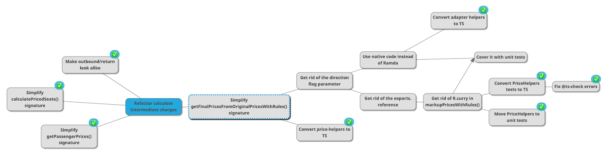
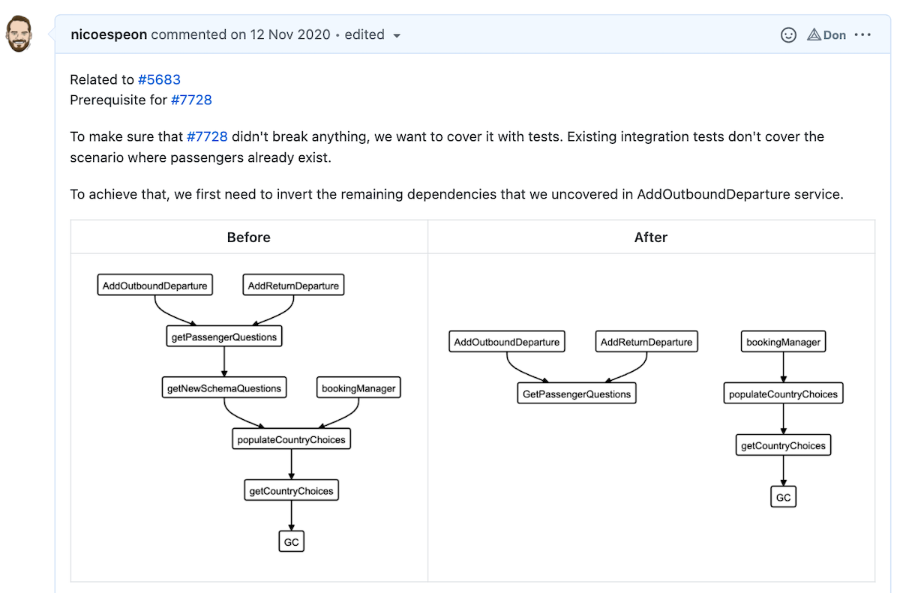
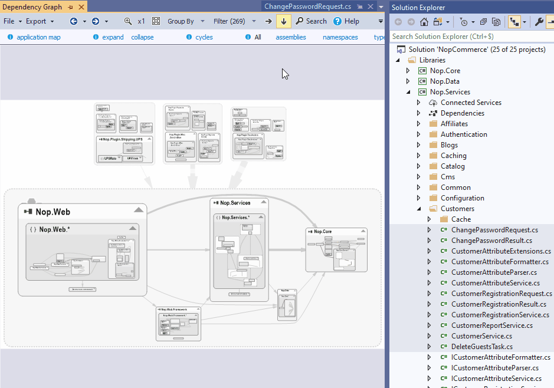
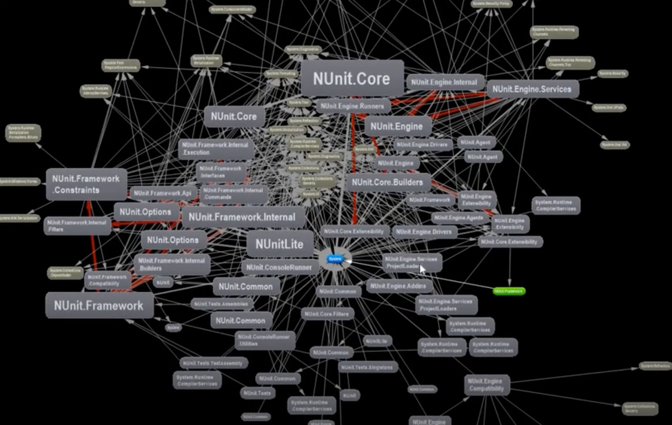
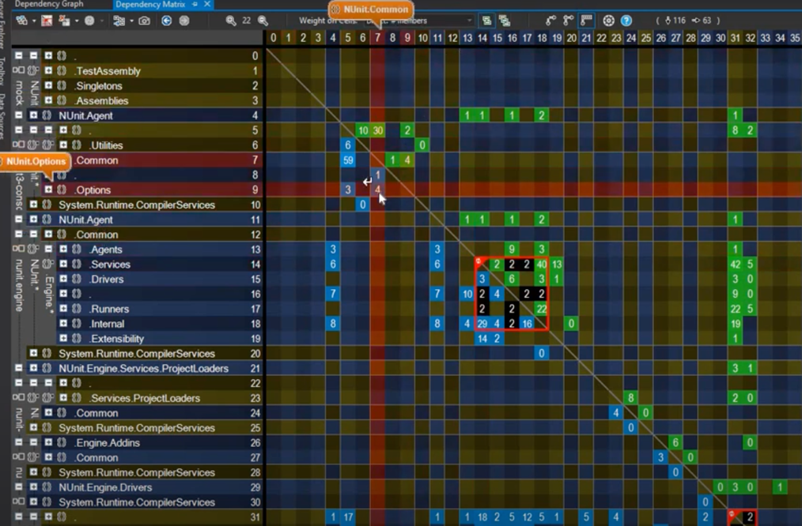
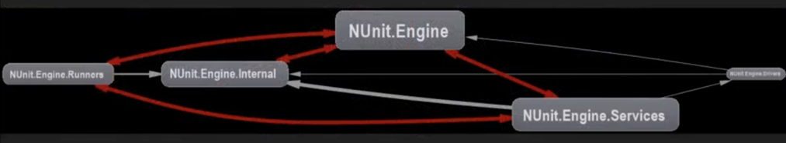
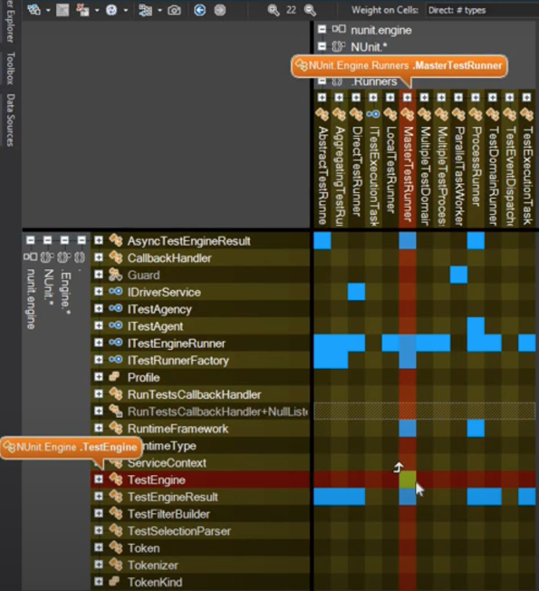
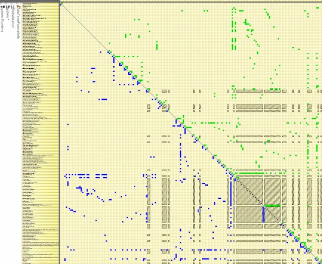

As an application grows, the quality of its design will impact its maintenance: if everything is tangled and anything can be mutated from anywhere, any change is a challenge.

You probably have to deal with such a challenging codebase. You probably didn't write most of it. If I'm guessing right, then these should sound familiar:

> "Please don't deploy to prod team, my last change caused a regression. Rolling back…"

> "I'm done with the change, but a bunch of tests is failing so now I'm fixing that. I should be done tomorrow…"

> "Let's add another parameter instead, I don't want to break other clients…"

There's something common here: confusion. It's easy to get lost when you can't quite get your head around the code. That's a fact: [your brain can't hold so many pieces together](https://en.wikipedia.org/wiki/The_Magical_Number_Seven,_Plus_or_Minus_Two). You need techniques to help you, or you are working in the dark.

One of the techniques is building proper abstractions. Reduce the number of details you have to think about. Different paradigms have different approaches:

- Functional Programming minimizes these details, by limiting mutations and side-effects strictly to the edge of the system.
- Object-Oriented Programming encapsulates these, so mutations are limited within objects and not propagated across the codebase.

Refactoring towards a better design helps. But if your codebase was already there, you wouldn't be struggling. Thus, you need something to deal with not-well-designed software—until you make it better.

## In a Legacy application

Say you have to make "that" change. You have identified the function where that change should likely happen. But you first need to change the signature of it, because you need some extra data. Which clients would be impacted by this change?

You probably can find the 3 clients of the API you plan to change, but what if 2 of them don't have the data you need? It means you certainly need to change their signature too. It means you have to identify their clients. Now you have 5 more places to look for. Unfortunately, 3 of them don't have the data you need…

It's getting out-of-hand pretty quickly right 😅

Hopefully, I have 2 concrete techniques to offer you for when you are in such a situation:

1. [Use the Mikado Method to get things out of your head](https://understandlegacycode.com/blog/a-process-to-do-safe-changes-in-a-complex-codebase/). Seriously, each time you realize you need to do B before you can achieve A, write it down and start over from B. Your brain will thank you, so does your productivity.
2. Draw a _Dependency Graph_ as you go!

## Why you should draw a Dependency Graph

[A Dependency Graph](https://en.wikipedia.org/wiki/Dependency_graph) is a directed graph that represents the dependencies of several objects towards each other. That's pretty generic, yet super useful when it comes to changing existing code.

The Mikado Graph is a sort of dependency graph: you are mapping the dependencies of the tasks you have to complete to achieve your main objective.

Why would you draw such a graph? **To get it out of your head!**

A Dependency Graph of the code would have the same purpose: to help you visualize the interconnections of the things you aim to change. Chances are that you have more nodes in the graph than you would be able to keep in your mind.

Not only such a graph will help you keep track of what you are doing, **but it's also a great asset to share with your team**. Maybe that's worth adding it to the source code documentation. At the very least, it's the kind of graph I'd put in the description of the change request. It helps the reviewer understand what's going on and give better feedback on the solution.

### How to draw such a graph?

Honestly, I usually start with a piece of paper. When I realize there are more nodes than I can remember reliably, I start jotting them down on a draft paper. I recommend you rotate it on a landscape mode, put the first node at the center, and map.

However, this has 2 downsides:

1. It can't scale too much if the graph turns out to grow big
2. It can't be easily shared, especially when working remotely

Thus, I'd eventually reach out to an online tool. Do I have any recommendations?

Well, the thing is you don't need a _fancy_ one. I recommend one where you don't spend too much time on the design at first. That's why I **don't** recommend something like [Excalidraw](https://excalidraw.com/) for such a job—although I love it for drawing documentation schemas. Instead, **I reach for [diagrams.code](https://playground.diagram.codes/d/graph)**, or the classic [mermaid online editor](https://mermaid-js.github.io/mermaid-live-editor/#/edit).

Manually creating the Dependency Graph takes time. Ideally, you would leverage a tool that can do that. But in this game, not all languages are equals. Some are statically typed, with amazing tooling that can produce such graphs at compilation time! Others don't have such tools yet.

However, my main concern regarding tools that would automate generating a Dependency Graph is the _clarity_ of such a graph. There can be a lot of noise in a Legacy codebase. When drawing the graph manually, you would filter out details that aren't relevant. The resulting graph should be a useful focus on what matters, not a full-detailed picture of everything that exists. In my experience, automated tools tend to produce a visual mess that's not so helpful.

But I have found some exceptions…

## Using automated tools like NDepend to save your day

Among the tools I know, one actually stands out for generating incredible Dependency Graphs. I will use this one to demonstrate what features you should be looking for. Meet [NDepend](https://www.ndepend.com/) 🦄

NDepend is for .NET developers. I don't code in .NET. Still, I was interested in seeing the capacities of such a tool. If you're looking for tools that would work with other languages, I listed some at the end of this post 👇

Now, this Visual Studio extension is literally a swiss army knife. I barely scratched its surface. Let's focus on its graphs and have a look at what makes them actually useful.

First, they are **interactive**. Being able to zoom in and out smoothly is essential as graphs can become quite large. You can also filter the nodes that matter, which is an essential feature when it comes to visualizing Legacy code.

Navigating a very large graph is smooth.

It's connected to the source code, so you can even drag & drop a specific file into the graph area to focus on this node.

We can even drag & drop from the source code to focus

NDepend has [different kinds of graphs to dive into a codebase](https://www.ndepend.com/docs/ramp-up-in-a-new-code-base):

- call graph hierarchies,
- class dependency diagrams,
- project dependency diagrams,
- etc.

I found that these different points of view help you reason about the code. Sometimes you need to take a different perspective to clarify your understanding of the codebase. This tool allows you to switch perspective, and I didn't see a similar, powerful tool to visualize a codebase in other languages yet.

But the one feature that I really think makes the difference when it comes to Legacy systems is **the Matrix view**.

### Enter the (Dependency) Matrix

I hope I repeated enough the typical issue with tools that would generate a Dependency Graph for you: chances are they will output a messy graph of everything that won't be so helpful. A great one should help you in filtering out the noise.

Now, because we're dealing with Legacy codebases, it's unfortunately common that some parts _are_ complex. Even by filtering out what doesn't matter, you're left with hundreds of interconnected nodes because there's no encapsulation in this design and everything mutates everything. What a mess!

This is hard to navigate…

This is where the graph view is limited, but the matrix one comes in handy. NDepend allows you to visualize large graphs differently:

The matrix view is more practical! It makes it easy to detect high-level patterns.

At a glance, we can see the dependencies and layers that structure the application. Columns show what a row depends on (e.g. it depends on many libs) and rows show what is depending on a column.

This gives you high-level insights that would have been difficult to catch otherwise. For example, the black squares represent cyclic dependencies. If you select one, you can dive into it as it generates a subgraph that's actually readable:

The matrix view helps you detect at a glance which dependency isn't like the others, creating a circular dependency. For example, `TestEngine` would depend on `MasterTestRunner` (see the green square instead of the blue ones), creating a circular dependency between these two modules. This allows you to detect the problems to address very quickly.

Finally, the matrix view has also another great use-case: detecting cohesive chunks inside of a God class:

Each "square" is a set of cohesive methods and fields that might be a great candidate for extraction.

NDepend is the first tool I tested that provides you with many improvements to make generated Dependency Graphs really useful. I wish more languages had such tooling.

### Other tools that are doing fine

Here's a collection of tools I know that you can use in other languages:

- [Jetbrains IDEs](https://www.jetbrains.com/) are usually able to generate dependency diagrams (e.g. [for example with Webstorm](https://www.jetbrains.com/help/webstorm/module-dependency-diagram.html#js_ts_module_dependency_diagram_analyze)). Along with other capabilities like automated refactorings, it's a great IDE to work with Legacy code.
- If you're dealing with JavaScript/TypeScript, you're not so lucky. However, I found [Source Viz](https://github.com/cowchimp/source-viz), which is an attempt to build dependency matrixes. It has a [VS Code extension](https://marketplace.visualstudio.com/items?itemName=cowchimp.source-viz-vscode) and [an online playground](https://source-viz.netlify.app/) you can try out.

Would you recommend any other tool here? [Let me know on Twitter](https://twitter.com/nicoespeon) or by subscribing to my newsletter where you can reach me out!
