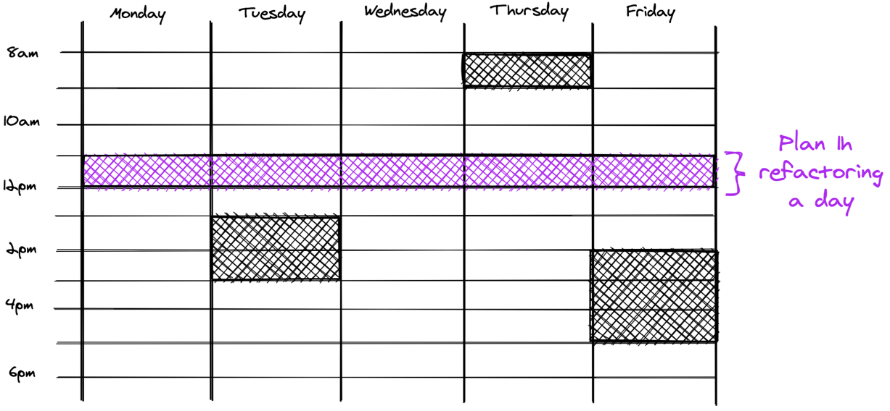

> "My biggest frustration with legacy code is when I don't have the time to invest in refactoring it"

If that's you, you're not alone.

It's not common for teams to be able to freeze development so they can refactor the code.

Sometimes [you may manage to convince management](https://understandlegacycode.com/blog/5-arguments-to-make-managers-care-about-technical-debt) to invest some time in cleaning up the code before you implement more features. But usually, you simply don't get enough time to clean up everything.

My current team is migrating our codebase from JavaScript to TypeScript. The codebase has a few hundred thousand lines of code. This is a quite large refactoring task!

It would be ideal to take weeks to get this done before we resume any development, but we can't do that. We still need to fix bugs and ship features. We can't just stop everything else to get this done.

I think that's a frequent situation. In the past, I've worked with projects where tests were a mess. Significant changes were required to support proper unit tests. Code behavior had to be preserved, but we had to redesign it so we can test.

Maybe you're in a similar situation at work 🍷

So what? Do you give up and let the codebase quality sinks with time?

That's what many teams do because the amount of required work is _so big_ that you don't even know _where_ to start.

## This is normal, chaos happens

The bigger the codebase, the harder it is to make abrupt changes. As you need to keep moving, you should adopt a different strategy for adapting the codebase.

Let's face it: you need to constantly put energy in to maintain some order in the codebase.

The very first step is to **make things visible**. [A wall of Technical Debt](https://verraes.net/2020/01/wall-of-technical-debt/#:~:text=The%20Wall%20of%20Technical%20Debt%20is%20a%20surface%20in%20your,pay%20back%2C%20or%20ignore%20debt.) will make it clear what direction you want to give to your codebase.

Then, you need to apply progressive pressure towards that direction. Make time your best friend.

And the best way to do so is to make this part of your habits!

## 1h refactoring a day keeps the rewrite away

Once you've identified the change you want to implement, **plan 1h refactoring each day for the next 2 weeks**.

That's your Daily Refactoring Hour™.

Very important: make sure **you ship a small thing every day**.

Open a Pull-Request after each timeboxed session. Be careful not to overflow your timebox because you're not done. Maybe take 40min to do your changes and 20min to set up the PR.

The trick is to keep it simple. 1h a day won't disturb your Sprint too much. It won't solve your Technical Debt overnight neither. But as you keep pushing in the same direction, you make things change!

As you work on regular bug fixes and features the rest of your day, spot refactoring opportunities. Identify little things you can do to improve the codebase. Write them down and do that during your refactoring hour.

This will also help you stay focused on your task at hand. Shipping refactorings independently from other changes simplifies code reviews.

### Why it works

It's an excellent way **to get started**. It forces you to take small steps, do small changes.

Doing little refactoring timeboxes is a great habit to build!

But just like when you start exercising, you won't see a difference overnight. Benefits compound, however. After a few weeks, your team will notice the effects on your velocity!

Thus, you don't really have to ask for permission. It's part of your daily job. It's how you work and _get things done_. The truth is, as you're making the codebase a little easier to work with, you'll make up for the time spent. In the end, it won't take you more time to deliver bug fixes and features!

### But I can't afford 1h a day!

Then plan 30min / day. Or do it only twice a week.

> Making it a habit matters much than the exact time you spend on this.

What about the rest of your team? Should you push them to do the same? I recommend you don't bother about it yet.

Start with yourself, lead by example. Learn to ship small, incremental refactorings. Don't disturb the team too much.

After a few weeks, they should feel the benefits of your constant efforts. At this point, you may suggest them to do the same (and coach them in doing so).

## Start doing it, now

Here's what you can do to get started:

1. Write down a list of things you wish to improve in your codebase
2. Pick one
3. Plan 1h / day to work on this, with the goal to ship a change at the end of every session, for the next 2 weeks.

Ignore the other topics. Do it. Don't spend more than an hour, including opening the PR.

After 2 weeks, stop and reflect on what you've done. How did it go? How can you improve?

Your codebase may feel impossible to maintain. The truth is, the first step is right in front of you. Trust me and give it a try!
