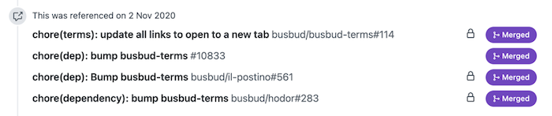
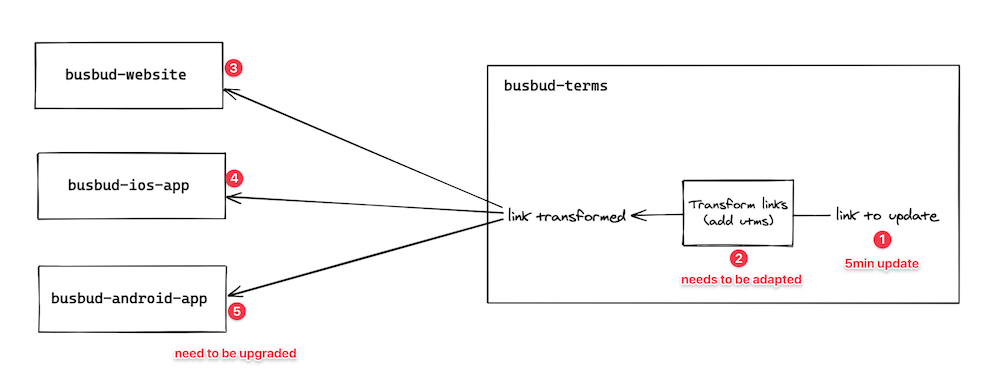

What seemed like a relatively straightforward job turned out to be much, much, _much_ more work after you had a look at the codebase.

From your client perspective, that looks like a quick one-off:

> The site is working well, we just need you to update the content on these pages ☕

But this application was not _well_ written. At all. The HTML you need to change is actually generated by some obscure magic. Business logic leaks throughout the entire codebase and some dead-end code seem to do nothing. Oh and that duplication…

It appears to run smoothly, but it keeps throwing exceptions that are being smothered! **It's completely broken!**

Now you feel bad.

You're afraid you made it sound like if it was nothing. And now you have to tell your client otherwise. They already asked you:

> How long would it take? A couple of days?

More like a couple of weeks! 😱

But how would you make them _understand_? How can you explain to your client how _bad_ their code is? Will they trust you? After all, it's your word against the previous developers who crafted this…

## Be respectful of your predecessors

This is my opinion. I believe that nothing good would come out of bashing previous developers who created the codebase you'll have to work with.

First, most incoming consultants/freelancers/developers to a project would react like this and shine a bad light on the previous ones. If your client has some experience, they'll probably think that it's the norm and they won't really listen to your complaints.

Plus, if you come across as condescending, you won't gain any credibility. Everyone does that, you'll look just like another developer!

It takes a lot of effort to overcome this instinctive reaction, but don't be that person. **It doesn't serve you!**

Give your predecessors the benefits of the doubt. Maybe projects constraints were too hard to do everything properly. Maybe some curious requirement makes it difficult to do otherwise. They probably weren't as experimented as you are. Or maybe every single change made sense, but the final picture is a gigantic mess!

Make your client notice you're **a professional**, a good person. Good persons don't say mean things on others.

**Focus on the code, not the coder.**

## "Why so long?" Walk them through an abstracted example!

Non-techies aren't idiots. They can understand your technical explanations if you keep them at a high-level. Don't get into the details, avoid technical jargon, use metaphors. Communicating with business experts (your client) is a difficult skill to master, but it's an essential one to practice.

Pick a task that seems to be simple, and walk them through to explain why it's not. For instance:

> I expected this change to be one word in one file. But when you change it here it breaks at 7 other places, like a domino! A change that should have taken 10 minutes ends up taking 2 hours to keep your app working. That's just one example.

### A story from the trenches

That may sound made up to some of you, but I actually had to work with a similar scenario at work.

My task was to make a link open in another tab, so mobile users can easily get back to the checkout process:

There even was a "Quick Win" label, what could go wrong? 🤠

Oh, boi… This fix took 4 Pull Requests in 4 distinct repositories to get done!

Here's the high-level explanation to make our Project Manager understand why such a simple change would actually take much longer to be completed:

> It looks like we could just update the link on the website and we're done. The truth is: this is part of the "Terms & Conditions", which are shared between all of our apps, not just the website. So we need to change it there, then upgrade all of our apps.

> Also, we have some logic in place to transform these links to add relevant UTM tags, depending on the client. This logic doesn't expect the syntax needed to open a link in a different tab, so we need to upgrade that logic too or it would break the links.

> That's why what seems to be a 5min change will actually take us a full day to make sure it's compatible with our existing features, everywhere!

A little diagram helped to convey the amount of work involved:

## "Why is it so complex?" Remember this is not about the coder

If you did a good job explaining why the change will take longer than it looks because of the state of the code, your client may ask you _why_ the code is in such a poor state—indeed.

This is a fair question to have, but it's a tricky one to answer. This is when you're tempted to say:

> Because previous devs did a terrible job…

If you're mindful, you may use a variant like:

> Because this code is a mess…

Slightly better, you're talking about the code now. But I don't think it's helpful. You're still implicitly shaming the author of this code—previous devs, of course.

Instead of pulling others down, try to raise you up. Shine. Consider something like:

> Web development is a rapidly-evolving field and future constraints are hard to anticipate. To stay ahead, you have to adapt your whole development style to the situation and evolve as you go. Most developers don't do this. It's unfortunately common to end-up with solutions that are more complex than necessary. I've seen that many times.

I think this is better:

- First, you acknowledge your predecessors did the best they could given their context and skills.
- But most developers would have done the same!
- Now, you stand out "most developers" because you know better and you can help your client grow further.

## Don't take a job that won't meet your expectations

As we're talking about joining a project in which codebase is much more complex than it looks, I feel I need to remind you something: **you don't have to accept this client.**

Maybe you do. That depends on your situation of course, but ask yourself the question.

The client probably wants you to make this work for the least amount of money. It's an understandable short-term goal. But that might very well be the mindset that put this codebase in this very state.

Without time and discipline to refactor the design to adapt to the new requirements, most developers will look for the quickest way to make it work. This is the recipe for an even bigger mess. Also, it may not work that well as they waste a lot of time testing manually. Eventually, that creates regressions down the line that they need to fix, spending even more time on this.

If the client isn't building a team of developers to maintain that system in the long run, they may not care about maintenance that much. They probably aren't ready to spend the extra money to get the system in a better state. They'll look for another, cheaper estimation. Let it go. **Don't burn yourself trying to fulfill promises you can't.**

## Conclusion

Sometimes, the change you're tasked to do looks simple on the outside but is much more complex than that. It's not obvious to your client why it would take you so long and cost so much.

In this situation, **don't blame past developers**. Drive your client through a high-level example of a task to make them understand why it's trickier than it looks. **Drawing things help**. Suggest them a plan to get them out of here. Don't try to refactor everything—you can't—but make time for improving the situation in your estimate.

If the client isn't willing to make things better and just wants the change to be done, remember you don't have to accept this client. Estimating things is hard, and you're not familiar with this codebase. Accepting will either have you make the codebase worse by trying to patch it, or have you spend much more time than you'd get paid for to make it work. Sometimes, both.

Be careful, take care of yourself!
