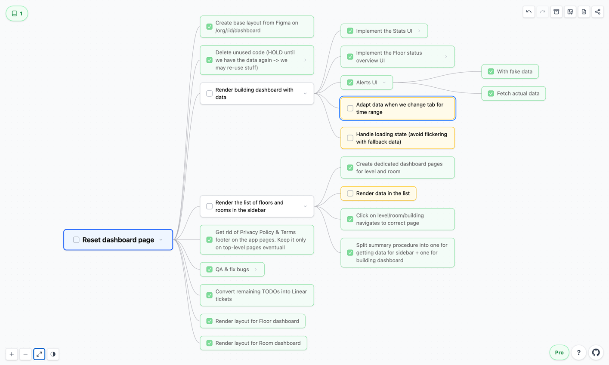
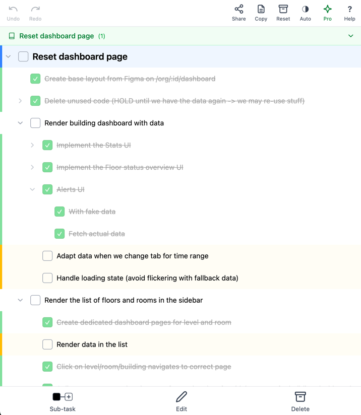
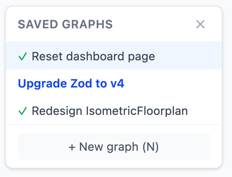

_🔗 Just searching for the link? [nikado.app](https://nikado.app/)_

[I wrote about the Mikado Method](https://understandlegacycode.com/blog/a-process-to-do-safe-changes-in-a-complex-codebase/) already. It's a practical technique for tackling unknown unknowns, which is common when you are dealing with a legacy codebase.

The idea is simple: instead of attempting a big change all at once, you decompose it into a graph of smaller tasks and work from the bottom up. You never stay in a broken state. You commit after each small win. You can stop anytime and ship what you have.

> Wait, isn't that just a fancy way to say "break things into smaller pieces"? 🤨

Almost. Here's the key difference: **you don't have to know the smaller pieces in advance.** Follow the recipe and you discover them by trying and failing. The "recipe" is just a guardrail to avoid getting lost in the weeds (way too common when the code is messy and untested). The growing graph artifact is your compass 🧭

If you've ever been 3 hours into a refactoring, 34 files changed, nothing compiles, and you're not sure how you got here: that's the exact trap this method prevents!

So, the Mikado Method is useful. But there was always one friction point…

## The paper problem

[In the article](https://understandlegacycode.com/blog/a-process-to-do-safe-changes-in-a-complex-codebase/#the-process), I tell you to "grab a piece of paper." I stand by it in general: it's low-tech, low-friction, so you are more likely to apply the method without getting distracted with the tooling. **I often start a Mikado graph on paper**.

Now, in practice, it quickly hit some blockers:

- My graph outgrows the paper quickly
- I can't easily share it with remote teammates
- I can't undo, rearrange, or collapse parts of it
- and frankly… it quickly becomes hard to read 😄

I have been looking for simple tools to quickly build such graphs. Alas, nothing was satisfactory. Too complex, too slow, too much friction… I eventually ended up leaning on [Mindmup](https://mindmup.com/) for a while. It's a mind-mapping tool, but that was the closest to the UX I was looking for.

Overall, here was my wish-list of key features:

- I don't want to micro-manage the layout
- I want to create/delete/check tasks quickly
- I want something fast that I can use offline
- Sharing with others should be simple

Accessibility was a key factor: I would rather hit shortcuts to express my thoughts than clicking around.

Finally, if I was to build this, it should be simple to maintain. Less moving parts = better.

## So I built Nikado

And it looks like that:

> [Nikado](https://nikado.app/) is a free, browser-based visual tool for the Mikado Method

It's focused for the Mikado Method. In fact, it's tailored to my usage of the technique. Thus, you can typically:

1. **Set a goal.** Double-click the canvas or hit Enter, write down what you want to achieve.
2. **Decompose into sub-tasks.** Tab from the main goal to create a sub-task. Enter to create a sibling. I made it easy to capture work as it shows up.
3. **Pick a sub-task to work on.** Leaf tasks (the ones with no dependencies) are highlighted. Pick one, start there.
4. **Complete tasks, pick another.** It's easy to mark a task complete and navigate to the next one. Also easy to undo/redo if you got it wrong.
5. **Collapse noisy details.** Finally completed a task with 8 sub-tasks? Collapse the nodes to keep the remaining work readable.
6. And finally, **share the link!** The entire graph lives in the URL. Copy it, send it to a teammate, open it in another device, bookmark it…

There is no backend. No sign-up. No data stored anywhere except your browser's URL bar. It's just a tool to make my life easier, not yet another SaaS product. 👐

## A few things I'm proud of

### Keyboard-first

You can navigate the entire graph without touching the mouse. Arrow keys to move between tasks, Tab to add a sub-task, Enter for a sibling, Space to edit, etc.

I use it this way most of the time 🙂 ⌨️

### The graph lives in the URL

Remember the screenshot I put above? Well, [here's the full graph](https://nikado.app/#N4Ig5g9ghgNgkgExALhAUwGwCYoHZcIAsAtGlgGYCcxhAjBtQEbkDMJtLl+L5ADC1F4BjEABoQAFygBnANbSUAbVABLJKkw58RUhWp0GxZm2IcuuHv0EjxMKIzQwUIAEpppaCQAIEMgBaM0ABOCF4ADlBgaGIg0lISAK4KqGFoAHYIKmlgIAC+oqrqILRQZGgIWACsxJVEQjS1UMQAHIwlxBi4lZ0YhPiVlDYgdg5OqADCQWhQEmhejDJzdgCeEAne5EEQALZeAGIqYNtQXhBpXgD0EEFgF8hqF77SAcFI4nEzSc4IZ9H5hc5eJVeGhaIwsCQ0Lhmk1CFg0ORiFwWLhiEJcGghLwsBgyANmjERo5nAARRyeOYJNJJcpeIQQBBzAAUAAkAPIAGRJXipEhUMC8AHc5n4oAA3OYSPxzXxSLyRKBZLzEAB8Qrmx2WXimxBpXjiCXI5AAlDEPolkiAfmk-gUQGpnFCWIxmrQsCw0QhujRKJU0MQoAhcNR6FhfOQ8EI0LxKIT7MTUG4MmggvMEvzMtkfP5AlAQkKVFLs1IzfEvil0pmcv97UVKIRKI3eLheKQEJRW4QUQgkRgoFhiFgHLw+37er446NnHBtmEYGhtulvFK5gBleLSLwAVTgpc+luttoBqFoRGY0f9uPKPvovcI9RYLEq5FwGGahEYLEwk4TIBnc4XJcvBXfYYAga59TLTcIAlIIxRUNBBW3Xd3ig75fjyO0HVQchTygFgiH9VoWxoBFqC4IRmiRXw-WaXCnz6H8xhAABBecggkTcdz3C10JtTDjxAOhaBHRpiGEQhYQhDAjCEchGA6OiQT4KAhAEWgmOcAAFfkYC4lDYjQ1BDwE2tvmbBByAQXgmlfaZSMIKioFKEhWkoDAv0oBAEGafBNNQAB1Qs-C8CNZBlGYoB48srQwmtsPQLAsGaThkuIVLO14byAyfAdBFoIQsCEHyMG6DTbHjZiAHFPHlIRElgYsotQ-c+KPMzUEoFhaAjNBnXSqoB3vLqkVdD01PrLFnUwSgCQqqdE3A7ZoKEIQEjCBC3kM1rjLirCijaCg+GvLsOBoL9W3BXASCmp8HDIRhKjm4ZKtJNB4KjaC0hgLJoha3jdv4+KikkxheFoa6qPITB-ToFgqJdSoFIwWg0EIDBSsINBmkK-yQAAURtG4tSSSI-u2gHYqB-bnGhTg8DQBSvU4GhyEqD1AyBUxeGaay8Cxr1CDxgAVex5wLIswoikt-pikzgecLyEE4FEBz7PrWcYVzQQU2gSiwLo+EkjAhiJZi9k8IQQtUhqBVlZqKblvbBOweMhEqJpLJ5mgoDoloOFReFUd4EEfJD3A8aCyWoHCprooPZ2OpAXAId4F0eF0ZoZMIYEZOaQbiFwRh8EeoRJO6yo8YtiQrbq2249lhPqcE4RaEk+Ee0ZaGaCESgmkYSgjWIF8JMEFtGAxvGk0ZVMQJ+uJTnIUKwOuTcoAybUls3JUQOkNRGbzePnFSDIsmrGmTyN2hBgHKyBgaEcA2c-1OD6AjcBxINeDxljfDCbx7ZCmlOcYUdJRTZElPYUKEE+SLm1OvKIR8Kyn2yKZBKLosaVHRh6aMzAaDX1RIwcEOCMC4T4CiZoWCtpm2cOMaUQhZBeBUEvC4jB0wwCrBcAAJGwjMZ9EAADosiMgAB4CM4iIphm4aShAgmkCA3gmR7FUvyQsyxxh5gQKaRubU0FFFKKCL86N0qo1hH1eoRD2ymAWFASgjBvJgmvnjSY0xZg+HKCoIQMxaRPBeJo8IZNNzkAgvOCUAp16hC2DsJBVN2oJRbM-aEPZ6xoGqIQRyJBShCAUpgYE+E+rdV7lPSsKYmpMPOHPFQcQYknyrHox09BeDo2aFDCoqI4RDhaF2AcRAMAOHZkjQgfBnE-QYacc4oTHAXCidsVh7CqxeDSOKQ43jNwSAgHSa4Ux6oBMQTowGcSijkDkjzVS1RaC+VhNkvKzZ-Q4Hys0aMlA0axnmr+Vcc5Cz6gSNsY4QQtRhC2FGBACQpjlPWeMuYwTUxRAkHyLMgDoX6n3gsVMABqSF0DUy8I4WfbMzxcwhBifLC+IAcYumutCUwjl6jpMID2ewr40SkPBGjDAadnJ4xqt4IIahF5eC0rysUqktRaQgKMrUAAyLwwsUzLWgQo0pZxgLSnlGEMIuz3ACK8AAaTQGgDVXyzgwC1Mq9ZYRiCTIFBEKIm53pLgSLAJw+zYn1NQNcxgvcB5GAsApPoJsAxYHaBcp6Cx0bQiqHjAAiixLw0ryAqEkWwsACgXUkpbgQQgQJsABnwO0hAn4WgmwUuQNygY+7TGSnjOA0hpAJHcBLEKSz4JgBmCoM4xLE7oLLnRWoHoPwfxoD5D0+cUqkF6ARVJQg3zeTxgAWSqXvLMC5-5anNFCkJ9q9KNsWRsmZnbm5J18CUDE4IagsCqD6dmLRB7UFwHwCeuBSgdgwNQ16gU-Brp2HMGZm5rQAHJvDPAgEhdaAB+A9hznDdiIVAHqphgSwwQJ0Lp7pSAfnbOkvqCw30LRAGyb6pqT4qqWFu-lu9yT1VpDihZyqwKBm1eMMCHgSNeCtdBJe8i0jEA8POKjoQaNn2kAIyDbqQBBuaDGe9-pPVEPOm6JEHALEwhxC6coUATbOLOLBHlC5FRpDxcLNkJI2TbzSBCjkv08zAU8eFTiomFaoHPPe8gpDC5ZX7ek5JFR+7vmjAk5y2IRlQASIyAVbJxgOdJV5OS+qOykCRlRel7KAwNiaGnBAJRnLPgKSM6Y5wmMhbC1pCLUXBIOGwCHXgiIfKFXOvWJELAspInSV5XojNaiVzecxFkETxb0YWeurwTJxQQD5eQUZ4VeVZkFMFUKTqFhjPttox2lpalnzE0QZ5-B6WF1YElrBiJmiNk7r4Vo0wShNawMU5MqYVhrA2BBPYK9Uy+MJVtc0TtD0JQQNO8E5Ac7Dw0-2zAJB6yniMH3aEzkKiUOejQxMJS7tQFWOsLFXgXBLXxX4olaau1FC9CkoNtBx0FpoPwBS74IfMBSoTvpIJGDOPoYw5h6p9R+DWBw7U-o9QgRYCSYg2wGSOFCioII1S8ffaKPgd0T1Kj1AhFCVmBBey-fc8hugQgLnFwjt15wLE5BeEK6FyUGyvH-1BXMLIe8wB+E4qFLYuxGTzlmKEQFEBgWW+3kvOAiz9WhClDMYCZvxV8YATmV4DdVu6NyAAXXEIyWp6QhAIWSMoEAmxokaFdtoSEeh8GGGMOwTg3ByHWBiOs5wJQygVGqLUe8DRfAtDaE0To3RXx9C6IMUymftiOhz5m3QVAC9MFYMX8wlgBDCArxAQEiGwQQlINDmg8JETIlROiTE2JcRVFmj3x3-etCD7IMPgwo+TBmFL1Yaf4hK8aF9a6NDxVvQNj9AGIMIZsDhkjE8-fWf0AP5ujjRejZy+j+iBjBimBf5QARi4BRgxgz6KwNhNgkTlDxZdgq7uT9iDjDijig4Tg1i96OiAFP4gFXrgEf5QFhgwE-4IG36z4nhnjQwggdD+43gyTuQN6PjPivjvifjfiEEH737OiP7AEv5gHv6QGhjf5wG-70HOC4S+AERYzN4kRYzD4URUReRQC0T0RYIRyCH-71iNgdioHtidjdi9jYFDjRh4HjgOx35CR6yiRN6jwr7GKerySKTHQqRqRwZ-596dTIGmGthoEWGYF9gDg2Ejg6H4EOEMFWgWRWQ2SFy4hmKORPxozN7uSeTeS+QGF2hEFBEmHNihHmHnQRHWG4GxH2GIEaBJQpSUBpQZTk7ZT4SVA3IFRFQlRlQBGOgNGpRUQtFZptG5QBjgyFTFRZy9HyGdTdS9T9QXodE9wjSzRnQTT3gU4zQEiGGBGJTJSDHpRNGZSjHLH5STE9Eox1EgCHRGihzyb9oXRGAGw3T8B3T6pDhPR9H1EHFNFDHHGtEMpjHnHdHTFXGzFCT2DgyQzDwwz4LwxGCULIyozoyYzYy4y7FV5MEXisEnSUC3icEPhPgvhvgfhfgYDXF0xQ6MzEDMz6BswczWTnI8x8zXTlBYLfHFDYksFXg9gNgEm9BEk8Gkn8EUkQlKwqyDrqz9ryTaxgimD6yGxNIaYiCYk4R4TKFETFydhkRIhwFaE0TYx6GMQQmuwODuyex8BJa+xHYByDigjRihySbNicmKH4SESqE6kaH6nUSxF0QcD6GUmpzpyIhkBZwPx5wFxFwlzy7ly0CVxqnoAD46An76D0Dn7j5X5T5DCOGtztzXhdywy9z9yDyIgjxlxjxpyTyJlOguhAGejiFv4QGf7UGwHwGvKSAJE9RNLXx1Z3z6C5xPylBHFvxBifwticlAgggL6QjL5wgIh6kohogYhYg4h4h74QkYKpLYKkBpyIh0BcBGDELjpkL8DQhUKTla75mdwIhFl9yQ5DzlmSSlETximdnOAGIcBsomL2RYwsAWL2Ihg2J2IOJtCxiJl5n9gFm3krElmPktgVkvmTwQkBZQi8wtapI0AZIBiYg5KlQ2RfiPgFTgWFFCEgCQUdy0kwXDRwVlkIXPnjzIXvkaCNLNKtIGwr6dLvgXq0noz9J3RDLfwQVXlQU3ndw0UPl0WjxIVvmOHHJWlnKmCXI9xnpjx3KBYXJPIvKcmaB4DH755n5GBj6mAl4WBl437MVkrZK+R9BURtw4xYW7aMoyTTryTwjowcpRQ1nJl56n7plGUX6mWT7l4QkepepMC+o0Cvj1D9jBpw5hqdD5wJmkX-5hV2IRX9T+oxVBpNAhqtBQDhpJXXEWRZrdB5R5pDqFpZzZLDxlrtilD9g7EpV7ElXZrlX4CVUjrFq1UDzloNVVqbk9pszKw0DFxDTDotAHHjpdiMjy4zpIAQWZptW5odX0pVXdWlq9X1WVrPSOHHoMxnrsyXqv4jq3p7ZVlPpoAvoLXNWAhLVlUrX5rrU1WbV9zbWNXXEwYLDwbxksHJaojvhoZoyAVYbOiBg6U+VD5pmF7GWX5mXX45kJESZSbdyyZ+rdQDj4n-mIn9h9KPK+CaaJlUkHW0nsz0nXqczMm8w2RsmCzXHOZGhuYtgjV0reY4CIlYylHOSCDXZE2NEk10mswU1MnczU38zslCzim-bQxXWhGJZDopYFX3kZZZY6HQyPg6UkFiGgFNmUHSE0GyF0GWUVZYBVY1Y4xDSvyNbNb1gNga4dZegQ1H4pkGX+VF4mUT7mWI3fANjRhsA9j3oIk5xDI3peS0lnYOBwb4RBbeXO2+XQ0Zke1ZkhWWW-Z9IUCA4RgeSkS9AtbU5Q4wiBjJRfEQXz7gizkwgr4Lnr7Llb5rm767UJGE5YzE6k5+oU5dLU6loEQDD06MyTll2L5oVSTV0WAb4rnb7rmN20wfxPiUIK5YztIvjJKvr1DM29AFTa5+Rx7iD0gwB2BhAeAIAABywuae5F91OaelT1XVL1dVFaH1u94Inq6VPqmV0VgacVoaBViVka4gxhKBZR6BlhWBUR1RY49KDsp4H4zBl4bB-JHBgp6UxJvBZJ344gU5OsQ9c5q+i549ddO++IIAseuQQAA).

This was a deliberate design choice. Your Mikado graph is serialized, compressed, and stored in the URL hash. That means:

- Share it by copying the URL
- Bookmark it in your browser
- Paste it in a PR description for context
- And mostly for me: no database or server to manage

Maybe someday someone will report they are hitting a limit… but so far it was good enough for my use-cases 😄

### It works on mobile

On small screens, the graph wouldn't be readable. So on mobile, Nikado switches to an indented tree view.

Same data, different layout. You can tap to select, check off tasks, collapse branches. It's fully functional.

### It's open-source

👉 [github.com/nicoespeon/nikado](https://github.com/nicoespeon/nikado)

You can send feedback, report issues, suggest improvements, see how it's implemented and fork it if you'd like to.

## "Pro" license?

If you start using the tool and you'd like to say "thank you", I built non-essential-but-convenient features you can get with a Pro license.

For now, you can keep track of multiple graphs in parallel. They are stored in your browser. It is convenient if you use the tool on multiple goals, so you don't have to track 1 browser tab / goal.

The Pro license is "pay-what-you-want" (min. $2, suggested $10). You can [get one here](https://polar.sh/checkout/polar_c_iB2cv9AND1wfcGueJhQ2EkAmqXRyjYGO818V63JbwnF). It's a lifetime one.

## Why "Nikado"?

The Mikado Method is named after the [Mikado pick-up sticks game](https://en.wikipedia.org/wiki/Mikado_%28game%29). My name is Nicolas.

"Nikado" is a playful twist _(and the domain was available)_ 🙂

## Try it

If you've never tried the Mikado Method, [start here](https://understandlegacycode.com/blog/a-process-to-do-safe-changes-in-a-complex-codebase/) to learn the technique, then use [Nikado](https://nikado.app/) to put it into practice.

If you already use the method, I'd love to hear how the tool works for you. What's missing? What would make it better?

Hit me on [Bluesky](https://bsky.app/profile/nicoespeon.com), [LinkedIn](https://www.linkedin.com/in/nicolas-carlo-095b243b/), or directly on [the GitHub repo](https://github.com/nicoespeon/nikado).
