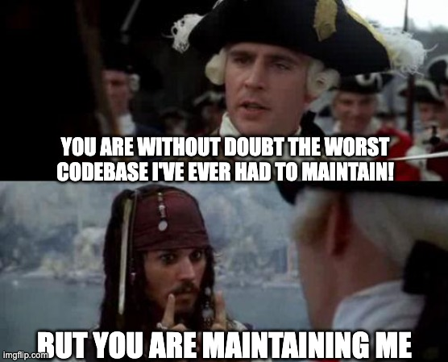

_"Legacy Code"_.

When developers talk about it, it usually has a lot of negative connotations. But what exactly do they call "Legacy Code"?

Is it any old code? Or someone else’s code? Is it just crappy code? In general, it doesn't rhyme with good code.

If you’ve been in the game for some time, you might have noticed that everyone has a different opinion on what good code looks like. In this context, is there a useful definition of “Legacy Code” you can refer to?

Well, you may have heard about this one:

## "Code without tests"

In his book [Working Effectively With Legacy Code](https://understandlegacycode.com/blog/key-points-of-working-effectively-with-legacy-code), Michael Feathers defines Legacy Code like so:

> To me, legacy code is simply code without tests.

This is an insight from years of experience.

But why is Feathers saying that? Well, it turns out that without automated tests, it’s very hard to know what some piece of code can do. You would need to read it carefully, play the computer in your head, and envision all the possible scenarios.

You may also test it manually to see what it does.

In general, code without tests is tricky to change without introducing a regression somewhere.

Therefore, I like this definition. It works. More often than not, tests are missing, so that’s a good place to get started.

However, I don't think it's the best definition.

In my opinion, two aspects are missing:

1. **Code with tests can also be Legacy Code**. Poorly written tests get in the way of refactoring. Yes, code can be harder to change because the tests are terrible! Ever read tests without understanding what the code is supposed to do? Code with tests can be even more difficult to change than if it wasn't tested!
2. **Code may not have tests and still be easy to change**. Maybe you’re maintaining a small codebase that’s not tested, but it is easy for you to understand and change. In this context, would you qualify it as Legacy Code, even though tests are lacking?

Now, what about…

## "Code you're not comfortable changing"

OK. Let me put it differently:

**Legacy Code is _valuable_ code that _you're afraid_ to change.**

This definition introduces two important nuances.

First of all, Legacy Code is **valuable** code. If the system is crap but is barely used, you can just throw it away and start over. This is not something you can do with valuable code that is being used in production.

Valuable code often pays for our salary. In fact, Legacy Code may be the reason why you have been hired and are working on your application today. In a sense, this legacy you are dealing with has been successful. It got your company here. Now, some of the wheel is in your hand to keep going further.

Second, when you work on this **valuable** code, I bet you spend a considerable amount of time looking for the root cause of a bug, or figuring out where to insert some new feature. You want to change the code, but you have a hard time doing so because you don’t know how NOT to break the existing behavior!

This is the painful part: you are **afraid** to change this code.

There are a couple of important facts here:

- **Unfamiliarity with the code plays a lot**. We overestimate the complexity of unfamiliar code. This is why you think this code you didn’t write is Legacy Code. Or that code you wrote because you can’t remember the hell you had in mind when you did. Yes, our past selves often make silly mistakes. Don’t tell your future self 🤫
- **Good tests make you comfortable changing unfamiliar code**. Hence Feathers' definition. But poor tests won't.
- **It gets better after a few months**. Keep that in mind when you start working on a legacy project and you are feeling miserable. I’m not saying the code is great—I trust you it's terrible. But you’ll get used to it. You will get to understand its quirks and specificities better. Exciting isn’t it?… Not feeling excited? Alright, let’s move on.

Why is this code terrible? Often, it is the result of many people working on it, over a long period, with conflicting requirements, under time pressure. Knowledge is imperfect and shortcuts are taken to meet the deadlines. That’s VERY common.

You may even reach a state where every move introduces a bug and any feature takes forever to be implemented. Meh.

Hear me out again:

> Legacy Code is the code you need to change, but you struggle to understand.

Why is that definition useful? It states something people often fail to realize: **Legacy Code is a personal point of view**.

It depends on **your** understanding of the code. And **your** feelings about changing it.

Some code might be a challenge for every developer on the team. Some code might only feel complex to you because you don’t understand it (yet). And some code you might understand, but you still don’t feel comfortable changing 🤷

There is a lot of Legacy Code out there! Every codebase you'll work on will mostly be Legacy. You can try to avoid it and feel bad when you're stuck with it…

Or you can see this as an opportunity to develop valuable skills that will make you stand out as a _great_ developer.

Remember:

**Legacy Code is _valuable_ code that _you're afraid_ to change.**

Hopefully, there are techniques to get familiar with Legacy Code faster! And this is what you will find around here and in my newsletter. You are not alone 😉
