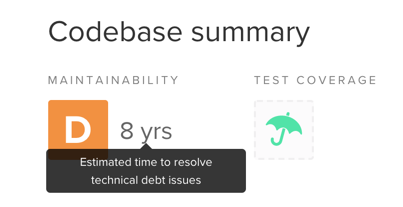

One of the hardest things to teach is probably _when_ to refactor.

With expertise, that's an answer you may feel in your guts: sometimes a piece of code should be refactored, and sometimes it doesn't worth it. But it's hard to stand by the "gut check" when you have to justify your score in a poker planning session!

## Different approaches, different problems

Some people follow the TDD cycle: red-green-refactor. There's a dedicated moment for refactoring the code that has just been written.

But what about Legacy Code? When you inherited a large pile of tangled code, how do you know the cost of refactoring would be less than the cost of not refactoring?

You can't calculate these costs. You can at best estimate them. People can do a decent job of comparing things, but we are not very good at estimating them. How do you know if the code you see will have to change? How do you estimate the number of bugs it will generate? Just like all estimation techniques, there are theories, sophisticated algorithms to try to tell you how much hours each code smell would take to clean up.

But it's not because some code _could_ be refactored that it _should_ be refactored.

What's good in refactoring if it takes you more time to deliver the value **every single time**? If you constantly argue that the Story the team sized is larger because you need to refactor everything that might come across, is it really helpful?

On the other hand, if you're barely able to see the whole function in your big widescreen monitor in portrait mode, then any change to this code is considerably longer and riskier to make.

Could there be some common understanding of when to refactor, so you don't waste time doing it when it doesn't worth it, but don't skip it when it does?

## Refactor continuously, but only what needs to be

I think the best moment to refactor is before you need to change the code.

You shouldn't refactor every tangled spaghetti you're coming across. You don't have to refactor the first time you write the code. You can't just plan days of refactorings for the sake of it.

Instead, make refactoring part of implementing the feature or fixing the bug. It doesn't mean you should size every story larger because you want to refactor everything first—although you should probably add some points if you don't have a clear understanding of the change that needs to be made, that's another topic.

> Refactor continuously. But only refactor what needs to be.

What if you don't know the code enough to see what needs to be refactored? I suggest you first do some [Exploratory Refactoring](../demine-codebase-with-exploratory-refactoring) to learn more about it. You won't keep these changes. You do that so you have a clearer idea about what actually needs to be changed.

Wouldn't that make the code inconsistent if you only refactor a part of it? It probably will and that's fine. Your team can keep track of ongoing refactorings in a Markdown file, versioned with the source code.

The rationale is that if you have a hard time selling refactoring time to your stakeholders, you really shouldn't. **Refactoring isn't a separate activity, it's part of your work.** It doesn't mean that every single task should take twice the time because you will clean up everything. Take a pragmatic approach, refactor as you go, focus your refactoring on what needs to be changed.

Don't ask for time to refactor. Don't make refactoring sounds like a constant waste of time because you wouldn't be able to work on the existing code. You refactor because it will make changes faster and safer. Don't get side-tracked by all the refactorings that could be made though. Practice cleaning up what's in the way, and only that.
