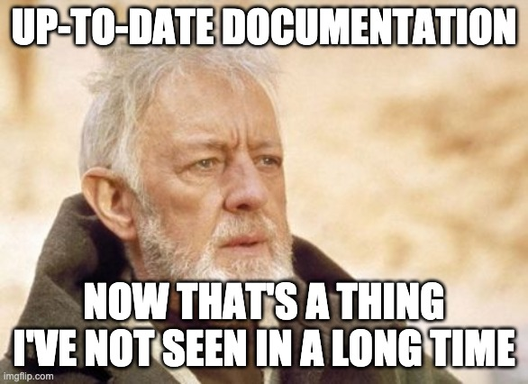
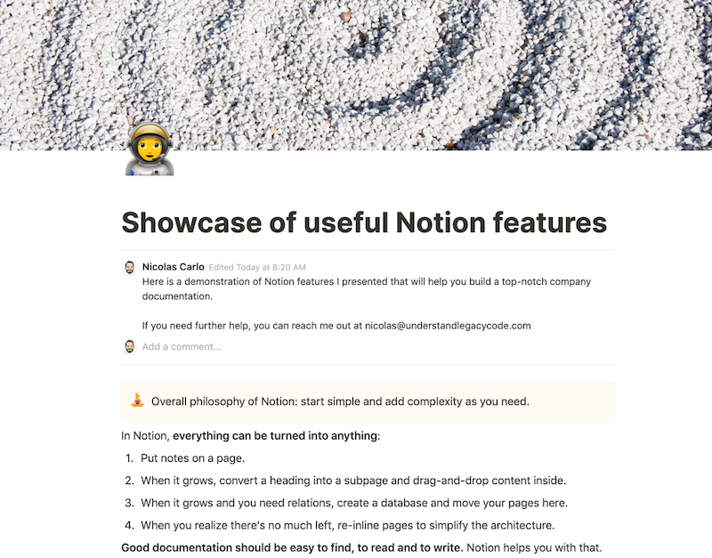

> "Of course, there is never any documentation…"

This is the typical experience of a Legacy codebase.

Sure, documentation is not fun to write. It often feels like a waste of precious time, because _we know_. The problem is: we forget.

Documentation is **never** a priority for your project stakeholders. There are features to ship and bugs to fix! And then, one day, the lead developer who was working on the project for the last 5 years announces she's leaving in 2 months. You now have 60 days to learn how to live and work without her.

So you start thinking about documenting everything she knows, all of the implicit knowledge. And very quickly comes up the question:

> "Where should we put the documentation?"

Should it be specific to the team? Should it live in the company's Confluence? Should you use the wiki that comes along GitHub/Gitlab? Are there tips that can help you? Traps you should avoid?

Let's pause a moment here to think about what makes **great** documentation.

## The 3 traits of great documentation

### 1. Easy to find

If knowledge is spread across wikis, google docs, emails, and Jira tickets, people will have a hard time finding the information they need.

How do you know if documentation is easy to find? Well, there's a typical symptom when it's not: people frequently ask questions about things your team knows. Often, questions are the same. Because it's not clear where they can find the information _by themselves_. Hunting for the answer will take longer (and more efforts) than raising the question and wait. That's a waste of time. Good documentation would fix that!

When it's clear where the documentation is, and it's easy to search for specific information, you see less of that.

**Aim for having your documentation in a single place**. A powerful search feature is a must.

### 2. Easy to read

Basic formatting matters (and is usually given by most tools).

But think about images, diagrams, and code. Are they easy to read? Is there a way to make some information stand out? Is there a way to hide details that would not be relevant for all readers?

Adding information is simple. Keeping it relevant takes practice. Going to the point is a hard skill to earn, but it definitely worth it. Remove from your documentation what turns out to be unnecessary.

**Keep information short, easy to skim. Make people practice writing docs.**

Speaking of writing…

### 3. Easy to write

This is usually overlooked, especially when it gets spoiled by heavy validation processes.

Let me be clear on this one:

> The more friction you add to the process of updating the doc, the less updated it will be.

Out-of-date documentation is untrustworthy, making people fall back to asking others instead of trusting it. Out-of-date information should be updated or deleted.

Get rid of useless information. Add missing ones. Make newcomers update the onboarding documentation. Take questions as chances to clarify the doc!

If updating the doc is frictionless, you'll save your team a loooot of time.

You don't need a validation stamp from the Tech Lead to update the doc. Anyone should feel entitled to do it.

2 things can help here:

1. Change history will make you stop being afraid of losing information by someone accidentally removing it.
2. Frequent backups, in case something goes wrong

**Trust people in doing their job. Let them update the doc as if it was a living document.**

## OK, but WHERE to put the documentation?

Following these 3 traits, I'd recommend keeping your documentation in 2 places:

1. **Everything that is codebase specific should be versioned along with the source code**. Instructions to help people work with the codebase should be here, in some README. I recommend you to [document your architectural decisions here, with ADRs](https://understandlegacycode.com/blog/earn-maintainers-esteem-with-adrs).
2. **Everything else should be in a single place**. The exact solution doesn't matter. What matters is that it's consistent.

That is, if your company uses Confluence, then use Confluence. If there's no company standard on this, then make a decision for your team. Make it clear that all the documentation would be here.

### What would be the best solution for documentation?

If you don't have a place to put your documentation yet, or if you've decided to migrate from your existing solution, you should be looking for something that makes documentation:

- easy to find
- easy to read
- easy to write

As of 2020, I recommend going for [Notion](https://www.notion.so/). It ranks best in most of the characteristics that matter for building handy documentation, especially if you're working in software.

Listing all reasons why Notion is my preferred choice would fill another blog post. But in short:

- their search feature is powerful enough to make it easy to find information
- they handle formatting, embedding images, code syntax highlighting, calling out important bits, and hiding less relevant ones
- the content is editable in place, making it a breeze to write
- anything can be turned into anything else, so you can just dump what's in your head and then turn it into a more sophisticated page later
- comments and assignments make it great for collaborating
- they backup your content with change history, so you can go back in time if some information was deleted

If you're curious, have a look [at my showcase of useful Notion features](https://www.notion.so/Showcase-of-useful-Notion-features-d344bc6bf3c64eb88522cd746a206077) for building company documentation.

Regardless of the solution you choose, don't get caught with perfectionism. Done is better than perfect. As long as you start putting useful knowledge in a single place that anyone can update, you're doing great!
